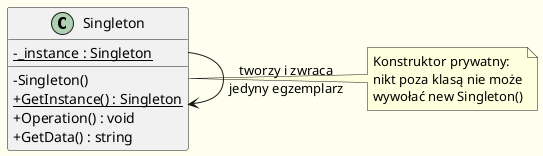
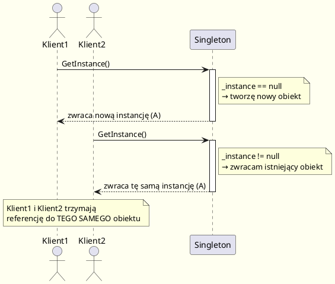

# Singleton — Definicja i Podstawowe Implementacje

---

## Definicja (Gang of Four)

> *„Zapewnij, że klasa ma tylko jeden egzemplarz i udostępnij globalny punkt dostępu do niego."*  
> — Gamma, Helm, Johnson, Vlissides, *Design Patterns* (1994), s. 127

Singleton jest wzorcem **kreacyjnym** — odpowiada za sposób tworzenia obiektów.  
Łączy dwie odpowiedzialności:

1. **Kontrola liczby instancji** — klasa sama pilnuje, że istnieje tylko jeden jej egzemplarz.
2. **Globalny punkt dostępu** — klienci uzyskują dostęp przez dobrze znany punkt (statyczną metodę/właściwość).

---

## Motywacja

Niektóre klasy powinny mieć dokładnie jeden egzemplarz: menedżer okien, system plików, kolejka wydruków, pula połączeń.

**Przykład: kocioł czekoladowy**

Wyobraź sobie fabrykę czekolady z jednym kotłem. Kocioł:
- napełnia się surowcami,
- podgrzewa masę,
- spuszcza gotową zawartość.

Gdyby kontroler kotła miał więcej niż jeden egzemplarz, mogłoby dojść do sytuacji, gdzie jeden egzemplarz dostaje informację "kocioł pusty", a drugi ocenia go jako "pełny i podgrzany" — katastrofa.

```csharp
// Dwa sterowniki pewnego dnia rano...
ChocolateBoiler boiler1 = ChocolateBoiler.GetInstance();
ChocolateBoiler boiler2 = ChocolateBoiler.GetInstance();

Console.WriteLine(boiler1 == boiler2); // true — tylko jeden obiekt!
```

Pełna implementacja: [`ChocolateBoiler.cs`](code/SingletonDefinition/ChocolateBoiler.cs)

---

## Struktura UML



Plik diagramu: [`diagrams/singleton_class.puml`](diagrams/singleton_class.puml)

---

## Cykl życia Singletona



Plik diagramu: [`diagrams/singleton_sequence.puml`](diagrams/singleton_sequence.puml)

---

## Uczestnicy wzorca

| Uczestnik | Rola |
|-----------|------|
| `Singleton` | Definiuje statyczną operację `GetInstance()`, która pozwala klientom na dostęp do jedynego egzemplarza. Może być odpowiedzialna za tworzenie własnego egzemplarza. |

Wzorzec singleton ma tylko jednego uczestnika — co jest jednocześnie jego siłą i słabością.

---

## Implementacje w C#

### Wariant 1: Klasyczny leniwy (Lazy, NIE jest thread-safe)

```csharp
// UWAGA: Ta implementacja NIE jest bezpieczna wątkowo
public class ClassicSingleton
{
    private static ClassicSingleton? _instance;

    private ClassicSingleton()
    {
        Console.WriteLine("ClassicSingleton: tworzona instancja");
    }

    public static ClassicSingleton GetInstance()
    {
        if (_instance is null)          // ← problem przy współbieżności
        {
            _instance = new ClassicSingleton();
        }
        return _instance;
    }
}
```

**Zalety:** prosta implementacja, leniwe tworzenie (lazy initialization).  
**Wady:** nie jest bezpieczna wątkowo — w środowisku wielowątkowym możliwe jest stworzenie wielu instancji.

Pełna wersja: [`ClassicSingleton.cs`](code/SingletonDefinition/ClassicSingleton.cs)

---

### Wariant 2: Zachłanny (Eager Initialization)

```csharp
public class EagerSingleton
{
    // CLR gwarantuje inicjalizację statycznych pól przed pierwszym użyciem
    // i jest to operacja thread-safe
    private static readonly EagerSingleton _instance = new EagerSingleton();

    private EagerSingleton()
    {
        Console.WriteLine("EagerSingleton: tworzona instancja przy starcie");
    }

    public static EagerSingleton Instance => _instance;
}
```

**Zalety:** prosta, bezpieczna wątkowo (CLR gwarantuje thread-safe inicjalizację pól statycznych).  
**Wady:** instancja tworzona nawet wtedy, gdy nigdy nie jest potrzebna.

Pełna wersja: [`EagerSingleton.cs`](code/SingletonDefinition/EagerSingleton.cs)

---

### Wariant 3: Lazy\<T\> (.NET — zalecany)

```csharp
public class LazySingleton
{
    // Lazy<T> z domyślnym LazyThreadSafetyMode.ExecutionAndPublication
    // jest bezpieczna wątkowo i leniwa jednocześnie
    private static readonly Lazy<LazySingleton> _lazy =
        new Lazy<LazySingleton>(() => new LazySingleton());

    private LazySingleton()
    {
        Console.WriteLine("LazySingleton: tworzona instancja przy pierwszym dostępie");
    }

    public static LazySingleton Instance => _lazy.Value;

    public string GetStatus() => $"Initialized: {_lazy.IsValueCreated}";
}
```

**Zalety:** leniwa inicjalizacja, bezpieczna wątkowo, wbudowana w .NET, czytelna.  
**Wady:** lekka nadmiarowość obiektu `Lazy<T>`.

Pełna wersja: [`LazySingleton.cs`](code/SingletonDefinition/LazySingleton.cs)

---

### Wariant 4: Inicjalizacja statyczna (Static Holder / Bill Pugh w C#)

```csharp
public class StaticHolderSingleton
{
    private StaticHolderSingleton() { }

    // Zagnieżdżona klasa statyczna — inicjalizowana dopiero przy pierwszym
    // odwołaniu do Nested.Instance
    private static class Nested
    {
        // Explicit static constructor prevents beforefieldinit
        // Gwarantuje thread-safe lazy initialization
        static Nested() { }
        internal static readonly StaticHolderSingleton Instance = new StaticHolderSingleton();
    }

    public static StaticHolderSingleton Instance => Nested.Instance;
}
```

**Zalety:** leniwa, bezpieczna wątkowo, bez blokad, bez `Lazy<T>`.  
**Wady:** nieco bardziej rozbudowany kod.

Pełna wersja: [`StaticHolderSingleton.cs`](code/SingletonDefinition/StaticHolderSingleton.cs)

---

## Porównanie wariantów

| Wariant               | Leniwa inicjalizacja | Thread-safe | Prostota | Zalecany |
|-----------------------|----------------------|-------------|----------|----------|
| Klasyczny (Lazy)      | ✅                   | ❌          | ✅✅✅  | ❌       |
| Zachłanny (Eager)     | ❌                   | ✅          | ✅✅✅  | ⚠️       |
| `Lazy<T>`             | ✅                   | ✅          | ✅✅     | ✅✅     |
| Static Holder         | ✅                   | ✅          | ✅       | ✅       |

---

## Kiedy stosować Singleton?

Stosuj Singleton gdy:
- Musi istnieć dokładnie jeden egzemplarz klasy (np. sterownik sprzętu, pula połączeń).
- Globalny punkt dostępu jest konieczny i uzasadniony architektonicznie.
- Egzemplarz powinien być rozszerzalny przez podklasy (zob. [04-problemy](../04-problemy/README.md)).

**Nie stosuj**, gdy:
- Używasz go tylko po to, żeby uniknąć przekazywania parametrów (lazy dependency injection).
- Klasa ma stan, który utrudnia testowanie (zastąp Dependency Injection — zob. [06-alternatywy](../06-alternatywy/README.md)).

---

## Kod źródłowy

| Plik | Opis |
|------|------|
| [`ClassicSingleton.cs`](code/SingletonDefinition/ClassicSingleton.cs) | Klasyczna implementacja leniwa (nie thread-safe) |
| [`EagerSingleton.cs`](code/SingletonDefinition/EagerSingleton.cs) | Implementacja zachłanna |
| [`LazySingleton.cs`](code/SingletonDefinition/LazySingleton.cs) | Implementacja z `Lazy<T>` |
| [`StaticHolderSingleton.cs`](code/SingletonDefinition/StaticHolderSingleton.cs) | Implementacja ze statycznym holderem |
| [`ChocolateBoiler.cs`](code/SingletonDefinition/ChocolateBoiler.cs) | Praktyczny przykład: sterownik kotła czekoladowego |
| [`Program.cs`](code/SingletonDefinition/Program.cs) | Uruchamialny przykład demonstracyjny |

```bash
cd code/SingletonDefinition
dotnet run
```

---

## Literatura i źródła

- Gamma et al. (1994). *Design Patterns*. Addison-Wesley. **s. 127–136** — oryginalna definicja.
- Freeman & Robson (2020). *Head First Design Patterns* (2nd ed.). O'Reilly. **rozdz. 5**.
- [Singleton — Refactoring.Guru](https://refactoring.guru/design-patterns/singleton) — ilustrowany przewodnik.
- [Implementing the Singleton Pattern in C# — Jon Skeet](https://csharpindepth.com/articles/singleton) — wyczerpujące porównanie implementacji.
- [Lazy\<T\> — Microsoft Docs](https://learn.microsoft.com/en-us/dotnet/api/system.lazy-1) — dokumentacja .NET.
