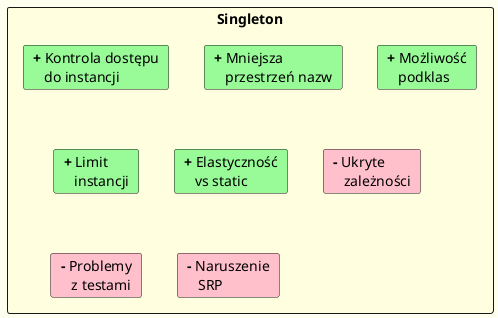

# Singleton — Konsekwencje Stosowania

---

## Wprowadzenie

Wzorzec Singleton ma zarówno zalety, jak i istotne wady.  
Gang of Four wymienia pięć głównych konsekwencji jego stosowania.  
Zrozumienie ich pozwala świadomie decydować — **kiedy Singleton jest dobrym wyborem, a kiedy antywzorcem**.

---

## Konsekwencja 1: Kontrola dostępu do jedynego egzemplarza

> *„Klasa Singleton enkapsuluje swój jedyny egzemplarz, dzięki emu może mieć pełną kontrolę nad tym, jak i kiedy klienci uzyskują do niego dostęp."*

Singleton pozwala ścisłe kontrolować moment tworzenia instancji i dostęp do niej.  
W przeciwieństwie do zmiennej globalnej — kod klienta nie może ominąć kontroli dostępu.

```csharp
// Klient nie może zrobić: new DatabaseConnection()  ← błąd kompilacji
// Może jedynie:
var conn = DatabaseConnection.Instance;   // przez kontrolowany punkt dostępu
```

**Diagram:** [`diagrams/consequences.puml`](diagrams/consequences.puml)

---

## Konsekwencja 2: Zmniejszenie przestrzeni nazw

> *„Singleton unika zaśmiecania przestrzeni nazw zmiennymi globalnymi, które przechowują jedyne egzemplarze."*

Zamiast globalnych zmiennych (które w C# i tak nie istnieją na poziomie globalnym)  
Singleton organizuje stan globalny wewnątrz klasy.

```csharp
// Zła praktyka (C nie ma klas, ale analogicznie w C++):
// extern Logger* gLogger;  ← globalna zmienna

// Dobra praktyka — zorganizowana w klasie:
Logger.Instance.Log("komunikat");
```

Jednak nawet z Singletonem nadal mamy **globalny stan** — zmiana sposobu dotyczy wyłącznie składni.

---

## Konsekwencja 3: Dopracowywanie operacji i reprezentacji

> *„Klasę Singleton można podklasować, a aplikacja może być konfigurowana do używania rozszerzenia egzemplarza klasy."*

Można oprzeć implementację Singletona na podklasach, dzięki czemu aplikacja używa rozszerzonego egzemplarza.

```csharp
// Bazowy Singleton
public class Logger
{
    private static Logger? _instance;
    protected Logger() { }
    public static Logger Instance => _instance ??= new Logger();
    public virtual void Log(string msg) => Console.WriteLine($"[LOG] {msg}");
}

// Rozszerzona wersja
public class FileLogger : Logger
{
    public override void Log(string msg)
    {
        base.Log(msg);
        File.AppendAllText("app.log", msg + Environment.NewLine);
    }
}
```

⚠️ W praktyce rozszerzanie przez dziedziczenie jest problematyczne — zob. [04-problemy](../04-problemy/README.md).

---

## Konsekwencja 4: Możliwość określenia dowolnego limitu egzemplarzy

> *„Łatwo można zmienić implementację, w której kontrolowana jest liczba egzemplarzy klasy."*

Singleton to specjalny przypadek ogólniejszego wzorca **ograniczonej puli obiektów**.  
Mechanizm można łatwo rozszerzyć, by dopuszczał np. 2 lub N instancji.

```csharp
// Multiton — uogólnienie Singletona na N instancji
public class ConnectionPool
{
    private static readonly int MaxInstances = 3;
    private static readonly List<ConnectionPool> _instances = new();
    private static int _counter = 0;

    private ConnectionPool(int id) { Id = id; }

    public int Id { get; }

    public static ConnectionPool GetInstance()
    {
        if (_instances.Count < MaxInstances)
        {
            var instance = new ConnectionPool(++_counter);
            _instances.Add(instance);
            return instance;
        }
        // Round-robin lub inny algorytm wyboru
        return _instances[_counter++ % MaxInstances];
    }
}
```

Pełna implementacja: [`code/Consequences/LimitedInstancesSingleton.cs`](code/Consequences/LimitedInstancesSingleton.cs)

---

## Konsekwencja 5: Większa elastyczność niż operacje statyczne

> *„Innym sposobem spakowania funkcji Singletona są operacje statyczne. Jednak trudno jest zmienić projekt, aby pozwolić na więcej niż jeden egzemplarz klasy."*

Klasa statyczna (`static class`) to alternatywa dla Singletona, ale z ograniczeniami:

| Cecha | Singleton | Klasa statyczna |
|-------|-----------|-----------------|
| Może implementować interfejs | ✅ | ❌ |
| Może być parametrem metody | ✅ | ❌ |
| Obsługuje polimorfizm | ✅ | ❌ |
| Inicjalizacja leniwa | ✅ (opcja) | ❌ (zawsze eager) |
| Możliwa podmiana w testach (mock) | ✅ (przez interfejs) | ❌ |
| Może dziedziczyć | ✅ | ❌ |

```csharp
// Klasa statyczna — prosta, ale niemockowana
public static class StaticLogger
{
    public static void Log(string msg) => Console.WriteLine(msg);
}

// Singleton przez interfejs — testowalny
public interface ILogger { void Log(string msg); }
public class AppLogger : ILogger
{
    public static AppLogger Instance { get; } = new AppLogger();
    private AppLogger() { }
    public void Log(string msg) => Console.WriteLine(msg);
}

// W testach można podmienić:
ILogger logger = new MockLogger();  // ← niemożliwe ze static class
```

---

## Wady Singletona (jako antywzorzec)

Oprócz wymienionych zalet, warto znać ciemną stronę wzorca:

### Ukryte zależności

```csharp
// Zła praktyka — ukryta zależność od Singletona
public class OrderService
{
    public void PlaceOrder(Order order)
    {
        Logger.Instance.Log("Placing order...");  // ← ukryta zależność!
        Database.Instance.Save(order);             // ← ukryta zależność!
    }
}

// Dobra praktyka — jawne zależności przez konstruktor
public class OrderService
{
    private readonly ILogger _logger;
    private readonly IDatabase _db;

    public OrderService(ILogger logger, IDatabase db)
    {
        _logger = logger;
        _db = db;
    }
}
```

### Problemy z testowalnością

Singleton utrudnia testowanie, bo:
- Nie można łatwo zastąpić go mockiem.
- Stan z jednego testu "wcieka" do następnego.
- Testy stają się kolejnościozależne (order-dependent).

### Naruszenie zasady pojedynczej odpowiedzialności (SRP)

Klasa Singleton jest odpowiedzialna jednocześnie za:
1. Swoją własną logikę domenową.
2. Zarządzanie swoim cyklem życia (tworzenie, dostęp).

---

## Podsumowanie konsekwencji



---

## Kod źródłowy

| Plik | Opis |
|------|------|
| [`LimitedInstancesSingleton.cs`](code/Consequences/LimitedInstancesSingleton.cs) | Multiton — N instancji |
| [`Program.cs`](code/Consequences/Program.cs) | Demo wszystkich konsekwencji |

```bash
cd code/Consequences
dotnet run
```

---

## Literatura i źródła

- Gamma et al. (1994). *Design Patterns*. Addison-Wesley. **s. 135–136** — konsekwencje GoF.
- Martin, R. C. (2007). *Agile Software Development*. Prentice Hall. **Single Responsibility Principle**.
- [Singleton as an Anti-Pattern — Stack Overflow](https://stackoverflow.com/questions/137975/what-is-so-bad-about-singletons)
- [Global State and Singletons — Google Testing Blog](https://testing.googleblog.com/2008/11/clean-code-talks-global-state-and.html)
