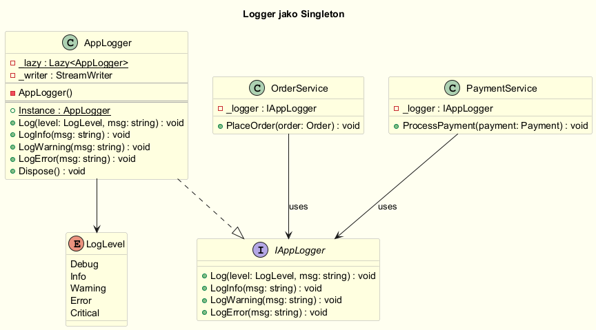
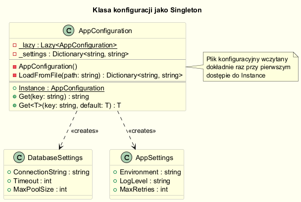
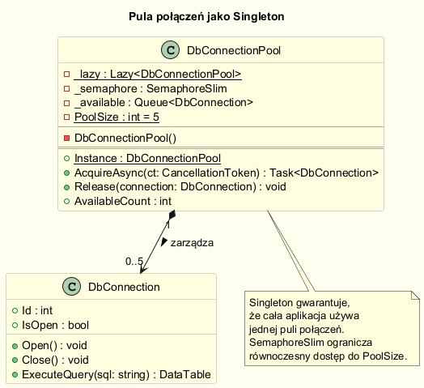
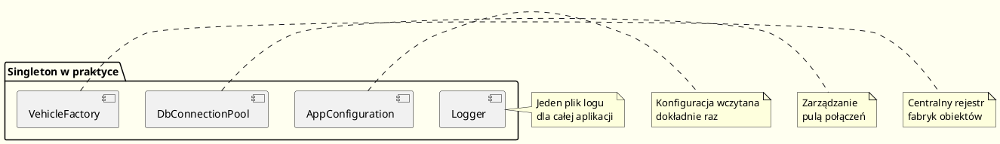

# Singleton — Przykłady Użycia

---

## Wprowadzenie

Singleton jest szczególnie przydatny w przypadku zasobów, które:
- powinny istnieć w jednej instancji (np. plik logu, konfiguracja),
- są kosztowne do stworzenia (np. połączenie z bazą danych),
- wymagają globalnego, spójnego stanu w całej aplikacji.

Poniżej omówione są cztery klasyczne zastosowania.

---

## 1. Logger (Dziennik zdarzeń)

Logger jest jednym z najczęstszych zastosowań Singletona.  
Wymaga jednej, spójnej instancji, żeby:
- wszystkie wpisy trafiały do tego samego pliku/strumienia,
- nie było kolizji przy zapisie z różnych modułów.



```csharp
public sealed class AppLogger
{
    private static readonly Lazy<AppLogger> _lazy = new(() => new AppLogger());
    private readonly StreamWriter _writer;

    private AppLogger()
    {
        _writer = new StreamWriter("app.log", append: true) { AutoFlush = true };
    }

    public static AppLogger Instance => _lazy.Value;

    public void Log(LogLevel level, string message)
    {
        var entry = $"[{DateTime.Now:yyyy-MM-dd HH:mm:ss}] [{level}] {message}";
        Console.WriteLine(entry);
        _writer.WriteLine(entry);
    }
}

// Użycie z różnych modułów aplikacji:
AppLogger.Instance.Log(LogLevel.Info, "Aplikacja uruchomiona");
AppLogger.Instance.Log(LogLevel.Warning, "Niska pamięć");
```

Pełna implementacja: [`code/Logger/AppLogger.cs`](code/Logger/AppLogger.cs)

---

## 2. Klasa konfiguracji (Configuration)

Ustawienia aplikacji powinny być wczytane raz i dostępne globalnie.  
Singleton gwarantuje, że plik konfiguracyjny jest odczytany dokładnie raz.



```csharp
public sealed class AppConfiguration
{
    private static readonly Lazy<AppConfiguration> _lazy = new(() => new AppConfiguration());
    private readonly Dictionary<string, string> _settings;

    private AppConfiguration()
    {
        // Wczytanie konfiguracji z pliku (raz!)
        _settings = LoadFromFile("appsettings.json");
        Console.WriteLine("[Config] Konfiguracja wczytana z pliku.");
    }

    public static AppConfiguration Instance => _lazy.Value;

    public string Get(string key) =>
        _settings.TryGetValue(key, out var value) ? value : string.Empty;

    public T Get<T>(string key, T defaultValue) where T : IParsable<T>
    {
        if (_settings.TryGetValue(key, out var str) &&
            T.TryParse(str, null, out var result))
            return result;
        return defaultValue;
    }
}

// Użycie:
var timeout = AppConfiguration.Instance.Get<int>("ConnectionTimeout", 30);
var connString = AppConfiguration.Instance.Get("ConnectionString");
```

Pełna implementacja: [`code/Configuration/AppConfiguration.cs`](code/Configuration/AppConfiguration.cs)

---

## 3. Pula połączeń (Connection Pool)

Pula połączeń zarządza ograniczoną liczbą połączeń z bazą danych.  
Singleton zapewnia, że istnieje jeden menedżer puli w całej aplikacji.



```csharp
public sealed class DbConnectionPool
{
    private static readonly Lazy<DbConnectionPool> _lazy = new(() => new DbConnectionPool());
    private readonly SemaphoreSlim _semaphore;
    private readonly Queue<DbConnection> _available;

    private DbConnectionPool()
    {
        const int poolSize = 5;
        _semaphore = new SemaphoreSlim(poolSize, poolSize);
        _available = new Queue<DbConnection>(
            Enumerable.Range(1, poolSize).Select(i => new DbConnection(i)));
    }

    public static DbConnectionPool Instance => _lazy.Value;

    public async Task<DbConnection> AcquireAsync(CancellationToken ct = default)
    {
        await _semaphore.WaitAsync(ct);
        lock (_available)
            return _available.Dequeue();
    }

    public void Release(DbConnection connection)
    {
        lock (_available)
            _available.Enqueue(connection);
        _semaphore.Release();
    }
}
```

Pełna implementacja: [`code/ConnectionPool/DbConnectionPool.cs`](code/ConnectionPool/DbConnectionPool.cs)

---

## 4. Fabryka jako Singleton

Fabryki obiektów są naturalnym kandydatem do implementacji jako Singleton,  
gdy tworzenie fabryki jest kosztowne lub gdy potrzebujemy jednego, centralnego rejestru.

```csharp
public interface IVehicle { string Describe(); }

public sealed class VehicleFactory
{
    private static readonly Lazy<VehicleFactory> _lazy = new(() => new VehicleFactory());
    private readonly Dictionary<string, Func<IVehicle>> _creators = new();

    private VehicleFactory()
    {
        // Rejestracja typów pojazdów przy tworzeniu fabryki
        Register("car", () => new Car());
        Register("truck", () => new Truck());
        Register("bike", () => new Bike());
    }

    public static VehicleFactory Instance => _lazy.Value;

    public void Register(string type, Func<IVehicle> creator) =>
        _creators[type] = creator;

    public IVehicle Create(string type)
    {
        if (_creators.TryGetValue(type, out var creator))
            return creator();
        throw new ArgumentException($"Nieznany typ pojazdu: {type}");
    }
}

// Użycie:
var car   = VehicleFactory.Instance.Create("car");
var truck = VehicleFactory.Instance.Create("truck");
```

Pełna implementacja: [`code/Factory/VehicleFactory.cs`](code/Factory/VehicleFactory.cs)

---

## Diagram: Porównanie przypadków użycia



---

## Kiedy NIE używać Singletona w tych przypadkach?

W nowoczesnym .NET (ASP.NET Core) **Logger i Configuration** są zarządzane przez **DI Container**  
jako serwisy z odpowiednim lifetime (`Singleton`, `Scoped`, `Transient`).

```csharp
// ASP.NET Core — zamiast ręcznego Singletona:
builder.Services.AddSingleton<ILogger, AppLogger>();
builder.Services.AddSingleton<IConfiguration>(cfg => ...);
```

Więcej o alternatywach: [06-alternatywy/README.md](../06-alternatywy/README.md)

---

## Kod źródłowy

| Katalog | Plik | Opis |
|---------|------|------|
| `code/Logger/` | [`AppLogger.cs`](code/Logger/AppLogger.cs) | Logger — Singleton z zapisem do pliku |
| `code/Logger/` | [`Program.cs`](code/Logger/Program.cs) | Demo Loggera |
| `code/Configuration/` | [`AppConfiguration.cs`](code/Configuration/AppConfiguration.cs) | Konfiguracja aplikacji |
| `code/Configuration/` | [`Program.cs`](code/Configuration/Program.cs) | Demo konfiguracji |
| `code/ConnectionPool/` | [`DbConnectionPool.cs`](code/ConnectionPool/DbConnectionPool.cs) | Pula połączeń |
| `code/ConnectionPool/` | [`Program.cs`](code/ConnectionPool/Program.cs) | Demo puli połączeń |
| `code/Factory/` | [`VehicleFactory.cs`](code/Factory/VehicleFactory.cs) | Fabryka jako Singleton |
| `code/Factory/` | [`Program.cs`](code/Factory/Program.cs) | Demo fabryki |

```bash
# Uruchom wybrany przykład:
cd code/Logger && dotnet run
cd code/Configuration && dotnet run
cd code/ConnectionPool && dotnet run
cd code/Factory && dotnet run
```

---

## Literatura i źródła

- Freeman & Robson (2020). *Head First Design Patterns* (2nd ed.). O'Reilly. — Logger i ChocolateBoiler jako przykłady.
- [Logging in .NET — Microsoft Docs](https://learn.microsoft.com/en-us/dotnet/core/extensions/logging)
- [Configuration in ASP.NET Core — Microsoft Docs](https://learn.microsoft.com/en-us/aspnet/core/fundamentals/configuration/)
- [Connection Pooling — ADO.NET](https://learn.microsoft.com/en-us/dotnet/framework/data/adonet/sql-server-connection-pooling)
