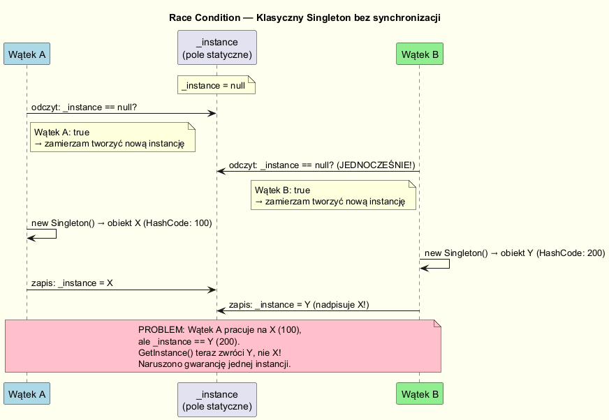
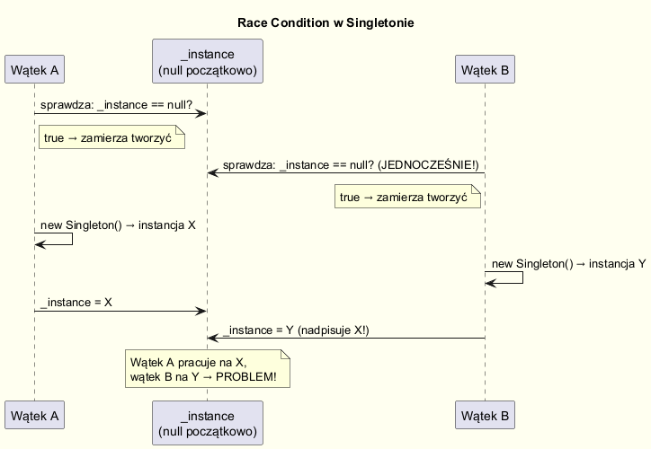
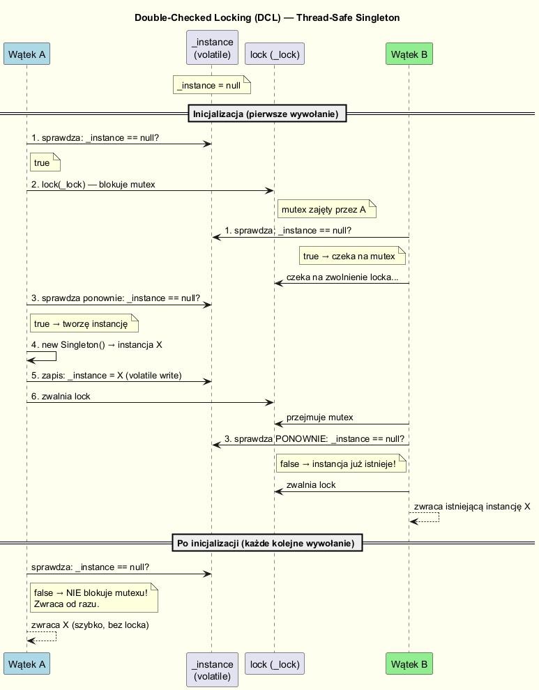
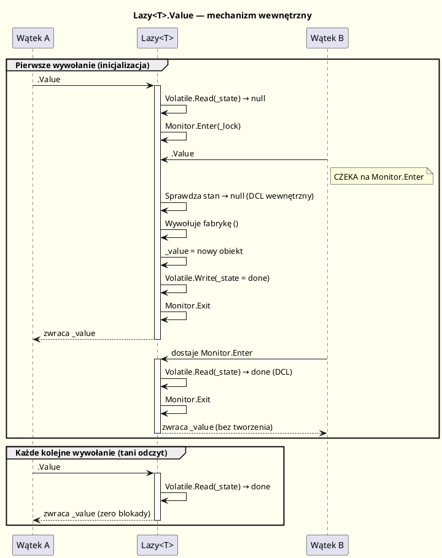

# Singleton — Współbieżność (Thread Safety)

---

## Wprowadzenie

Współbieżność to największe zagrożenie dla klasycznej implementacji Singletona.  
W środowisku wielowątkowym dwa lub więcej wątków może jednocześnie sprawdzić warunek  
`_instance == null` i każdy z nich stworzyć osobną instancję — naruszając gwarancję singletona.

---

## Problem: Race Condition

```csharp
// NIEBEZPIECZNA implementacja — możliwy wyścig wątków
public class NonThreadSafeSingleton
{
    private static NonThreadSafeSingleton? _instance;

    private NonThreadSafeSingleton() { }

    public static NonThreadSafeSingleton GetInstance()
    {
        if (_instance is null)           // ← Wątek A: sprawdza, widzi null
        {                                // ← Wątek B: sprawdza, widzi null (JEDNOCZEŚNIE!)
            _instance = new NonThreadSafeSingleton(); // A tworzy instancję
            // B tworzy instancję  ← DWIE INSTANCJE W PAMIĘCI!
        }
        return _instance;
    }
}
```



---

## Przeplot instrukcji prowadzący do wyścigu

Poniższa sekwencja demonstruje, jak może dojść do wyścigu:



---

## Rozwiązanie 1: Naiwna synchronizacja (lock)

```csharp
public class LockSingleton
{
    private static LockSingleton? _instance;
    private static readonly object _lock = new object();

    private LockSingleton() { }

    public static LockSingleton GetInstance()
    {
        lock (_lock)                              // BLOKUJE każde wywołanie!
        {
            _instance ??= new LockSingleton();
            return _instance;
        }
    }
}
```

**Wada:** Każde wywołanie `GetInstance()` blokuje wątek — nawet po inicjalizacji.  
W aplikacjach z intensywnym wywołaniem singletona: istotny spadek wydajności.

---

## Rozwiązanie 2: Double-Checked Locking (DCL)

Podwójne sprawdzenie pozwala uniknąć blokady po inicjalizacji:

```csharp
public class DCLSingleton
{
    // volatile zapewnia, że zapis do _instance jest widoczny dla wszystkich wątków
    private static volatile DCLSingleton? _instance;
    private static readonly object _lock = new object();

    private DCLSingleton() { }

    public static DCLSingleton GetInstance()
    {
        if (_instance is null)              // Pierwsze sprawdzenie (bez blokady)
        {
            lock (_lock)
            {
                if (_instance is null)      // Drugie sprawdzenie (z blokadą) — DCL
                {
                    _instance = new DCLSingleton();
                }
            }
        }
        return _instance;
    }
}
```

**Kluczowe:** słowo kluczowe `volatile` zapobiega reorderingowi instrukcji przez kompilator/CPU.  
Bez `volatile` DCL nie jest bezpieczne nawet w C# poniżej .NET 2.0.



---

## Rozwiązanie 3: Lazy\<T\> — zalecany w .NET

```csharp
public sealed class LazyTSingleton
{
    // LazyThreadSafetyMode.ExecutionAndPublication (domyślny)
    // gwarantuje: tylko jeden wątek wywołuje fabrykę, pozostałe czekają.
    private static readonly Lazy<LazyTSingleton> _lazy =
        new Lazy<LazyTSingleton>(() => new LazyTSingleton());

    private LazyTSingleton() { }

    public static LazyTSingleton Instance => _lazy.Value;
}
```

### Jak działa `Lazy<T>` pod spodem?

`System.Lazy<T>` to generyczna klasa dostępna od .NET 4.0. Przy każdym dostępie do `.Value`
wykonywane są trzy kroki:

1. **Volatile read stanu** — CLR odczytuje wewnętrzne pole `_state` przez `Volatile.Read`.
   Jeśli wartość jest już zainicjalizowana → zwraca ją **natychmiast, bez żadnej blokady**.
2. **Monitor.Enter** — jeśli jeszcze nie zainicjalizowana, wchodzi do sekcji krytycznej
   (identycznie jak `lock(_lock)`).
3. **Drugie sprawdzenie (DCL wewnętrznie)** — wewnątrz blokady ponownie sprawdza stan.
   Jeśli inny wątek zdążył zakończyć inicjalizację → wraca z jego wynikiem.
   W przeciwnym razie: wywołuje fabrykę, zapisuje wynik przez `Volatile.Write`, oznacza stan
   jako ukończony i zwalnia blokadę.



Po pierwszej inicjalizacji każde kolejne wywołanie `.Value` to wyłącznie tani `Volatile.Read` —
porównywalne wydajnościowo z dostępem do zwykłego pola statycznego.

### Tryby bezpieczeństwa wątkowego (`LazyThreadSafetyMode`)

`Lazy<T>` obsługuje trzy tryby, wybierane przez konstruktor:

| Tryb | Zachowanie | Kiedy użyć |
|------|-----------|-----------|
| `ExecutionAndPublication` *(domyślny)* | Blokada: tylko **jeden** wątek wywołuje fabrykę; pozostałe czekają | Fabryka ma efekty uboczne lub jest kosztowna |
| `PublicationOnly` | Wiele wątków może **równolegle** wywołać fabrykę; tylko pierwszy opublikowany wynik „wygrywa" | Fabryka jest tania i idempotentna |
| `None` | Brak synchronizacji — odpowiednik klasycznego singletona | Kod jednowątkowy |

```csharp
// Domyślny tryb — najczęstszy w Singletonie
var lazy1 = new Lazy<MyClass>(() => new MyClass());

// Explicit tryb ExecutionAndPublication — to samo co powyżej
var lazy2 = new Lazy<MyClass>(() => new MyClass(),
    LazyThreadSafetyMode.ExecutionAndPublication);

// PublicationOnly — równoległe tworzenie, wygrywa pierwszy opublikowany
var lazy3 = new Lazy<MyClass>(() => new MyClass(),
    LazyThreadSafetyMode.PublicationOnly);
```

### Dlaczego `Lazy<T>` jest zalecany zamiast ręcznego DCL?

**1. Oficjalnie przetestowana implementacja**  
Ręczny DCL ma kilka miejsc, w których można popełnić błąd:
pole `_instance` musi być `volatile`, kolejność operacji musi być precyzyjna.
`Lazy<T>` jest zaimplementowany i przetestowany przez team .NET — nie ma tu miejsca na błąd ludzki.

**2. `volatile` — łatwo zapomnieć**  
W ręcznym DCL pominięcie `volatile` na polu `_instance` powoduje, że kompilator lub CPU
może dokonać reorderingu instrukcji i zwrócić **częściowo skonstruowany obiekt** (widoczne
szczególnie na słabszych modelach pamięci, np. ARM). `Lazy<T>` używa `Volatile.Read`/`Volatile.Write`
w odpowiednich miejscach wewnętrznie — nie ma możliwości przypadkowego pominięcia.

**3. Obsługa wyjątków z fabryki**  
Gdy fabryka rzuci wyjątek, `Lazy<T>` zachowuje się inaczej zależnie od trybu:
- `ExecutionAndPublication`: wyjątek jest **zapamiętywany** i rzucany przy każdym kolejnym
  wywołaniu `.Value` — fabryka nie jest wywoływana ponownie.
- `PublicationOnly`: nieudane wywołanie jest porzucane — inny wątek może spróbować jeszcze raz.

```csharp
var lazy = new Lazy<string>(() => throw new InvalidOperationException("błąd fabryki"));
try { _ = lazy.Value; } catch { }
try { _ = lazy.Value; } catch { }  // ← ten sam wyjątek, fabryka NIE jest wywoływana drugi raz
```

**4. Dodatkowe możliwości**  
- `_lazy.IsValueCreated` — sprawdza bez inicjalizacji, czy wartość jest już gotowa.
- Jedno miejsce w kodzie wyraźnie komunikuje intencję: „inicjalizuj leniwie i bezpiecznie".

```csharp
// DCL ręczny — ~15 linii + ryzyko błędu w volatile/lock
// Lazy<T>:
private static readonly Lazy<T> _lazy = new(() => new T());
public static T Instance => _lazy.Value;
// 2 linie, zero ryzyka, jasna intencja
```

---

## Rozwiązanie 4: Inicjalizacja statyczna (Static Initialization)

```csharp
public sealed class StaticInitSingleton
{
    // CLR gwarantuje thread-safe inicjalizację pól statycznych.
    // Inicjalizacja następuje przy pierwszym dostępie do klasy.
    private static readonly StaticInitSingleton _instance = new StaticInitSingleton();

    static StaticInitSingleton() { } // jawny konstruktor statyczny — disables beforefieldinit

    private StaticInitSingleton() { }

    public static StaticInitSingleton Instance => _instance;
}
```

**Zaleta:** najprostsza z thread-safe implementacji, zero blokad.  
**Wada:** inicjalizacja zachłanna — instancja tworzona przy pierwszym dostępie do klasy,  
nawet jeśli `Instance` nie zostało jeszcze wywołane (dostęp do innego statycznego elementu klasy).

---

## Porównanie wydajności

| Metoda | Thread-safe | Leniwa | Wydajność | Złożoność kodu |
|--------|-------------|--------|-----------|----------------|
| Brak synchronizacji | ❌ | ✅ | ★★★★★ | ★☆☆☆☆ |
| `lock` za każdym razem | ✅ | ✅ | ★★☆☆☆ | ★★☆☆☆ |
| Double-Checked Locking | ✅ | ✅ | ★★★★☆ | ★★★☆☆ |
| `Lazy<T>` | ✅ | ✅ | ★★★★☆ | ★★☆☆☆ |
| Inicjalizacja statyczna | ✅ | ✅\* | ★★★★★ | ★☆☆☆☆ |

\*Leniwa względem dostępu do `Instance`, ale zachłanna jeśli klasa ma inne statyczne elementy.

---

## Benchmark (orientacyjny)

```csharp
// Wywołanie 10 000 000 razy z 8 wątków:
// Brak synchronizacji:  ~  50 ms
// lock każdorazowo:     ~ 800 ms  (16x wolniejszy!)
// DCL (volatile):       ~  90 ms
// Lazy<T>:              ~ 100 ms
// Inicjalizacja static: ~  50 ms
```

Kod benchmarku: [`code/Concurrency/Benchmark.cs`](code/Concurrency/Benchmark.cs)

---

## Kod źródłowy

| Plik | Opis |
|------|------|
| [`NonThreadSafeSingleton.cs`](code/Concurrency/NonThreadSafeSingleton.cs) | Problematyczna implementacja — race condition |
| [`LockSingleton.cs`](code/Concurrency/LockSingleton.cs) | Naiwna synchronizacja — lock |
| [`DCLSingleton.cs`](code/Concurrency/DCLSingleton.cs) | Double-Checked Locking |
| [`LazyTSingleton.cs`](code/Concurrency/LazyTSingleton.cs) | Rekomendowany — Lazy\<T\> |
| [`StaticInitSingleton.cs`](code/Concurrency/StaticInitSingleton.cs) | Inicjalizacja statyczna |
| [`Benchmark.cs`](code/Concurrency/Benchmark.cs) | Benchmark porównawczy |
| [`Program.cs`](code/Concurrency/Program.cs) | Demo ze współbieżnymi wątkami |

```bash
cd code/Concurrency
dotnet run
```

---

## Literatura i źródła

- [Implementing the Singleton Pattern in C# — Jon Skeet](https://csharpindepth.com/articles/singleton) — kanoniczny artykuł, 6 wariantów implementacji.
- [Double-Checked Locking — Wikipedia](https://en.wikipedia.org/wiki/Double-checked_locking)
- [Lazy\<T\> Thread Safety — Microsoft Docs](https://learn.microsoft.com/en-us/dotnet/framework/performance/lazy-initialization#thread-safe-initialization)
- [volatile keyword — Microsoft Docs](https://learn.microsoft.com/en-us/dotnet/csharp/language-reference/keywords/volatile)
- Albahari, J. (2021). *C# 10 in a Nutshell*. O'Reilly. — rozdział o wątkach i synchronizacji.
