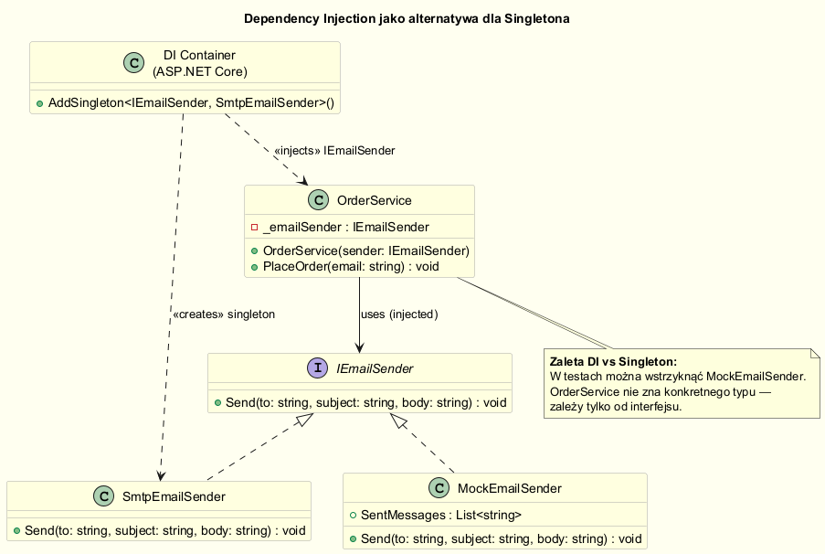
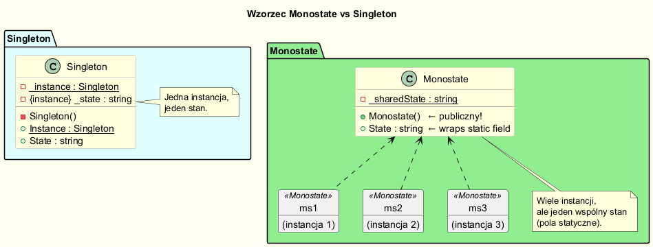
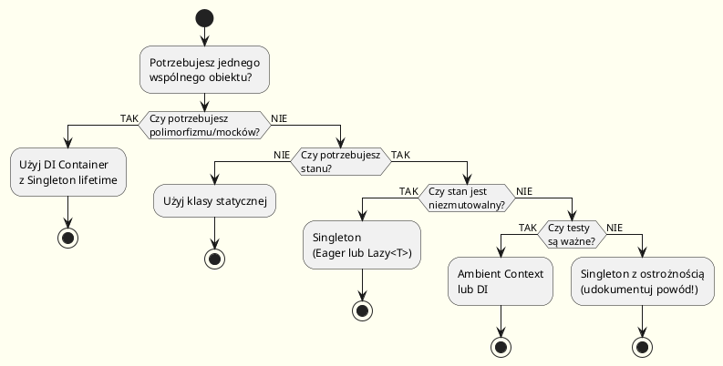

# Singleton — Alternatywy i Dobre Praktyki

---

## Wprowadzenie

Singleton jest antywzorcem wtedy, gdy jest stosowany zamiast prawidłowego zarządzania zależnościami.  
Istnieje kilka alternatyw — każda ma swoje zastosowanie. Kluczem jest zrozumienie, **dlaczego** chcesz singletona i **co** naprawdę potrzebujesz.

---

## Kiedy zastąpić Singleton?

Zastąp Singleton, jeśli:

1. **Singleton utrudnia testowanie** — nie możesz zastąpić go mockiem.
2. **Singleton ukrywa zależności** — klasy nie deklarują jawnie, czego potrzebują.
3. **Singleton przechowuje globalny stan mutowalny** — każdy test zmienia stan dla następnego.
4. **Wiele instancji w różnych kontekstach** — np. testy, mikroservisy, multitenant.

---

## Alternatywa 1: Dependency Injection (DI)

To jest **preferowana alternatywa** w nowoczesnym .NET.  
DI Container może zarządzać cyklem życia obiektu — w tym jako `Singleton`.

```csharp
// Definiuj przez interfejs — lu testowalności
public interface IEmailSender
{
    void Send(string to, string subject, string body);
}

public class SmtpEmailSender : IEmailSender
{
    public void Send(string to, string subject, string body)
        => Console.WriteLine($"[SMTP] Wysyłam do {to}: {subject}");
}

// Rejestracja w kontenerze DI (np. ASP.NET Core):
builder.Services.AddSingleton<IEmailSender, SmtpEmailSender>();

// Wstrzyknięcie przez konstruktor (Dependency Injection):
public class OrderService
{
    private readonly IEmailSender _emailSender;

    public OrderService(IEmailSender emailSender)  // ← jawna zależność
    {
        _emailSender = emailSender;
    }

    public void PlaceOrder(string customerEmail)
    {
        // ... logika zamówienia
        _emailSender.Send(customerEmail, "Potwierdzenie", "Twoje zamówienie zostało przyjęte.");
    }
}

// Testowanie — można łatwo podmienić na mock:
var mockSender = new MockEmailSender();
var service = new OrderService(mockSender);
```



Pełna implementacja: [`code/Alternatives/DIExample.cs`](code/Alternatives/DIExample.cs)

---

## Alternatywa 2: Wzorzec Monostate

Monostate pozwala na istnienie wielu instancji klasy, ale wszystkie współdzielą **ten sam stan**.  
Efekt singletona — bez ograniczenia liczby instancji.

```csharp
// Monostate — wiele instancji, wspólny stan
public class MonostateLogger
{
    // Wszystkie pola statyczne → wspólny stan dla wszystkich instancji
    private static string _logFile = "app.log";
    private static LogLevel _minimumLevel = LogLevel.Info;
    private static int _messageCount = 0;

    // Każda instancja zachowuje się identycznie — bo dzieli stan
    public string LogFile
    {
        get => _logFile;
        set => _logFile = value;
    }

    public void Log(LogLevel level, string msg)
    {
        if (level >= _minimumLevel)
        {
            _messageCount++;
            Console.WriteLine($"[{level}] ({_messageCount}) {msg}");
        }
    }
}

// Użycie — tworzymy wiele instancji, ale zachowują się jak jeden obiekt
var logger1 = new MonostateLogger();
var logger2 = new MonostateLogger();
logger1.LogFile = "new.log";
Console.WriteLine(logger2.LogFile); // "new.log" ← wspólny stan!
```



Pełna implementacja: [`code/Alternatives/MonostatePattern.cs`](code/Alternatives/MonostatePattern.cs)

---

## Alternatywa 3: Ambient Context

Używany, gdy potrzebujemy jawnego, ale wymienialnego globalnego kontekstu.  
Popularny do implementacji kontekstu czasu, loggera, kultury, itp.

```csharp
// Ambient Context — jawny globalny kontekst z możliwością podmiany
// UWAGA: Nazwana AppTimeProvider, by uniknąć konfliktu z System.TimeProvider (.NET 8)
public abstract class AppTimeProvider
{
    // Wątkowy kontekst (może być różny per wątek / per test)
    private static readonly AsyncLocal<AppTimeProvider?> _current = new();

    public static AppTimeProvider Current
    {
        get => _current.Value ?? Default;
        set => _current.Value = value ?? throw new ArgumentNullException(nameof(value));
    }

    public static AppTimeProvider Default { get; } = new SystemAppTimeProvider();

    public abstract DateTime Now { get; }
    public abstract DateTime UtcNow { get; }
}

public class SystemAppTimeProvider : AppTimeProvider
{
    public override DateTime Now    => DateTime.Now;
    public override DateTime UtcNow => DateTime.UtcNow;
}

public class FixedAppTimeProvider : AppTimeProvider
{
    private readonly DateTime _fixedTime;
    public FixedAppTimeProvider(DateTime fixedTime) => _fixedTime = fixedTime;
    public override DateTime Now    => _fixedTime;
    public override DateTime UtcNow => _fixedTime.ToUniversalTime();
}

// Użycie w kodzie produkcyjnym:
Console.WriteLine(AppTimeProvider.Current.Now);

// W testach — podmiana bez singletona:
AppTimeProvider.Current = new FixedAppTimeProvider(new DateTime(2024, 1, 1));
Console.WriteLine(AppTimeProvider.Current.Now); // zawsze "2024-01-01"
```

---

## Alternatywa 4: Klasa statyczna

Gdy naprawdę nie potrzebujesz instancji — użyj klasy statycznej.  
Bez instancji, bez singletona, bez zależności.

```csharp
// Kiedy Singleton to "za dużo" — prosta klasa statyczna
public static class MathHelper
{
    public static double CircleArea(double radius) => Math.PI * radius * radius;
    public static double Hypotenuse(double a, double b) => Math.Sqrt(a * a + b * b);
}

// Użycie — bez GetInstance(), bez Instance, bez zarządzania cyklem życia
var area = MathHelper.CircleArea(5.0);
```

**Kiedy klasa statyczna jest właściwym wyborem:**
- Brak stanu mutowalnego (pure functions).
- Nie potrzebujesz polimorfizmu.
- Nie planujesz zastępować w testach.

---

## Kiedy NIE zastępować Singletona

Mimo złej sławy, Singleton jest **uzasadniony** gdy:

| Sytuacja | Uzasadnienie |
|----------|-------------|
| Sterownik sprzętu (drukarka, karta dźwiękowa) | Fizycznie istnieje jeden zasób |
| Globalny rejestrator zdarzeń (Event Log, Windows Kernel) | Kontrakt zewnętrzny wymaga jednej instancji |
| Pula połączeń z zewnętrznym systemem (limit licencyjny) | Ścisłe ograniczenie z zewnątrz |
| Readonly konfiguracja startowa | Stan niezmutowalny, bezpieczny globalnie |

---

## Dobre rady (best practices)

### ✅ Dobra praktyka

```csharp
// 1. Używaj interfejsów — zawsze można podmienić
public interface IQueue { void Enqueue(object item); object Dequeue(); }
public sealed class MessageQueue : IQueue { ... }
builder.Services.AddSingleton<IQueue, MessageQueue>();

// 2. Singleton readonly — bezpieczny, niezmutowalny
public sealed class AppMetadata
{
    public static AppMetadata Instance { get; } = new AppMetadata();
    private AppMetadata() { }
    public string Version { get; } = "1.0.0";  // niezmutowalny
    public string BuildDate { get; } = DateTime.UtcNow.ToString("yyyy-MM-dd");
}

// 3. Jeśli musisz — używaj Lazy<T>
private static readonly Lazy<ExpensiveService> _lazy =
    new Lazy<ExpensiveService>(() => new ExpensiveService());
```

### ❌ Zła praktyka

```csharp
// 1. NIE ukrywaj zależności w konstruktorze
public class OrderService
{
    private readonly ILogger _logger = Logger.Instance;  // ← ukryta zależność!
    private readonly IDb _db = Database.Instance;         // ← ukryta zależność!
}

// 2. NIE przechowuj zależności między testami w Singletonie
public class TestState
{
    public static TestState Instance { get; } = new TestState();
    public List<string> Results { get; } = new();  // ← stan "wycieka" między testami!
}

// 3. NIE używaj singletona tylko po to, żeby uniknąć przekazywania parametrów
// ŹLE:
void ProcessOrder() => Database.Instance.Save(/* ... */);
// DOBRZE:
void ProcessOrder(IDatabase db) => db.Save(/* ... */);
```

---

## Podsumowanie: Kiedy co wybrać?



---

## Kod źródłowy

| Plik | Opis |
|------|------|
| [`DIExample.cs`](code/Alternatives/DIExample.cs) | Dependency Injection zamiast Singletona |
| [`MonostatePattern.cs`](code/Alternatives/MonostatePattern.cs) | Wzorzec Monostate |
| [`AmbientContext.cs`](code/Alternatives/AmbientContext.cs) | Ambient Context (TimeProvider) |
| [`Program.cs`](code/Alternatives/Program.cs) | Demo wszystkich alternatyw |

```bash
cd code/Alternatives
dotnet run
```

---

## Literatura i źródła

- Seemann, M. (2011). *Dependency Injection in .NET*. Manning. — rozdział o testowaniu.
- [Inversion of Control Containers — Martin Fowler](https://martinfowler.com/articles/injection.html)
- [Monostate Pattern — Robert C. Martin](http://staff.cs.utu.fi/staff/jouni.smed/doos_06/material/DesignPatternsCh3.pdf)
- [Ambient Context — Mark Seemann's Blog](https://blog.ploeh.dk/2010/04/07/DependencyInjectionisLooseCoupling/)
- [Why Singletons Are Controversial — Google Testing Blog](https://testing.googleblog.com/2008/08/root-cause-of-singletons.html)
- [Microsoft DI Lifetime — Microsoft Docs](https://learn.microsoft.com/en-us/dotnet/core/extensions/dependency-injection#service-lifetimes)
