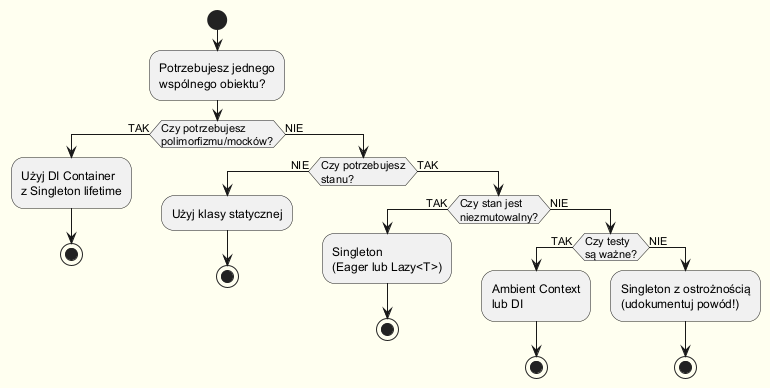

# Singleton — Alternatywy i Dobre Praktyki

---

## Wprowadzenie

Singleton jest antywzorcem wtedy, gdy jest stosowany zamiast prawidłowego zarządzania zależnościami.  
Istnieje kilka alternatyw — każda ma swoje zastosowanie. Kluczem jest zrozumienie, **dlaczego** chcesz singletona i **co** naprawdę potrzebujesz.

---

## Kiedy zastąpić Singleton?

Zastąp Singleton, jeśli:

1. **Singleton utrudnia testowanie** — nie możesz zastąpić go mockiem.
2. **Singleton ukrywa zależności** — klasy nie deklarują jawnie, czego potrzebują.
3. **Singleton przechowuje globalny stan mutowalny** — każdy test zmienia stan dla następnego.
4. **Wiele instancji w różnych kontekstach** — np. testy, mikroservisy, multitenant.

---

## Alternatywa 1: Dependency Injection (DI)

To jest **preferowana alternatywa** w nowoczesnym .NET.  
DI Container może zarządzać cyklem życia obiektu — w tym jako `Singleton`.

```csharp
// Definiuj przez interfejs — lu testowalności
public interface IEmailSender
{
    void Send(string to, string subject, string body);
}

public class SmtpEmailSender : IEmailSender
{
    public void Send(string to, string subject, string body)
        => Console.WriteLine($"[SMTP] Wysyłam do {to}: {subject}");
}

// Rejestracja w kontenerze DI (np. ASP.NET Core):
builder.Services.AddSingleton<IEmailSender, SmtpEmailSender>();

// Wstrzyknięcie przez konstruktor (Dependency Injection):
public class OrderService
{
    private readonly IEmailSender _emailSender;

    public OrderService(IEmailSender emailSender)  // ← jawna zależność
    {
        _emailSender = emailSender;
    }

    public void PlaceOrder(string customerEmail)
    {
        // ... logika zamówienia
        _emailSender.Send(customerEmail, "Potwierdzenie", "Twoje zamówienie zostało przyjęte.");
    }
}

// Testowanie — można łatwo podmienić na mock:
var mockSender = new MockEmailSender();
var service = new OrderService(mockSender);
```


**Kiedy DI jest lepsze od Singletona?**

| Kryterium | Singleton | DI z `AddSingleton` |
|-----------|-----------|---------------------|
| Testowalność | ❌ trudna (ukryta zależność) | ✅ prosta (podmiana interfejsu) |
| Jawność zależności | ❌ ukryte przez `Instance` | ✅ jawne w konstruktorze |
| Zmiana implementacji | ❌ wymaga edycji klasy | ✅ zmiana jednej linii rejestracji |
| Wiele środowisk (dev/prod/test) | ❌ wymaga if-ów w kodzie | ✅ oddzielna rejestracja per środowisko |
| Multitenant / scope per request | ❌ jeden globalny stan | ✅ `AddScoped` daje instancję per request |

DI **nie eliminuje** singletonu — `AddSingleton<T>` to wciąż jeden obiekt w całym procesie.
Różnica polega na tym, że zależność jest **jawna**, **wymienialna** i **zarządzana przez kontener**,
a nie ukryta wewnątrz klasy. Wybierz DI zawsze, gdy piszesz kod produkcyjny w .NET
(ASP.NET Core, Worker Service, Blazor) — kontenery są tam natywne i bezpłatne.

**Kiedy DI może być przesadą:**
- Prosta aplikacja konsolowa lub skrypt bez frameworka
- Biblioteka, która nie powinna narzucać kontenera DI klientowi

Pełna implementacja: [`code/Alternatives/DIExample.cs`](code/Alternatives/DIExample.cs)

---

## Alternatywa 2: Wzorzec Monostate

Monostate pozwala na istnienie wielu instancji klasy, ale wszystkie współdzielą **ten sam stan**.  
Efekt singletona — bez ograniczenia liczby instancji.

```csharp
// Monostate — wiele instancji, wspólny stan
public class MonostateLogger
{
    // Wszystkie pola statyczne → wspólny stan dla wszystkich instancji
    private static string _logFile = "app.log";
    private static LogLevel _minimumLevel = LogLevel.Info;
    private static int _messageCount = 0;

    // Każda instancja zachowuje się identycznie — bo dzieli stan
    public string LogFile
    {
        get => _logFile;
        set => _logFile = value;
    }

    public void Log(LogLevel level, string msg)
    {
        if (level >= _minimumLevel)
        {
            _messageCount++;
            Console.WriteLine($"[{level}] ({_messageCount}) {msg}");
        }
    }
}

// Użycie — tworzymy wiele instancji, ale zachowują się jak jeden obiekt
var logger1 = new MonostateLogger();
var logger2 = new MonostateLogger();
logger1.LogFile = "new.log";
Console.WriteLine(logger2.LogFile); // "new.log" ← wspólny stan!
```


**Kiedy Monostate jest lepszy od Singletona?**

Monostate nie jest zalecany dla nowego kodu — wciąż ma wszystkie wady globalnego stanu
(nietesowalność, ukryte zależności). Jego jedyna przewaga nad Singletonem pojawia się w wąskich sytuacjach:

- **Refaktoryzacja istniejącej klasy** — kod zewnętrzny już tworzy instancje przez `new`,
  a ty nie możesz zmienić tego kodu; Monostate pozwala wtedy zachować semantykę singletona
  bez zmiany interfejsu publicznego.
- **Frameworki wymagające bezargumentowego konstruktora** — niektóre ORM-y (np. Entity Framework)
  lub frameworki serializacji muszą tworzyć obiekty przez `new T()`. Prywatny konstruktor
  singletona jest wtedy przeszkodą; Monostate ją usuwa.
- **Wielokrotna inicjalizacja z identycznym zachowaniem** — gdy semantycznie obiekt jest „jeden",
  ale kod klienta tworzy go wielokrotnie w krótkich odcinkach (np. DTO-like use case).

**Przestroga:** Stan statyczny Monostate jest równie globalny i równie trudny do testowania
co stan w Singletonie — po prostu lepiej ukryty. Preferuj DI lub Ambient Context.

Pełna implementacja: [`code/Alternatives/MonostatePattern.cs`](code/Alternatives/MonostatePattern.cs)

---

## Alternatywa 3: Ambient Context

Używany, gdy potrzebujemy jawnego, ale wymienialnego globalnego kontekstu.  
Popularny do implementacji kontekstu czasu, loggera, kultury, itp.

```csharp
// Ambient Context — jawny globalny kontekst z możliwością podmiany
// UWAGA: Nazwana AppTimeProvider, by uniknąć konfliktu z System.TimeProvider (.NET 8)
public abstract class AppTimeProvider
{
    // Wątkowy kontekst (może być różny per wątek / per test)
    private static readonly AsyncLocal<AppTimeProvider?> _current = new();

    public static AppTimeProvider Current
    {
        get => _current.Value ?? Default;
        set => _current.Value = value ?? throw new ArgumentNullException(nameof(value));
    }

    public static AppTimeProvider Default { get; } = new SystemAppTimeProvider();

    public abstract DateTime Now { get; }
    public abstract DateTime UtcNow { get; }
}

public class SystemAppTimeProvider : AppTimeProvider
{
    public override DateTime Now    => DateTime.Now;
    public override DateTime UtcNow => DateTime.UtcNow;
}

public class FixedAppTimeProvider : AppTimeProvider
{
    private readonly DateTime _fixedTime;
    public FixedAppTimeProvider(DateTime fixedTime) => _fixedTime = fixedTime;
    public override DateTime Now    => _fixedTime;
    public override DateTime UtcNow => _fixedTime.ToUniversalTime();
}

// Użycie w kodzie produkcyjnym:
Console.WriteLine(AppTimeProvider.Current.Now);

// W testach — podmiana bez singletona:
AppTimeProvider.Current = new FixedAppTimeProvider(new DateTime(2024, 1, 1));
Console.WriteLine(AppTimeProvider.Current.Now); // zawsze "2024-01-01"
```

**Kiedy Ambient Context jest lepszy od Singletona?**

Ambient Context rozwiązuje konkretny problem: potrzebujesz globalnej wartości służącej jako
„kontekst środowiska" (czas, kultura, tożsamość, logger korelacji), ale testy muszą działać
niezależnie — każdy test z inną wartością.

| Cecha | Singleton | Ambient Context |
|-------|-----------|----------------|
| Izolacja testów | ❌ globalna zmiana wpływa na wszystkie wątki | ✅ `AsyncLocal` izoluje na poziomie wątku/flow |
| Czytelność dla wywołującego | ❌ ukryta zależność | ⚠️ widoczna przez `Current`, ale nie w sygnaturze |
| Obsługa async/await | ❌ TLS bez `AsyncLocal` zgubi kontekst | ✅ `AsyncLocal` propaguje przez async |
| Adekwatne użycie | Zbyt szeroki zakres, np. rejestr serwisów | Przekrojowe cechy: czas, kultura, log-scope |

Dobra zasada: używaj Ambient Context dla wartości, które są **niezmienne w ramach jednej operacji**
logicznej (request, polecenie, test case), ale **mogą się różnić między operacjami**.
Dla stanu, który zmienia się wewnątrz operacji — DI jest lepsze.

---

## Alternatywa 4: Klasa statyczna

Gdy naprawdę nie potrzebujesz instancji — użyj klasy statycznej.  
Bez instancji, bez singletona, bez zależności.

```csharp
// Kiedy Singleton to "za dużo" — prosta klasa statyczna
public static class MathHelper
{
    public static double CircleArea(double radius) => Math.PI * radius * radius;
    public static double Hypotenuse(double a, double b) => Math.Sqrt(a * a + b * b);
}

// Użycie — bez GetInstance(), bez Instance, bez zarządzania cyklem życia
var area = MathHelper.CircleArea(5.0);
```

**Kiedy klasa statyczna jest właściwym wyborem:**
- Brak stanu mutowalnego (pure functions).
- Nie potrzebujesz polimorfizmu.
- Nie planujesz zastępować w testach.

**Kiedy klasa statyczna jest złym wyborem (mimo braku instancji):**
- Funkcja ma efekt uboczny (I/O, zapis do bazy) — nie możesz jej mockować w testach.
- Potrzebujesz wstrzyknąć ją jako zależność — klasa statyczna nie może implementować interfejsu.
- Klasa statyczna ma mutowalny stan (np. cache, licznik) — to w istocie ukryty singleton
  ze wszystkimi jego wadami, ale bez żadnych kontroli nad cyklem życia.

Podsumowując: klasa statyczna jest lepszą opcją niż singleton **wyłącznie** wtedy, gdy
nie ma żadnego stanu. Gdy tylko pojawia się pole statyczne — rozważ DI lub Lazy\<T\>.

---

## Kiedy NIE zastępować Singletona

Mimo złej sławy, Singleton jest **uzasadniony** gdy:

| Sytuacja | Uzasadnienie |
|----------|-------------|
| Sterownik sprzętu (drukarka, karta dźwiękowa) | Fizycznie istnieje jeden zasób |
| Globalny rejestrator zdarzeń (Event Log, Windows Kernel) | Kontrakt zewnętrzny wymaga jednej instancji |
| Pula połączeń z zewnętrznym systemem (limit licencyjny) | Ścisłe ograniczenie z zewnątrz |
| Readonly konfiguracja startowa | Stan niezmutowalny, bezpieczny globalnie |

---

## Dobre rady (best practices)

### ✅ Dobra praktyka

**1. Używaj interfejsów — zawsze można podmienić**

Rejestruj singletonowy serwis pod interfejsem, a nie konkretną klasą. Dzięki temu w testach
możesz wstrzyknąć mock, a w produkcji — prawdziwą implementację, bez żadnej zmiany
w kodzie korzystającym z serwisu.

```csharp
// 1. Używaj interfejsów — zawsze można podmienić
public interface IQueue { void Enqueue(object item); object Dequeue(); }
public sealed class MessageQueue : IQueue { ... }
builder.Services.AddSingleton<IQueue, MessageQueue>();
```

**2. Singleton readonly — bezpieczny, niezmutowalny**

Jeśli singleton musi istnieć bez DI (np. w bibliotece), ogranicz jego stan do wartości
ustawionych raz w konstruktorze. Niezmutowalny singleton jest bezpieczny wątkowo bez
jakichkolwiek blokad i nie „wycieka" między testami.

```csharp
// 2. Singleton readonly — bezpieczny, niezmutowalny
public sealed class AppMetadata
{
    public static AppMetadata Instance { get; } = new AppMetadata();
    private AppMetadata() { }
    public string Version { get; } = "1.0.0";  // niezmutowalny
    public string BuildDate { get; } = DateTime.UtcNow.ToString("yyyy-MM-dd");
}
```

**3. Jeśli musisz — używaj Lazy\<T\>**

Jeśli jesteś zmuszony do ręcznego singletona (bez DI), `Lazy<T>` jest
najbezpieczniejszą opcją: leniwa inicjalizacja + thread safety w 2 liniach.

```csharp
// 3. Jeśli musisz — używaj Lazy<T>
private static readonly Lazy<ExpensiveService> _lazy =
    new Lazy<ExpensiveService>(() => new ExpensiveService());
```

### ❌ Zła praktyka

**1. NIE ukrywaj zależności w konstruktorze**

Kiedy klasa pobiera singletonowe zależności przez `Instance` w ciele konstruktora lub
metody, osoba czytająca kod nie widzi tych zależności w sygnaturze. Każdy refaktoring,
test jednostkowy i analiza statyczna są utrudnione. Sygnatury metod powinny mówić
wszystko o tym, czego funkcja potrzebuje.

```csharp
// 1. NIE ukrywaj zależności w konstruktorze
public class OrderService
{
    private readonly ILogger _logger = Logger.Instance;  // ← ukryta zależność!
    private readonly IDb _db = Database.Instance;         // ← ukryta zależność!
}
```

**2. NIE przechowuj zmiennego stanu między testami w Singletonie**

Stan statyczny przeżywa między testami w tej samej sesji xUnit/NUnit. Test A może
zmienić stan singletona, co spowoduje błąd w teście B — i oba będą przeżyć lub upaść
w zależności od kolejności uruchomienia (flaky tests).

```csharp
// 2. NIE przechowuj zależności między testami w Singletonie
public class TestState
{
    public static TestState Instance { get; } = new TestState();
    public List<string> Results { get; } = new();  // ← stan "wycieka" między testami!
}
```

**3. NIE używaj singletona tylko po to, żeby uniknąć przekazywania parametrów**

Globalny dostęp do `Database.Instance` jest kuszący, bo oszczędza pisanie parametrów.
W rzeczywistości utrudnia to testowanie każdej metody, która z tego korzysta — nie możesz
podmienić bazy na in-memory bez modyfikacji klasy Singletona.

```csharp
// 3. NIE używaj singletona tylko po to, żeby uniknąć przekazywania parametrów
// ŹLE:
void ProcessOrder() => Database.Instance.Save(/* ... */);
// DOBRZE:
void ProcessOrder(IDatabase db) => db.Save(/* ... */);
```

---

## Podsumowanie: Kiedy co wybrać?



---

## Kod źródłowy

| Plik | Opis |
|------|------|
| [`DIExample.cs`](code/Alternatives/DIExample.cs) | Dependency Injection zamiast Singletona |
| [`MonostatePattern.cs`](code/Alternatives/MonostatePattern.cs) | Wzorzec Monostate |
| [`AmbientContext.cs`](code/Alternatives/AmbientContext.cs) | Ambient Context (TimeProvider) |
| [`Program.cs`](code/Alternatives/Program.cs) | Demo wszystkich alternatyw |

```bash
cd code/Alternatives
dotnet run
```

---

## Literatura i źródła

- Seemann, M. (2011). *Dependency Injection in .NET*. Manning. — rozdział o testowaniu.
- [Inversion of Control Containers — Martin Fowler](https://martinfowler.com/articles/injection.html)
- [Monostate Pattern — C2 Wiki](http://wiki.c2.com/?MonostatePattern)
- [Ambient Context — Mark Seemann's Blog](https://blog.ploeh.dk/2010/04/07/DependencyInjectionisLooseCoupling/)
- [Why Singletons Are Problematic — Stack Overflow Discussion](https://stackoverflow.com/questions/137975/what-is-so-bad-about-singletons)
- [Microsoft DI Lifetime — Microsoft Docs](https://learn.microsoft.com/en-us/dotnet/core/extensions/dependency-injection#service-lifetimes)
