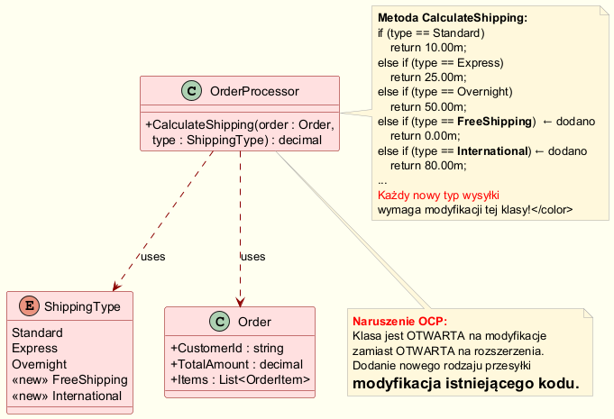
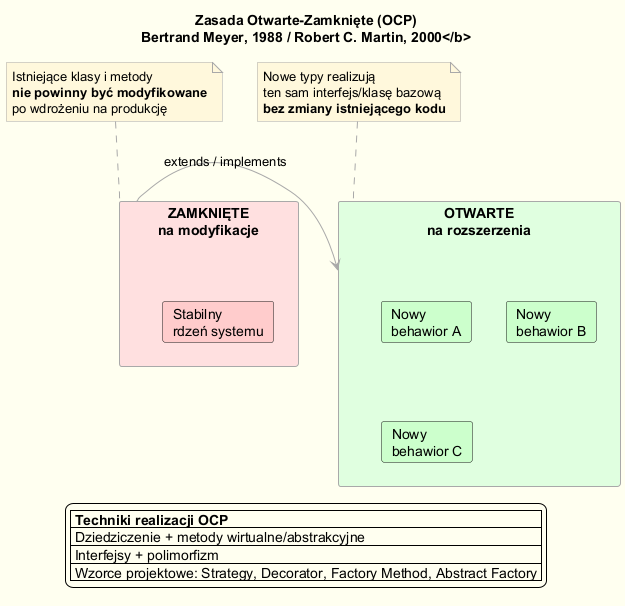
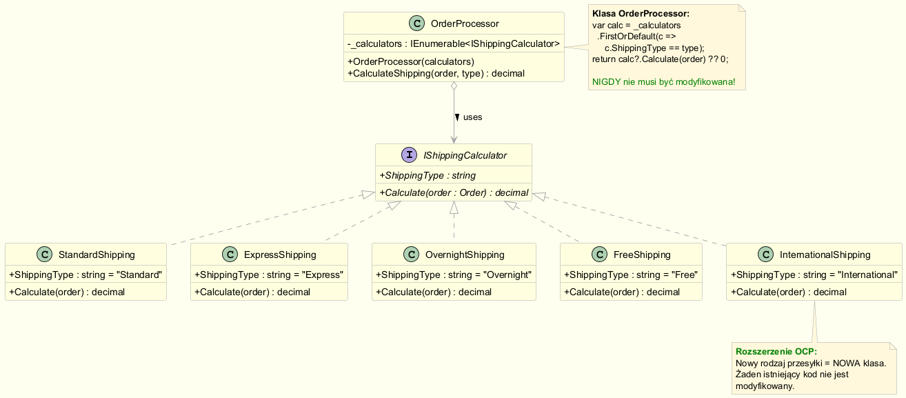
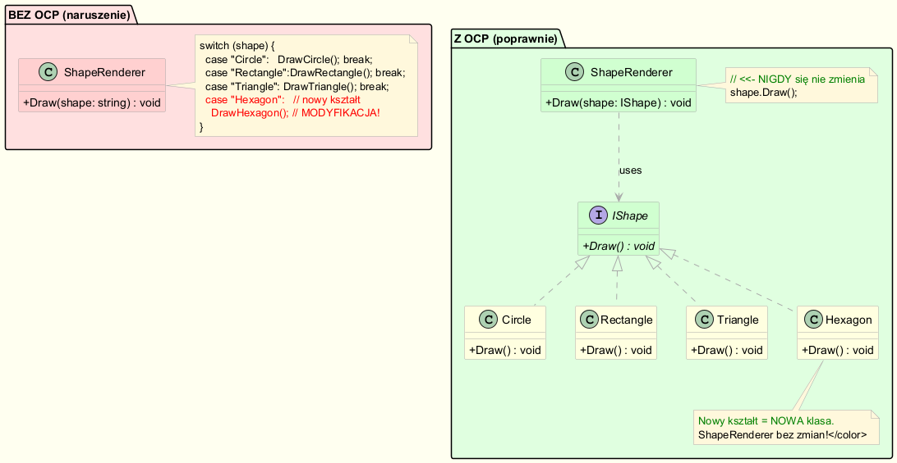

# Zasada Otwarte-Zamknięte (Open-Closed Principle, OCP)

---

## Definicja

> *„Moduły programowe powinny być **otwarte na rozszerzenie**, lecz **zamknięte na modyfikacje**."*  
> — Bertrand Meyer, *Object-Oriented Software Construction* (1988)  
> Spopularyzowana przez Roberta C. Martina jako litera **O** w zasadach **SOLID** (2000)

OCP mówi o tym, że po wdrożeniu klasy na produkcję jej zachowanie powinniśmy móc rozszerzać **przez dodawanie nowego kodu**, nie przez **zmianę istniejącego**. Zmiana istniejącego kodu niesie ryzyko regresji — psuje to, co już działa.

---

## Motywacja: co się dzieje BEZ OCP

Wyobraź sobie system sklepu e-commerce obsługujący różne rodzaje wysyłki:

```csharp
public decimal CalculateShipping(Order order, ShippingType type)
{
    if (type == ShippingType.Standard)   return 10.00m;
    else if (type == ShippingType.Express)   return 25.00m;
    else if (type == ShippingType.Overnight) return 50.00m;
    // Miesiąc później: dodano nowe opcje wysyłki
    else if (type == ShippingType.FreeShipping)    return 0.00m;    // MODYFIKACJA
    else if (type == ShippingType.International)   return 80.00m;   // MODYFIKACJA
    else throw new ArgumentOutOfRangeException(...);
}
```

**Co jest złe w tym kodzie?**

| Problem | Konsekwencja |
|---------|-------------|
| Każde nowe wymaganie = modyfikacja klasy | Ryzyko wprowadzenia błędu w istniejącej logice |
| Klasa zna wszystkie typy wysyłki | Naruszenie zasady jednej odpowiedzialności (SRP) |
| Testy regresyjne muszą pokryć całą metodę | Spadek szybkości dostarczania zmian |
| Trudna rozszerzalność przez zewnętrzne biblioteki | Brak możliwości dodania logiki pluginowo |



Pełny kod przykładu: [`WithoutOcp/OrderProcessor.cs`](Examples/WithoutOcp/OrderProcessor.cs)

---

## Zasada OCP — wizualizacja



Schemat pokazuje podział systemu na:
- **Rdzeń zamknięty** — stabilne klasy, które nie ulegają zmianie
- **Otwarte rozszerzenia** — nowe typy zachowań dodawane przez implementację interfejsu

---

## Jak uzyskać OCP

Techniki realizacji OCP w C#:

### 1. Interfejsy + polimorfizm (najczęstszy)

```csharp
public interface IShippingCalculator
{
    string ShippingType { get; }
    decimal Calculate(Order order);
}

public class StandardShipping : IShippingCalculator
{
    public string ShippingType => "Standard";
    public decimal Calculate(Order order) => 10.00m;
}

public class InternationalShipping : IShippingCalculator
{
    public string ShippingType => "International";
    public decimal Calculate(Order order)
        => order.TotalAmount >= 200m ? 50.00m : 80.00m;
}
```

Klasa `OrderProcessor` jest teraz **zamknięta na modyfikacje**:

```csharp
public class OrderProcessor
{
    private readonly IEnumerable<IShippingCalculator> _calculators;

    public OrderProcessor(IEnumerable<IShippingCalculator> calculators)
        => _calculators = calculators;

    public decimal CalculateShipping(Order order, string shippingType)
    {
        var calculator = _calculators
            .FirstOrDefault(c => c.ShippingType == shippingType);
        return calculator?.Calculate(order)
            ?? throw new InvalidOperationException($"Nieznany typ: {shippingType}");
    }
}
```

Dodanie nowego rodzaju wysyłki `SameDayShipping` to **wyłącznie nowa klasa**:

```csharp
public class SameDayShipping : IShippingCalculator
{
    public string ShippingType => "SameDay";
    public decimal Calculate(Order order) => 99.00m + order.TotalAmount * 0.01m;
}
```



Pełny kod: [`WithOcp/OrderProcessor.cs`](Examples/WithOcp/OrderProcessor.cs)

### 2. Klasy abstrakcyjne + dziedziczenie

```csharp
public abstract class Notification
{
    public abstract void Send(string message);
}

public class EmailNotification : Notification
{
    public override void Send(string message) 
        => Console.WriteLine($"Email: {message}");
}

public class SmsNotification : Notification   // Nowy typ — brak zmian w Notification
{
    public override void Send(string message) 
        => Console.WriteLine($"SMS: {message}");
}
```

### 3. Wzorzec Strategy (przykład z kształtami)

```csharp
interface IShape { void Draw(); }

class Circle    : IShape { public void Draw() => Console.WriteLine("Koło");      }
class Rectangle : IShape { public void Draw() => Console.WriteLine("Prostokąt"); }
class Hexagon   : IShape { public void Draw() => Console.WriteLine("Sześciokąt"); }

class ShapeRenderer
{
    // Ta metoda NIGDY nie ulega zmianie niezależnie od liczby kształtów
    public void Draw(IShape shape) => shape.Draw();
}
```



---

## OCP a wzorce kreacyjne (fabryki)

OCP jest **fundamentem uzasadniającym wzorce fabryki**:

| Wzorzec | Jak realizuje OCP |
|---------|------------------|
| **Simple Factory** | Centralizuje tworzenie obiektów — ale sam narusza OCP (if/switch) |
| **Factory Method** | Klasa bazowa definiuje szkielet, podklasy rozszerzają tworzenie |
| **Abstract Factory** | Cała rodzina produktów jest wymienna bez zmiany klienta |

> **Kluczowe pytanie:** co w systemie może się zmieniać? Tam należy wbudować punkt rozszerzenia (interfejs/metodę wirtualną). Resztę można „zamknąć".

---

## Gdy OCP jest zbyt kosztowne — pragmatyczne podejście

OCP nie oznacza, że **każdej** klasy nie można nigdy zmieniać.

> *„Opór przed zmianą kosztuje czas. Wdrażaj OCP po zidentyfikowaniu pierwszej rzeczywistej zmiany."*  
> — Robert C. Martin, *Agile Software Development* (2002)

**Reguła praktyczna:**
1. Za pierwszym razem — napisz prostą implementację (nawet naruszającą OCP).
2. Za drugim razem — wytrzymaj dyskomfort.
3. Za trzecim razem — refaktoryzuj do wzorca OCPowego.

---

## Podsumowanie

```
Zamknięte na modyfikacje:
    ✓ Istniejące klasy stabilne
    ✓ Brak ryzyka regresji
    ✓ Bezpieczne wdrożenia

Otwarte na rozszerzenia:
    ✓ Nowy byt = nowa klasa
    ✓ Zero ingerencji w przetestowany kod
    ✓ Możliwe pluginy / zewnętrzne rozszerzenia
```

---

## Uruchomienie przykładów

```bash
cd src/02-fabryka/01-open-close/Examples
dotnet run
```

---

## Literatura i źródła

- Meyer, B. (1988). *Object-Oriented Software Construction*. Prentice Hall.
- Martin, R. C. (2002). *Agile Software Development, Principles, Patterns, and Practices*. Prentice Hall. — rozdziały 8–9.
- Martin, R. C. (2017). *Clean Architecture*. Prentice Hall. — rozdział 8 (OCP).
- [Open-Closed Principle — Refactoring.Guru](https://refactoring.guru/solid/ocp)
- [Open–closed principle — Wikipedia](https://en.wikipedia.org/wiki/Open%E2%80%93closed_principle)
- [SOLID Principles: Open/Closed Principle — Microsoft Learn](https://learn.microsoft.com/en-us/archive/msdn-magazine/2014/may/csharp-best-practices-dangers-of-violating-solid-principles-in-csharp)
