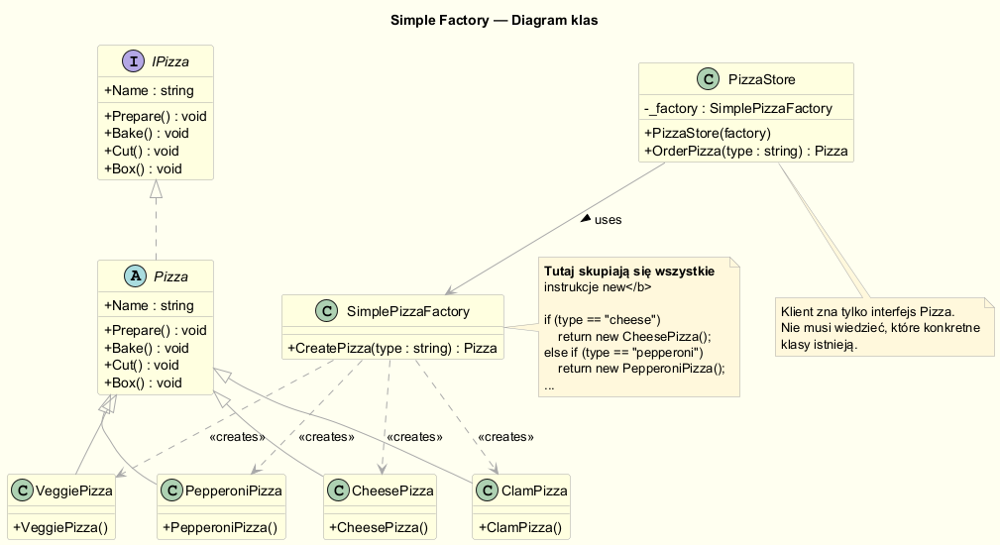
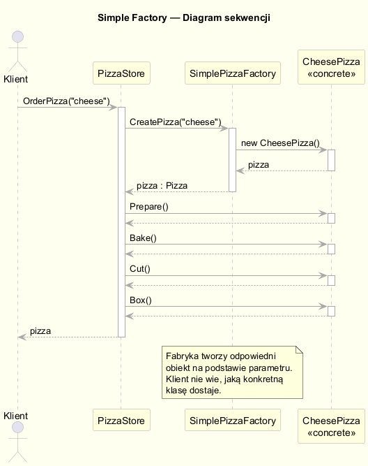
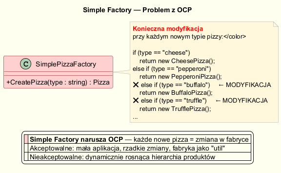
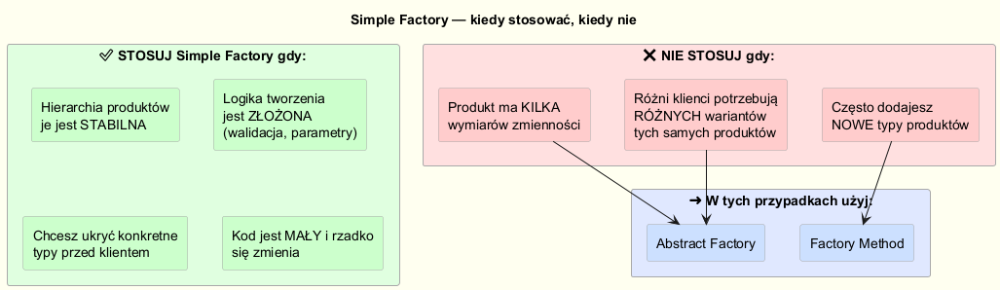

# Simple Factory — (Anty)wzorzec Prostej Fabryki

---

## Definicja

**Simple Factory** (Prosta Fabryka) nie jest wzorcem projektowym z książki *Design Patterns* (GoF), lecz **popularnym idiomem programistycznym** — enkapsuluje logikę tworzenia obiektów w dedykowanej klasie.

Wyrażenie „(anty)wzorzec" jest tu celowe — prosta fabryka **rozwiązuje realny problem** (ukrycie logiki `new`), ale **narusza zasadę OCP** i przy dużej hierarchii produktów staje się przeszkodą.

---

## Problem: rozproszony kod tworzenia obiektów

Bez żadnej fabryki klient sam decyduje, jakie konkretne typy tworzyć:

```csharp
Pizza pizza;
if (type == "cheese")    pizza = new CheesePizza();
else if (type == "pepperoni") pizza = new PepperoniPizza();
else if (type == "veggie")    pizza = new VeggiePizza();
// ...
// Ta sama logika jest powtórzona w KAŻDYM miejscu, które tworzy pizzę
pizza.Prepare();
pizza.Bake();
// ...
```

Gdy pojawia się nowy typ pizzy, musimy zmienić **każde** miejsce w kodzie.

---

## Simple Factory — rozwiązanie

Przenosimy logikę `new` do jednego miejsca:

```csharp
public class SimplePizzaFactory
{
    public Pizza? CreatePizza(string type)
    {
        return type.ToLower() switch
        {
            "cheese"    => new CheesePizza(),
            "pepperoni" => new PepperoniPizza(),
            "veggie"    => new VeggiePizza(),
            "clam"      => new ClamPizza(),
            _           => null
        };
    }
}
```

Klient (`PizzaStore`) korzysta wyłącznie z abstrakcji `Pizza`:

```csharp
public class PizzaStore
{
    private readonly SimplePizzaFactory _factory;

    public PizzaStore(SimplePizzaFactory factory)
        => _factory = factory;

    public Pizza? OrderPizza(string type)
    {
        var pizza = _factory.CreatePizza(type);   // nie wie, co dostaje
        pizza?.Prepare();
        pizza?.Bake();
        pizza?.Cut();
        pizza?.Box();
        return pizza;
    }
}
```

### Diagram klas



### Diagram sekwencji



Pełny kod: [`Examples/PizzaStore/PizzaStore.cs`](Examples/PizzaStore/PizzaStore.cs)

---

## Przykład 2: Fabryka powiadomień

```csharp
public class NotificationFactory
{
    public INotification Create(string channel)
    {
        return channel.ToLower() switch
        {
            "email" => new EmailNotification(),
            "sms"   => new SmsNotification(),
            "push"  => new PushNotification(),
            "slack" => new SlackNotification(),
            _ => throw new ArgumentException($"Nieznany kanał: {channel}")
        };
    }
}

// Klient
var service = new NotificationService(new NotificationFactory());
service.Notify("email", "user@example.com", "Zamówienie gotowe");
service.Notify("slack", "zamowienia", "Wymaga uwagi");
```

Kod: [`Examples/Notifications/NotificationFactory.cs`](Examples/Notifications/NotificationFactory.cs)

---

## Problem z OCP



Każde nowe `Pizza` (lub nowy kanał `INotification`) wymaga **modyfikacji** metody `CreatePizza`. To naruszenie zasady OCP:

```csharp
// Przed dodaniem BuffaloPizza:
"cheese"    => new CheesePizza(),
"pepperoni" => new PepperoniPizza(),

// Po — konieczna MODYFIKACJA istniejącego kodu:
"buffalo"   => new BuffaloPizza(),   // ← zmiana w przetestowanym kodzie!
```

**Konsekwencje:**
- Każda zmiana to potencjalna regresja
- Fabryka zna wszystkie typy produktów — naruszenie SRP
- Trudniejszy test jednostkowy (potrzebny mock fabryki)

---

## Kiedy Simple Factory jest akceptowalna



| Sytuacja | Ocena |
|----------|-------|
| Mała liczba typów produktów, rzadko rozszerzana | ✅ Akceptowalne |
| Logika tworzenia jest złożona (walidacja, dekoratorem) | ✅ Simple Factory izoluje złożoność |
| Klient ma być odizolowany od konkretnych implementacji | ✅ Cel osiągnięty |
| Często dodajemy nowe typy produktów | ❌ Użyj Factory Method |
| Różni klienci potrzebują różnych wariantów produktów | ❌ Użyj Abstract Factory |

---

## Simple Factory vs wzorce GoF

| Cecha | Simple Factory | Factory Method | Abstract Factory |
|-------|---------------|----------------|-----------------|
| Wzorzec GoF | ❌ Idiom | ✅ Tak | ✅ Tak |
| Narusza OCP | ✅ Tak | ❌ Nie | ❌ Nie |
| Klasy tworzące | 1 klasa | Hierarchia klas | Hierarchia fabryk |
| Ilość produktów | 1 hierarchia | 1 hierarchia | Rodziny produktów |
| Złożoność | Niska | Średnia | Wysoka |

---

## Uruchomienie przykładów

```bash
cd src/02-fabryka/02-simple-factory/Examples
dotnet run
```

---

## Oczekiwany output

```
═══ Przykład 1: Pizzeria (Head First) ═══

Przygotowuję Margherita
  Ciasto: cienkie ciasto
  Sos: sos pomidorowy
  Dodatki: mozzarella, bazylia
  Pieczenie Margherita w 200°C ...
  ...
```

---

## Literatura i źródła

- Freeman, E., Robson, E. (2020). *Head First Design Patterns* (2nd ed.). O'Reilly. — Rozdział 4: Factory patterns.
- Gamma, E. et al. (1994). *Design Patterns*. Addison-Wesley.
- Martin, R. C. (2009). *Clean Code*. Prentice Hall.
- [Factory Method — Refactoring.Guru](https://refactoring.guru/design-patterns/factory-method)
- [SimpleFactory vs FactoryMethod — Stack Overflow](https://stackoverflow.com/questions/5739611/what-are-the-differences-between-abstract-factory-and-factory-design-patterns)
