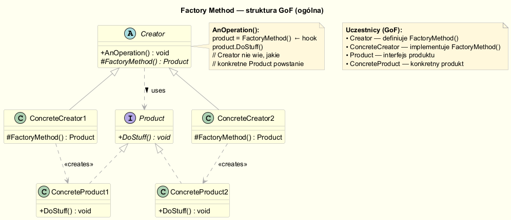
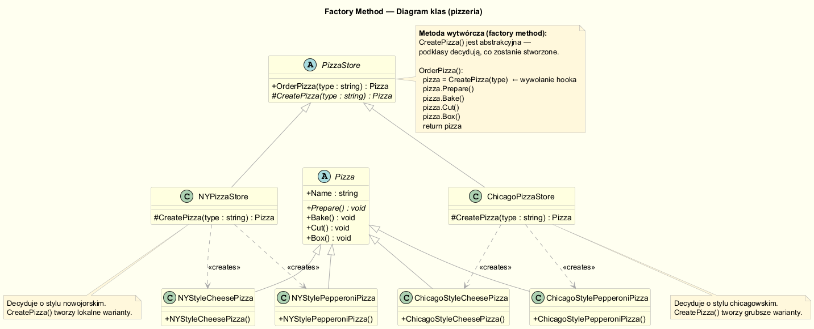
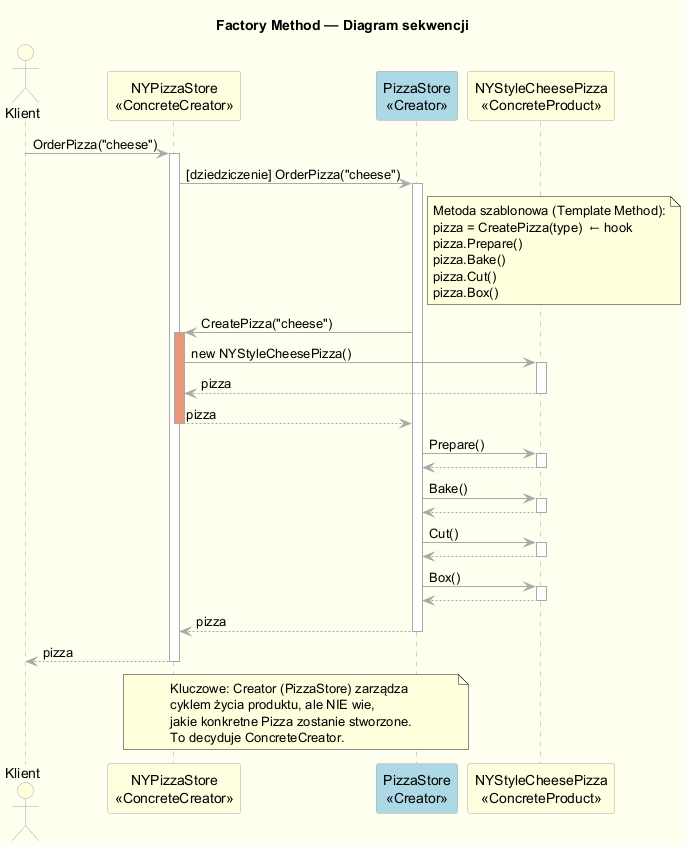
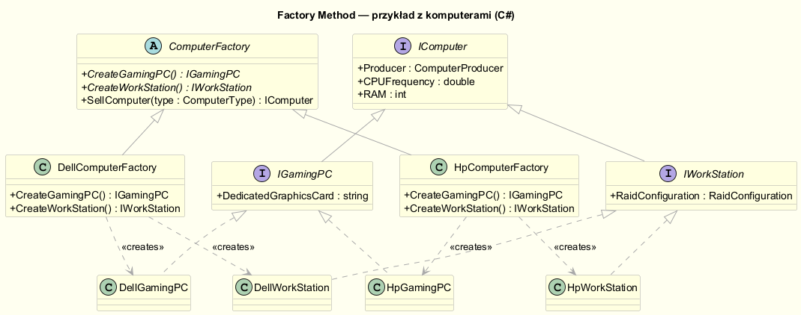

# Metoda Wytwórcza (Factory Method)

## Cel wzorca

**Metoda Wytwórcza** definiuje interfejs do tworzenia obiektu, ale pozwala
podklasom decydować, którą klasę konkretną instancjonować. Metoda wytwórcza
pozwala klasie odroczyć tworzenie instancji na podklasy.

> *"Define an interface for creating an object, but let subclasses decide which
> class to instantiate. Factory Method lets a class defer instantiation to
> subclasses."*
> — GoF, *Design Patterns*, s. 107

---

## Struktura GoF



| Rola              | Opis                                                                    |
|-------------------|-------------------------------------------------------------------------|
| **Creator**       | Deklaruje metodę wytwórczą `FactoryMethod()`; może zawierać domyślną implementację |
| **ConcreteCreator** | Nadpisuje `FactoryMethod()` i zwraca konkretny `ConcreteProduct`      |
| **Product**       | Interfejs/klasa abstrakcyjna produktu                                   |
| **ConcreteProduct** | Konkretna implementacja produktu                                      |

---

## Problem: dlaczego nie wystarczy Simple Factory?

W Simple Factory logika wyboru klasy jest w **jednej metodzie statycznej** —
to narusza Open-Closed Principle: każdy nowy typ produktu wymaga edycji fabryki.

Metoda Wytwórcza przenosi odpowiedzialność do **hierarchii klas**:
nowy typ → nowa podklasa Creator. Istniejący kod nie zmienia się.

---

## Przykład klasyczny: Pizzeria



### Kod źródłowy

**Creator (abstrakcyjna klasa bazowa):**

```csharp
public abstract class PizzaStore
{
    // Metoda wytwórcza — hook dla podklas
    protected abstract Pizza CreatePizza(string type);

    // Metoda szablonowa — algorytm jest TUTAJ, tworzenie w podklasach
    public Pizza OrderPizza(string type)
    {
        var pizza = CreatePizza(type);   // "nie pytaj mnie, pytaj podklasę"
        pizza.Prepare();
        pizza.Bake();
        pizza.Cut();
        pizza.Box();
        return pizza;
    }
}
```

**ConcreteCreator:**

```csharp
public class NYPizzaStore : PizzaStore
{
    protected override Pizza CreatePizza(string type) =>
        type.ToLower() switch
        {
            "cheese"    => new NYStyleCheesePizza(),
            "pepperoni" => new NYStylePepperoniPizza(),
            "veggie"    => new NYStyleVeggiePizza(),
            _ => throw new ArgumentException($"Nieznany typ: {type}")
        };
}
```

### Diagram sekwencji



---

## Przykład domenowy: Fabryka komputerów



```csharp
public abstract class ComputerFactory
{
    public abstract IGamingPC    CreateGamingPC();
    public abstract IWorkStation CreateWorkStation();
}

public class DellComputerFactory : ComputerFactory
{
    public override IGamingPC    CreateGamingPC()    => new DellGamingPC();
    public override IWorkStation CreateWorkStation() => new DellWorkStation();
}
```

Klient zna tylko **abstrakcyjne interfejsy** — wybór konkretnych klas jest
wstrzykiwany z zewnątrz (patrz przykład 2 w `Program.cs`).

---

## Relacja z innymi wzorcami

### Metoda Wytwórcza a Metoda Szablonowa

`OrderPizza()` to jednocześnie **Template Method** — definiuje algorytm
(prepare → bake → cut → box), delegując jeden krok (`CreatePizza`) do podklas.
To klasyczny przykład współpracy dwóch wzorców.

### Metoda Wytwórcza a Open-Closed Principle

```
Dodanie nowej lini produktów:
  ✅  Nowa podklasa (NYPizzaStore → PalermoPizzaStore)
  ✅  Nowe klasy produktów (PalermoStyleSicilianPizza)
  ❌  NIE modyfikujemy PizzaStore ani OrderPizza()
```

---

## Kiedy stosować Metodę Wytwórczą?

| Sytuacja | Rekomendacja |
|---|---|
| Klasa nie powinna wiedzieć, jakiego typu obiekt tworzy | ✅ użyj Factory Method |
| Chcesz umożliwić podklasom rozszerzenie logiki tworzenia | ✅ użyj Factory Method |
| Masz jedną konfigurację i nie planujesz rozszerzenia | 🟡 rozważ Simple Factory |
| Chcesz tworzyć **rodziny** powiązanych obiektów | ➡️ użyj Abstract Factory |
| Tworzenie obiektu jest proste i jednorazowe | ❌ nie komplikuj, użyj `new` |

---

## Porównanie: Simple Factory vs Factory Method

| Cecha                     | Simple Factory               | Factory Method                    |
|---------------------------|------------------------------|-----------------------------------|
| Mechanizm                 | Metoda statyczna             | Metoda wirtualna/abstrakcyjna     |
| Rozszerzalność            | Wymaga modyfikacji fabryki   | Dodanie nowej podklasy            |
| OCP                       | Narusza                      | Zachowuje                         |
| Typowe użycie             | Prosta enkapsulacja `new`    | Hierarchia fabryk, frameworki     |
| Polimorfizm               | Brak (statyczny)             | Pełny (runtime)                   |

---

## Uruchomienie przykładów

```bash
cd src/02-fabryka/03-factory-method/Examples
dotnet run
```

---

## Literatura

- Freeman E., Robson E. — *Head First Design Patterns*, wyd. 2, O'Reilly 2021, rozdz. 4
- Gamma E. et al. — *Design Patterns: Elements of Reusable OO Software*, Addison-Wesley 1994, s. 107
- Shvets A. — *Dive into Design Patterns*, <https://refactoring.guru/design-patterns/factory-method>
- Microsoft — *Factory Method in C#*, <https://refactoring.guru/design-patterns/factory-method/csharp/example>
