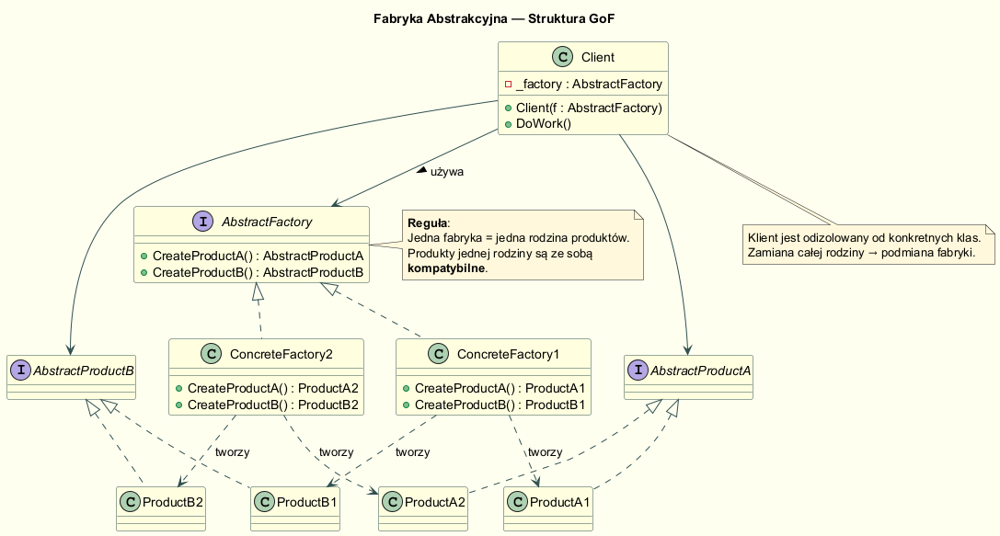
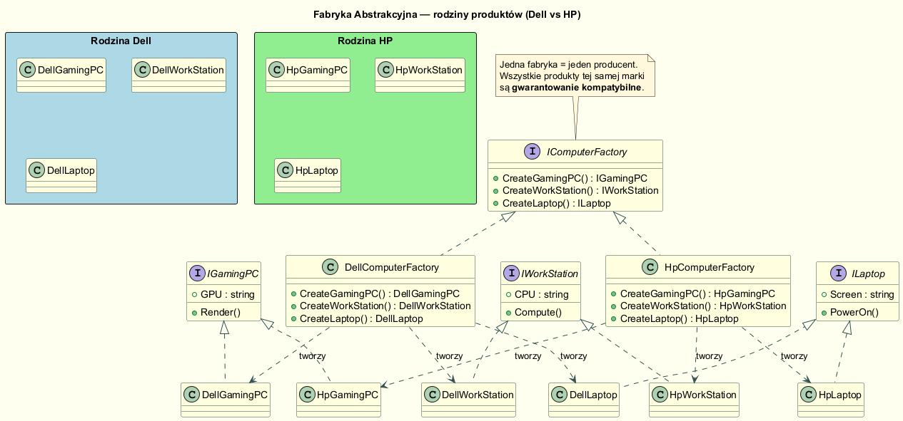
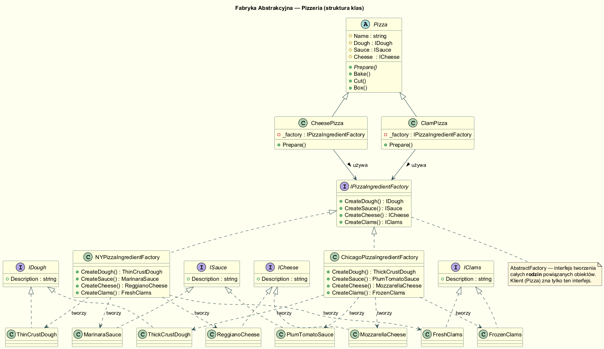
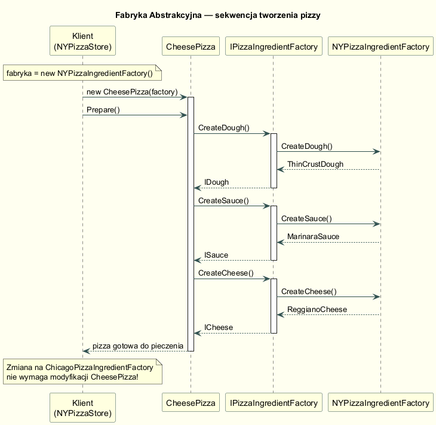

# Fabryka Abstrakcyjna (Abstract Factory)

## Cel wzorca

**Fabryka Abstrakcyjna** dostarcza interfejs do tworzenia **rodzin** powiązanych
lub zależnych obiektów bez specyfikowania ich konkretnych klas.

> *"Provide an interface for creating families of related or dependent objects
> without specifying their concrete classes."*
> — GoF, *Design Patterns*, s. 87

---

## Struktura GoF



| Rola                  | Opis                                                                     |
|-----------------------|--------------------------------------------------------------------------|
| **AbstractFactory**   | Interfejs z metodami wytwórczymi dla każdego typu produktu               |
| **ConcreteFactory**   | Implementuje możliwe kombinacje — jedna klasa = jedna rodzina produktów  |
| **AbstractProduct**   | Interfejs konkretnego typu produktu                                      |
| **ConcreteProduct**   | Konkretna implementacja produktu z danej rodziny                         |
| **Client**            | Używa tylko **AbstractFactory** i **AbstractProduct** — brak zależności od konkretów |

---

## Kluczowa idea: rodziny produktów

Fabryka Abstrakcyjna gwarantuje, że produkty z tej samej rodziny są
**kompatybilne** — nigdy nie pomylisz składników NY z Chicago, ani sprzętu
Dell z HP.



```
Dell → DellGamingPC + DellWorkStation + DellLaptop   ← spójna rodzina
HP   → HpGamingPC  + HpWorkStation  + HpLaptop       ← spójna rodzina
```

---

## Przykład klasyczny: Pizzeria ze składnikami



### Fabryka abstrakcyjna (interfejs)

```csharp
public interface IPizzaIngredientFactory
{
    IDough  CreateDough();
    ISauce  CreateSauce();
    ICheese CreateCheese();
    IClams  CreateClams();
}
```

### Fabryki konkretne

```csharp
// NY — cienkie ciasto, świeże małże
public class NYPizzaIngredientFactory : IPizzaIngredientFactory
{
    public IDough  CreateDough()  => new ThinCrustDough();
    public ISauce  CreateSauce()  => new MarinaraSauce();
    public ICheese CreateCheese() => new ReggianoCheese();
    public IClams  CreateClams()  => new FreshClams();
}

// Chicago — grube ciasto, mrożone małże
public class ChicagoPizzaIngredientFactory : IPizzaIngredientFactory
{
    public IDough  CreateDough()  => new ThickCrustDough();
    public ISauce  CreateSauce()  => new PlumTomatoSauce();
    public ICheese CreateCheese() => new MozzarellaCheese();
    public IClams  CreateClams()  => new FrozenClams();
}
```

### Klient (Pizza) — uniezależniony od konkretów

```csharp
public class CheesePizza : Pizza
{
    private readonly IPizzaIngredientFactory _factory;
    public CheesePizza(IPizzaIngredientFactory factory) => _factory = factory;

    public override void Prepare()
    {
        Dough  = _factory.CreateDough();   // nie wie: Thin czy Thick?
        Sauce  = _factory.CreateSauce();   // nie wie: Marinara czy Plum?
        Cheese = _factory.CreateCheese();  // nie wie: Reggiano czy Mozzarella?
    }
}
```

### Diagram sekwencji



---

## Przykład domenowy: fabryki komputerów

```csharp
public interface IComputerFactory
{
    IGamingPC    CreateGamingPC();
    IWorkStation CreateWorkStation();
    ILaptop      CreateLaptop();
}

// Klient (Office) używa tylko IComputerFactory — zero wzmianek o Dell/HP
public class Office
{
    private readonly IComputerFactory _factory;
    public Office(IComputerFactory factory) => _factory = factory;

    public void SetupAllEquipment()
    {
        _factory.CreateGamingPC().Render();
        _factory.CreateWorkStation().Compute();
        _factory.CreateLaptop().PowerOn();
    }
}
```

---

## Kiedy stosować Fabrykę Abstrakcyjną?

| Sytuacja | Rekomendacja |
|---|---|
| System powinien być niezależny od sposobu tworzenia produktów | ✅ Abstract Factory |
| System konfiguruje się dla jednej z wielu rodzin produktów | ✅ Abstract Factory |
| Chcesz wymuszić kompatybilność między produktami | ✅ Abstract Factory |
| Potrzebujesz tworzyć tylko jeden typ produktu | ➡️ Factory Method |
| Zbiór produktów rzadko się zmienia, ale typy często | 🟡 rozważ Factory Method |

---

## Porównanie: Factory Method vs Abstract Factory

| Cecha                     | Factory Method                  | Abstract Factory                        |
|---------------------------|---------------------------------|-----------------------------------------|
| Granularność              | Jedna metoda wytwórcza          | Wiele metod — cała rodzina              |
| Mechanizm rozszerzania    | Dziedziczenie (nowa podklasa)   | Kompozycja (nowa fabryka)               |
| Cel                       | Odroczone tworzenie jednego obj.| Tworzenie spójnych rodzin obiektów      |
| OCP                       | Zachowuje (nowa podklasa)       | Zachowuje (nowa fabryka implementuje interfejs) |
| Wstrzykiwanie             | Rzadziej (przez dziedziczenie)  | Często (Dependency Injection)           |

---

## Wada: rozbudowanie przy nowym typie produktu

Dodanie nowej metody do `IPizzaIngredientFactory` (np. `CreateVegetables()`)
wymaga **modyfikacji wszystkich** fabryk konkretnych. To jedyna poważna
wada wzorca — naruszenie OCP w przypadku zmiany interfejsu fabryki.

---

## Uruchomienie przykładów

```bash
cd src/02-fabryka/04-abstract-factory/Examples
dotnet run
```

---

## Literatura

- Freeman E., Robson E. — *Head First Design Patterns*, wyd. 2, O'Reilly 2021, rozdz. 4
- Gamma E. et al. — *Design Patterns: Elements of Reusable OO Software*, Addison-Wesley 1994, s. 87
- Shvets A. — *Dive into Design Patterns*, <https://refactoring.guru/design-patterns/abstract-factory>
- Microsoft — *Abstract Factory in C#*, <https://refactoring.guru/design-patterns/abstract-factory/csharp/example>
