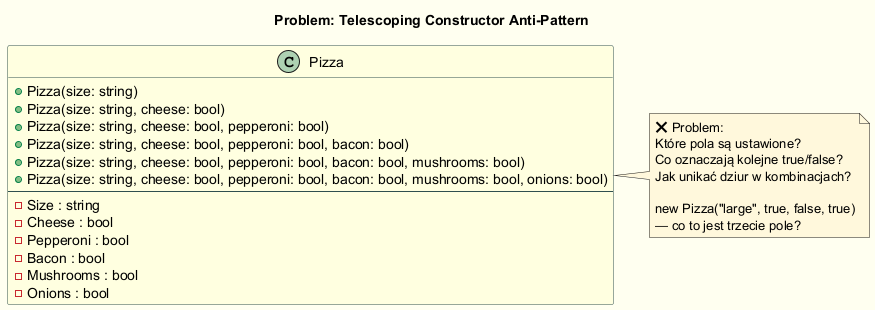
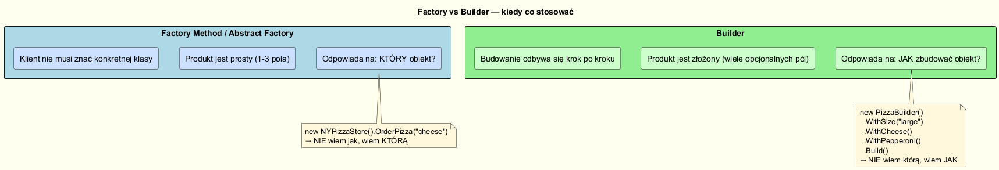

# Problem z Konstrukcją Złożonych Obiektów

## Motywacja — skąd potrzeba Buildera?

Wzorzec **Fabryka** odpowiada na pytanie: *który obiekt stworzyć?*
Nie rozwiązuje jednak innego problemu: *jak skonstruować obiekt z wieloma
opcjonalnymi parametrami konfiguracyjnymi?*

---

## Problem 1: Teleskopowy konstruktor (Telescoping Constructor)



Gdy obiekt ma wiele opcjonalnych pól, naturalnie pojawia się seria przeciążeń:

```csharp
public Pizza(string size) : this(size, false) { }
public Pizza(string size, bool cheese) : this(size, cheese, false) { }
public Pizza(string size, bool cheese, bool pepperoni) : this(size, cheese, pepperoni, false) { }
// ... kolejne 3 kombinacje
```

### Co jest nie tak?

```csharp
// Co oznacza to wywołanie?
var p = new Pizza("large", true, false, true);
//                           ↑     ↑     ↑
//                        cheese? pepperoni? bacon? — trzeba zajrzeć do definicji!
```

- Kod klienta jest **nieczytelny** — pozycja `true/false` nie mówi nic sama w sobie
- Przy `n` opcjonalnych polach mamy potencjalnie `2^n` kombinacji
- Dodanie nowego pola wymaga modyfikacji wszystkich konstruktorów

---

## Problem 2: Object Initializer — mutowalność

C# oferuje składnię `new Foo { Prop = val }`, która jest czytelna, ale wymaga
publicznych setterów — obiekt jest **mutowalny** i można go modyfikować po
stworzeniu:

```csharp
var pizza = new Pizza { Size = "small", Cheese = true };
// Ktoś później:
pizza.Bacon = true;  // ← obiekt zmienił się po zwrocie z metody — błąd logiczny
```

---

## Rozwiązanie: Builder

```csharp
var pizza = new Pizza.Builder("large")
    .WithCheese()
    .WithBacon()
    .Build();
```

Zalety:
- **Czytelność** — każde wywołanie mówi, co dodajemy (`WithBacon()`)
- **Niemutowalność** — `Pizza` ma tylko gettery, Builder ma prywatny konstruktor
- **Walidacja w jednym miejscu** — w `Build()` lub w setterach buildera
- **Open-Closed** — nowe opcje to nowe metody `WithX()`, nie nowe konstruktory

---

## Factory vs Builder — różne role



| Pytanie                      | Wzorzec              |
|-----------------------------|----------------------|
| *Który* obiekt stworzyć?    | Factory Method / Abstract Factory |
| *Jak* skonstruować złożony obiekt? | **Builder**     |

**Mogą współpracować:** Factory może wybierać odpowiedni Builder, a Builder
konstruuje właściwy Product.

---

## Kiedy warto zastanowić się nad Builderem?

| Sygnał w kodzie | Co sugeruje |
|---|---|
| Konstruktor z ≥ 4 parametrami | Kandydat na Builder |
| Wiele opcjonalnych parametrów nullable | Silny kandydat |
| Konstruktor `new Foo(null, null, true, null, "x")` | Builder prawdopodobnie konieczny |
| Różne "tryby" tworzenia tego samego obiektu | Builder lub Factory Method |

---

## Uruchomienie

```bash
cd src/03-budowniczy/01-problem-konstrukcji/Examples
dotnet run
```

---

## Literatura

- Bloch J. — *Effective Java*, 3rd ed., Addison-Wesley 2018, Item 2: "Consider a builder when faced with many constructor parameters"
- Gamma E. et al. — *Design Patterns*, Addison-Wesley 1994, s. 97
- Shvets A. — *Builder Pattern*, <https://refactoring.guru/design-patterns/builder>
