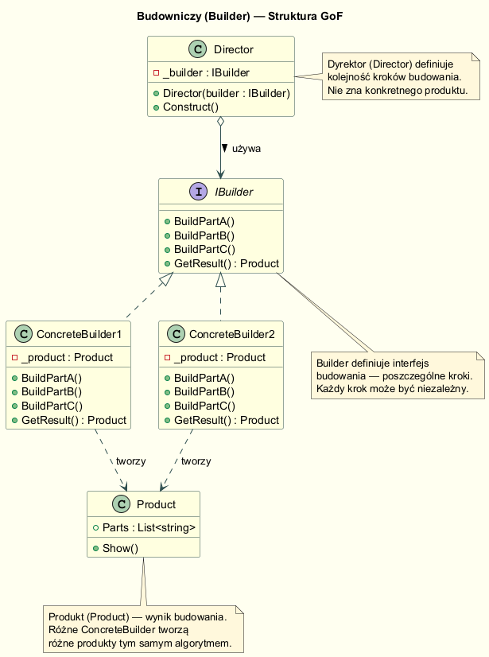
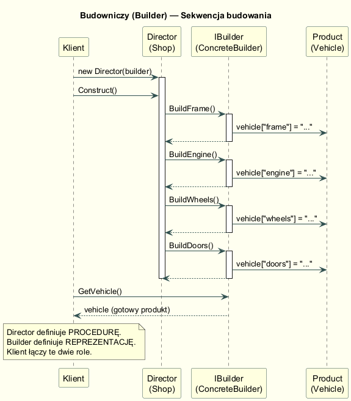
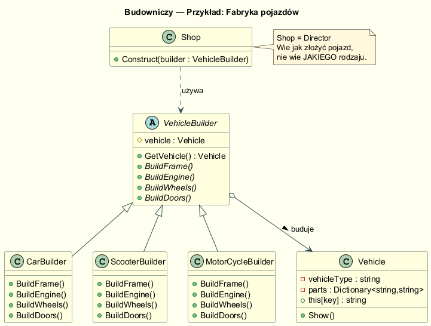

# Struktura GoF: Director + Builder + ConcreteBuilder + Product

## Definicja

**Budowniczy** oddziela konstruowanie złożonego obiektu od jego reprezentacji,
dzięki czemu ten sam proces konstruowania może tworzyć różne reprezentacje.

> *"Separate the construction of a complex object from its representation so
> that the same construction process can create different representations."*
> — GoF, *Design Patterns*, s. 97

---

## Struktura wzorca



### Uczestnicy

| Rola | Odpowiedzialność |
|---|---|
| **Director** | Definiuje kolejność kroków — algorytm budowania |
| **Builder** (interfejs) | Deklaruje metody dla każdego kroku budowania |
| **ConcreteBuilder** | Implementuje kroki; przechowuje i zwraca gotowy produkt |
| **Product** | Złożony obiekt będący wynikiem budowania |

---

## Diagram sekwencji



Kluczowa obserwacja: Director **wywołuje kroki** w określonej kolejności,
ale nie wie, jaki konkretnie produkt powstaje. ConcreteBuilder **wie jak**
budować każdą część, ale nie zna algorytmu składania.

---

## Przykład: Fabryka pojazdów



### Abstract Builder

```csharp
public abstract class VehicleBuilder
{
    protected Vehicle _vehicle = null!;
    public Vehicle GetVehicle() => _vehicle;

    public abstract void BuildFrame();
    public abstract void BuildEngine();
    public abstract void BuildWheels();
    public abstract void BuildDoors();
}
```

### ConcreteBuilder

```csharp
public class CarBuilder : VehicleBuilder
{
    public CarBuilder() => _vehicle = new Vehicle("Car");

    public override void BuildFrame()  => _vehicle["frame"]  = "Car Frame — Steel Unibody";
    public override void BuildEngine() => _vehicle["engine"] = "2.0T 204 KM";
    public override void BuildWheels() => _vehicle["wheels"] = "4 × 215/55 R17";
    public override void BuildDoors()  => _vehicle["doors"]  = "4";
}
```

### Director (Shop)

```csharp
public class Shop
{
    public void Construct(VehicleBuilder builder)
    {
        builder.BuildFrame();
        builder.BuildEngine();
        builder.BuildWheels();
        builder.BuildDoors();
    }
}
```

### Użycie

```csharp
var shop = new Shop();
var builder = new CarBuilder();
shop.Construct(builder);
builder.GetVehicle().Show();
```

---

## Director jest opcjonalny

W nowoczesnych implementacjach Director jest często pomijany — klient
bezpośrednio wywołuje metody buildera w wybranej kolejności. Director
ma sens gdy:

- Ten sam algorytm budowania musi być wielokrotnie używany
- Chcemy ukryć procedurę przed klientem
- Procedura jest skomplikowana i powinna być przetestowana niezależnie

---

## Porównanie z Metodą Wytwórczą

| Cecha | Factory Method | Builder (GoF) |
|---|---|---|
| Co tworzy | Jeden obiekt — wynik jednego wywołania | Złożony obiekt — wynik wielu kroków |
| Konfiguracja | Wybierana przez podklasę | Sterowana przez Director lub klienta |
| Złożoność produktu | Prosta | Złożona, wieloetapowa |
| Zwrot produktu | Natychmiastowy | Po zakończeniu wszystkich kroków |

---

## Uruchomienie

```bash
cd src/03-budowniczy/02-struktura-gof/Examples
dotnet run
```

---

## Literatura

- Gamma E. et al. — *Design Patterns*, Addison-Wesley 1994, s. 97–106
- Freeman E., Robson E. — *Head First Design Patterns*, O'Reilly 2021
- Shvets A. — *Builder*, <https://refactoring.guru/design-patterns/builder>
- Microsoft Docs — *Builder in C#*, <https://refactoring.guru/design-patterns/builder/csharp/example>
