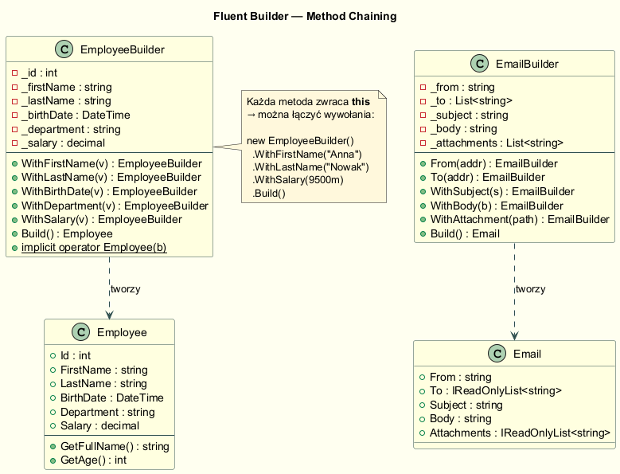
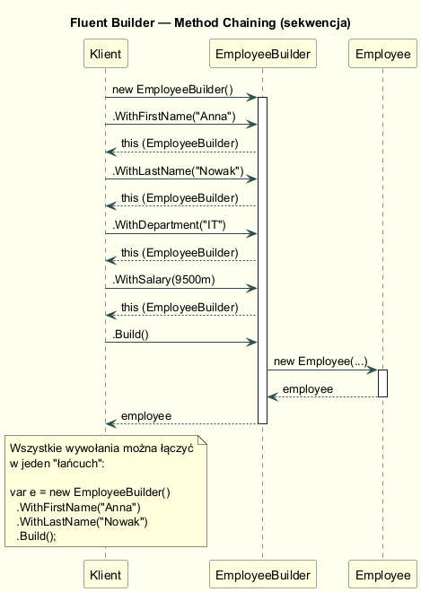

# Fluent Builder — Interfejs Płynny i Method Chaining

## Idea

**Fluent Builder** to ewolucja klasycznego Buildera GoF: zamiast zwracać `void`,
każda metoda konfiguracyjna zwraca `this`. Pozwala to na **łańcuchowanie wywołań**
w stylu przypominającym naturalny język.

> *"A fluent interface is normally implemented by using method chaining to relay
> the instruction context of a subsequent call."*
> — Martin Fowler, [FluentInterface](https://www.martinfowler.com/bliki/FluentInterface.html)

---

## Struktura



Kluczowa różnica wobec GoF: Builder **nie ma Dyrektora**. Klient sam komponuje
wywołania. Kolejność jest dowolna (chyba że użyjemy Step Buildera — patrz sekcja 04).

---

## Diagram sekwencji



---

## Implementacja: EmployeeBuilder

```csharp
public class Builder
{
    public string FirstName  { get; private set; } = "Imię";
    public string Department { get; private set; } = "Niezdefiniowany";
    public decimal Salary    { get; private set; } = 5000m;
    // ...

    // Każda metoda zwraca this → chaining
    public Builder WithFirstName(string firstName)
    {
        FirstName = firstName;
        return this;
    }

    public Builder WithSalary(decimal salary)
    {
        if (salary < 0) throw new ArgumentException("Pensja nie może być ujemna");
        Salary = salary;
        return this;
    }

    public Employee Build() => new Employee(this);
}
```

### Użycie

```csharp
var employee = new Employee.Builder()
    .WithFirstName("Anna")
    .WithLastName("Kowalska")
    .WithBirthDate(1992, 5, 14)
    .WithDepartment("Engineering")
    .WithSalary(12_500m)
    .Build();
```

---

## Konwersja niejawna (Implicit Operator)

Trick z `implicit operator` pozwala pominąć jawne wywołanie `Build()`:

```csharp
public static implicit operator Employee(Builder builder) => builder.Build();

// Użycie:
Employee e = new Employee.Builder()
    .WithFirstName("Piotr")
    .WithLastName("Wiśniewski");
// ↑ brak Build() — konwersja następuje automatycznie przy przypisaniu
```

> **Uwaga:** Ten trick jest elegancki, ale może być zaskakujący dla czytelników kodu.
> Stosuj świadomie — głównie w API publicznych, gdzie czytelność jest priorytetem.

---

## Przykład: EmailBuilder

```csharp
var email = new Email.Builder()
    .From("hr@firma.pl")
    .To("anna@firma.pl")
    .To("marek@firma.pl")
    .Cc("ceo@firma.pl")
    .WithSubject("Nowe zasady pracy zdalnej")
    .WithBody("<h1>Nowe zasady</h1><p>...</p>")
    .AsHtml()
    .WithAttachment("polityka_zdalna_2026.pdf")
    .Build();
```

Zwróć uwagę: `.To()` można wywołać wielokrotnie — Builder akumuluje listę adresatów.

---

## Walidacja w `Build()`

```csharp
public Email Build()
{
    if (string.IsNullOrWhiteSpace(SenderAddress))
        throw new InvalidOperationException("Pole From jest wymagane");
    if (ToAddresses.Count == 0)
        throw new InvalidOperationException("Wymagany co najmniej jeden adresat To");
    return new Email(this);
}
```

`Build()` to **jedyne miejsce**, gdzie walidujemy kompletność obiektu.
Pozwala to na wywołania w dowolnej kolejności, ale gwarantuje spójność wyniku.

---

## Fluent Builder vs GoF Builder

| Cecha | GoF Builder | Fluent Builder |
|---|---|---|
| Dyrektor | Wymagany | Opcjonalny / zbędny |
| Kolejność kroków | Narzucona przez Director | Dowolna (lub narzucona przez Step Builder) |
| Czytelność wywołania | Proceduralna | "Jak zdanie w języku naturalnym" |
| Walidacja | W Director lub Builder | Centralna w `Build()` |
| Powszechność użycia | Frameworki | Codzienne API, testy (test data builders) |

---

## Fluent Builder w testach jednostkowych

Fluent Builder jest wyjątkowo przydatny jako **Test Data Builder**:

```csharp
// Tworzenie danych testowych bez pisania wielu konstruktorów testowych
var employee = new Employee.Builder()
    .WithDepartment("IT")
    .WithSalary(10_000m)
    .Build();   // reszta pól = sensowne domyślne
```

---

## Uruchomienie

```bash
cd src/03-budowniczy/03-fluent-builder/Examples
dotnet run
```

---

## Literatura

- Fowler M. — *FluentInterface*, <https://www.martinfowler.com/bliki/FluentInterface.html>
- Freeman S. et al. — *Growing Object-Oriented Software, Guided by Tests*, Addison-Wesley 2009 (Test Data Builders)
- Bloch J. — *Effective Java*, 3rd ed., Addison-Wesley 2018, Item 2
- Shvets A. — *Builder*, <https://refactoring.guru/design-patterns/builder>
