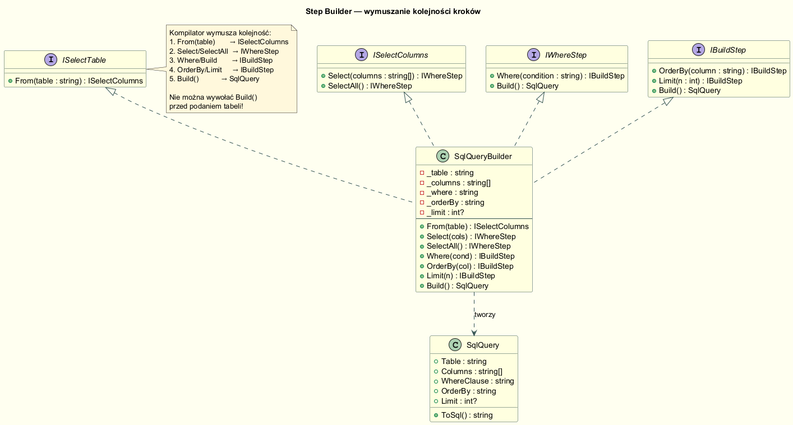
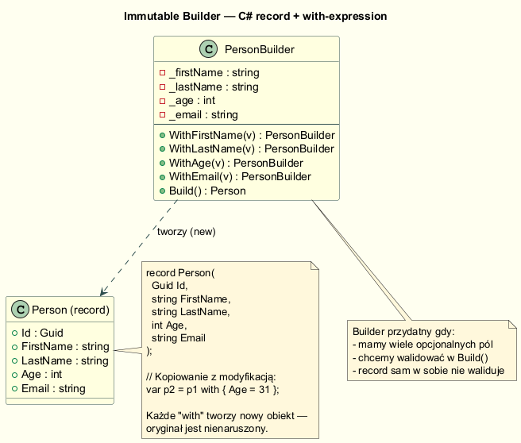

# Warianty Implementacji Buildera

## Przegląd wariantów

Wzorzec Builder można zaimplementować na kilka sposobów, zależnie od potrzeb:

| Wariant | Kolejność kroków | Kiedy stosować |
|---|---|---|
| **GoF (Director + Builder)** | Narzucona przez Director | Złożone procedury budowania, wielokrotne użycie algorytmu |
| **Fluent Builder** | Dowolna | Konfiguracja z wieloma opcjonalnymi parametrami |
| **Step Builder** | Wymuszana przez **kompilator** | Gdy błędna kolejność to błąd biznesowy |
| **Immutable Builder + record** | Dowolna | Niemutowalne obiekty wartościowe (VO) |

---

## Typ 1: Step Builder

Kluczowy pomysł: **każdy krok zwraca inny interfejs**, który udostępnia
wyłącznie legalne kolejne operacje. Kompilator staje się strażnikiem kolejności.



### Implementacja — interfejsy kroków

```csharp
public interface IFromStep    { ISelectStep From(string table); }
public interface ISelectStep  { IWhereStep Select(params string[] cols); IWhereStep SelectAll(); }
public interface IWhereStep   { IBuildStep Where(string cond); SqlQuery Build(); }
public interface IBuildStep   { IBuildStep OrderBy(string col); IBuildStep Limit(int n); SqlQuery Build(); }
```

### Jedna klasa implementuje wszystkie interfejsy

```csharp
public sealed class SqlQueryBuilder : IFromStep, ISelectStep, IWhereStep, IBuildStep
{
    private SqlQueryBuilder() { }

    // Statyczny punkt wejścia — zwraca IFromStep (tylko From() dostępne)
    public static IFromStep Query() => new SqlQueryBuilder();

    public ISelectStep From(string table)   { _table = table; return this; }
    public IWhereStep  SelectAll()          { _columns = [];  return this; }
    public IBuildStep  Where(string cond)   { _where = cond;  return this; }
    public SqlQuery    Build()              => BuildQuery();
    // ...
}
```

### Użycie — kompilator pilnuje kolejności

```csharp
// ✅ Poprawna kolejność
var q = SqlQueryBuilder.Query()
    .From("employees")      // IFromStep → ISelectStep
    .SelectAll()            // ISelectStep → IWhereStep
    .Where("age > 30")      // IWhereStep → IBuildStep
    .OrderBy("name")        // IBuildStep → IBuildStep
    .Build();               // IBuildStep → SqlQuery

// ❌ Błąd kompilacji — Build() nie istnieje w IFromStep!
// SqlQueryBuilder.Query().Build();
```

---

## Typ 2: Immutable Builder + C# record

Gdy produkt jest prostym **obiektem wartościowym** (Value Object), `record`
zapewnia niemutowalność i `==` oparty o content. Builder dodaje walidację.



### Record — definicja (C# 9+)

```csharp
public sealed record Person(
    Guid   Id,
    string FirstName,
    string LastName,
    int    Age,
    string Email
);
```

### Builder z walidacją

```csharp
public sealed class PersonBuilder
{
    private string _firstName = "Imię";
    private int    _age       = 0;
    private string _email     = string.Empty;

    public PersonBuilder WithFirstName(string v) { _firstName = v; return this; }
    public PersonBuilder WithAge(int v)          { _age       = v; return this; }
    public PersonBuilder WithEmail(string v)     { _email     = v; return this; }

    public Person Build()
    {
        if (_age is < 0 or > 150) throw new ArgumentException($"Nieprawidłowy wiek: {_age}");
        if (!_email.Contains('@')) throw new ArgumentException($"Nieprawidłowy email: {_email}");
        return new Person(Guid.NewGuid(), _firstName, _lastName, _age, _email);
    }
}
```

### `with`-expression — "modyfikacja" niemutowalnych recordów

```csharp
var p1 = new PersonBuilder().WithFirstName("Anna").WithAge(30).Build();
var p2 = p1 with { Age = 31 };    // nowy obiekt, Age = 31, reszta skopiowana
var p3 = p1 with { LastName = "Nowak" };

// Oryginalny p1 jest nienaruszony
Console.WriteLine(p1 == p2);      // False — różny wiek
Console.WriteLine(p1 == p1 with { }); // True — wartościowa równość
```

---

## Kiedy który wariant?

```
Mam wiele opcjonalnych pól?
  → TAK: Fluent Builder (lub Immutable Builder jeśli obiekt jest VO)

Kolejność kroków ma znaczenie biznesowe?
  → TAK: Step Builder

Chcę wielokrotnie uruchamiać ten sam algorytm dla różnych konfiguracji?
  → TAK: GoF Builder z Director

Buduję niemutowalny Value Object z prostą strukturą?
  → Rozważ: record + Builder z walidacją (lub nawet sam record jeśli nie potrzebujesz walidacji)
```

---

## Uruchomienie

```bash
cd src/03-budowniczy/04-typy-implementacji/Examples
dotnet run
```

---

## Literatura

- Bloch J. — *Effective Java*, 3rd ed., Item 2: "*Consider a builder when faced with many constructor parameters*"
- Fowler M. — *FluentInterface*, <https://www.martinfowler.com/bliki/FluentInterface.html>
- Microsoft — *Records in C#*, <https://learn.microsoft.com/en-us/dotnet/csharp/language-reference/builtin-types/record>
- Shvets A. — *Builder*, <https://refactoring.guru/design-patterns/builder>
