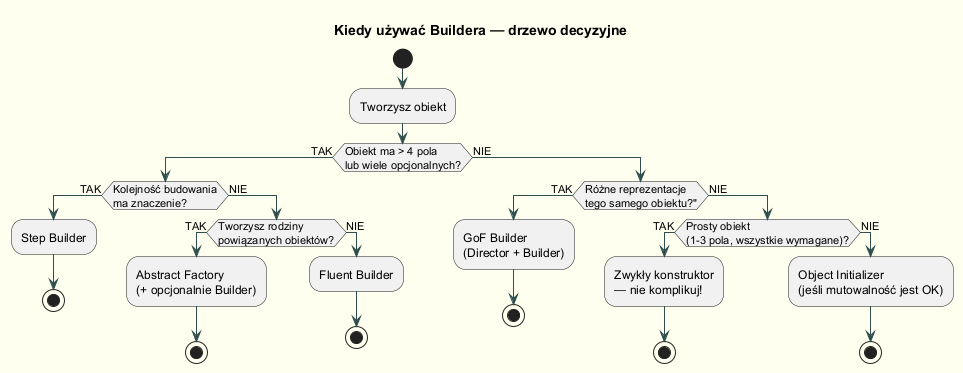
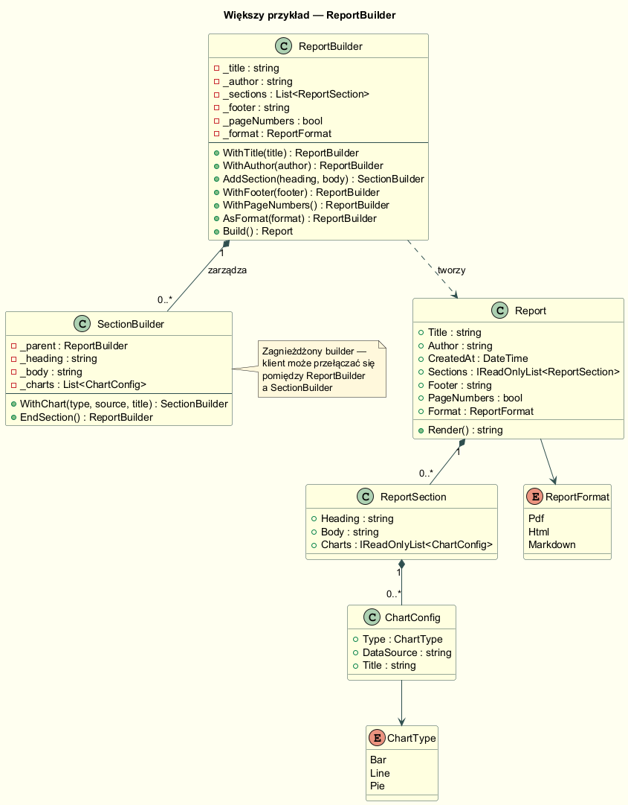

# 05 – Kiedy stosować Builder

## Cel

Pokazanie, **kiedy Builder jest właściwym wyborem**, a kiedy jest przerostem formy wobec prostszych technik (konstruktor, named arguments, object initializer, Abstract Factory).

---

## Diagram decyzyjny



---

## Kiedy Builder jest uzasadniony

| Sygnał | Dlaczego Builder |
|--------|-----------------|
| Więcej niż ~4 parametry konstruktora | Unika "*telescoping constructor*" |
| Część parametrów jest opcjonalna | Nie trzeba tworzyć N! przeciążeń |
| Wymagana kolejność kroków (krok A → B → C) | Step Builder wymusza kolejność |
| Produkt jest niezmienny po zbudowaniu | Builder montuje, `Build()` zamraża |
| Walidacja zależy od kombinacji pól | Logika weryfikacyjna w `Build()` |
| Ten sam algorytm montażu, różne reprezentacje | GoF Builder + Director |
| Produkt zawiera listy / kolekcje zagnieżdżone | Accumulator pattern w builderze |

---

## Kiedy Builder to przerost formy

```csharp
// ŹLE — nadmierny builder dla obiektu z 2 polami
new PointBuilder().WithX(3.0).WithY(4.5).Build()

// DOBRZE — konstruktor jest wystarczający
new Point2D(3.0, 4.5)

// DOBRZE — named arguments eliminują pomyłki kolejności
new Color(R: 255, G: 128, B: 0)

// DOBRZE — object initializer bez walidacji
new ApiOptions { BaseUrl = "...", TimeoutSeconds = 60 }
```

### Alternatiwy do rozważenia

| Sytuacja | Zamiast Buildera użyj |
|----------|----------------------|
| ≤ 4 parametry, wszystkie wymagane | Konstruktor + named args |
| Opcjonalne pola, brak walidacji | Object initializer |
| Wiele wariantów produktu z tej samej rodziny | Abstract Factory |
| Produkt niezmienny, C# record | `with` expression |

---

## Analiza czterech anty-wzorców (code smells)

### Anty-wzorzec 1: Telescoping Constructor

```csharp
// Problem — 6 przeciążeń konstruktora, każde z innym zestawem opcjonalnych pól
public Pizza(string size) : this(size, false, false, false, false, false) { }
public Pizza(string size, bool cheese) : this(size, cheese, false, false, false, false) { }
public Pizza(string size, bool cheese, bool pepperoni) : this(size, cheese, pepperoni, false, false, false) { }
public Pizza(string size, bool cheese, bool pepperoni, bool bacon) { ... }
// ...

// Wywołanie — co oznacza każda wartość?
new Pizza("duża", true, false, false, true, false)
//                ^^^^  ^^^^^  ^^^^^  ^^^^ ^^^^^ — który bool to co?
```

Refaktoryzacja do Buildera:

```csharp
// Builder — każda opcja nazwana, walidacja w Build()
new Pizza.Builder("duża")   // rozmiar wymagany w konstruktorze buildera
    .WithCheese()
    .WithMushrooms()
    .Build();
```

### Anty-wzorzec 2: Parametry opcjonalne z domyślnymi (Optional Parameters)

```csharp
// Wygląda OK, ale rośnie nieliniowo:
// 5 parametrów opcjonalnych = 2^5 = 32 możliwe kombinacje nazw w intellisense
public Pizza(string size,
    bool cheese = false, bool pepperoni = false,
    bool bacon = false,  bool mushrooms = false,
    bool onions = false) { }

// Wywołanie wymaga znajomości nazw
new Pizza("duża", cheese: true, mushrooms: true)
// Ale jeśli doda się 6. parametr i zmieni kolejność — kod nie kompiluje się
```

### Anty-wzorzec 3: Null jako placeholder

```csharp
// Null "zaśmiecalń" — które null'e można pominąć?
new Connection("host", 5432, null, null, null, true)
//                           ^^^^  ^^^^  ^^^^  — co to znaczy?
```

Refaktoryzacja:

```csharp
new ConnectionBuilder()
    .WithHost("host").WithPort(5432)
    .WithSsl()
    .Build();
// Jasne: username, password, certificate — nie podane = null/domyślne
```

### Anty-wzorzec 4: Mutowalny obiekt inicjalizowany właściwościami

```csharp
// Dwa problemy:
// 1. Connection jest mutowalny — każdy może zmienić właściwości po fakcie
// 2. Można zapomnieć ustawić wymagane pole (np. Host) i wykryć błąd dopiero w runtime
var conn = new Connection();
conn.Host = "host";         // co jeśli ktoś zrobi conn.Host = null później?
conn.Port = 5432;
// UseConn(conn) — czy Host i Port zostały ustawione? Kompilator nie wie
```

---

## Przykład uzasadnionego użycia — ReportBuilder

Raport posiada: tytuł, autora, listę sekcji (każda z nagłówkiem, treścią i wykresami), stopkę, format wyjściowy i opcjonalne numery stron. To **klasyczny kandydat** do Buildera:

- 7+ pól,
- sekcje są opcjonalne i powtarzalne,
- walidacja w `Build()` (brak tytułu → wyjątek),
- zagnieżdżony `SectionBuilder` dla płynności bez utraty typów.

### Diagram klas



### Kod — budowanie raportu

```csharp
Report report = new ReportBuilder()
    .WithTitle("Raport Sprzedaży — Styczeń 2024")
    .WithAuthor("Jan Kowalski")
    .AsFormat(ReportFormat.Html)
    .WithPageNumbers()
    .AddSection("Podsumowanie")            // ← zwraca SectionBuilder
        .WithBody("Sprzedaż wzrosła o 12% r/r.")
        .AddChart(ChartType.Bar, "sales.csv", "Sprzedaż wg regionów")
        .EndSection()                      // ← wraca do ReportBuilder
    .AddSection("Rekomendacje")
        .WithBody("Zwiększyć budżet marketingowy.")
        .EndSection()
    .WithFooter("Dokument poufny")
    .Build();
```

### Kod — zagnieżdżony SectionBuilder

Technika *zagnieżdżonego buildera* (nested sub-builder) pozwala kontynuować
płynny łańcuch wywołań przez granicę klasy. Klient przełącza kontekst
`ReportBuilder ↔ SectionBuilder` przez `AddSection()` i `EndSection()`.

```csharp
public sealed class SectionBuilder
{
    private readonly ReportBuilder _parent;   // referencja do "rodzica"
    private readonly string _heading;
    private string _body = string.Empty;
    private readonly List<ChartConfig> _charts = [];

    internal SectionBuilder(ReportBuilder parent, string heading)
        => (_parent, _heading) = (parent, heading);

    // Pozostajemy w SectionBuilder — konfigurujemy tę sekcję
    public SectionBuilder WithBody(string body) { _body = body; return this; }
    public SectionBuilder AddChart(ChartType type, string src, string title)
    {
        _charts.Add(new ChartConfig(type, src, title));
        return this;
    }

    // Wracamy do ReportBuilder — finalizujemy sekcję
    public ReportBuilder EndSection()
    {
        _parent.AddBuiltSection(new ReportSection(_heading, _body, _charts));
        return _parent;   // ← powrót do kontekstu rodzica
    }
}
```

### Kod — finalizacja z walidacją

```csharp
public Report Build()
{
    if (string.IsNullOrWhiteSpace(_title))
        throw new InvalidOperationException("Raport musi mieć tytuł.");
    // Sekcje są opcjonalne — brak sekcji = raport pusty (ale prawidłowy)
    return new Report(_title, _author, _sections, _footer, _pageNumbers, _format);
}
```

### Dlaczego nie użyć List initialization zamiast ReportBuilder?

```csharp
// Alternatywa bez buildera
var report = new Report
{
    Title = "...",
    Sections = new List<ReportSection>
    {
        new ReportSection { Heading = "...", Body = "..." }
    }
};
// Problem: Report i ReportSection muszą być mutowalne — każdy może modyfikować po fakcie.
// Nie ma walidacji (pusty tytuł przejdzie).
// Nie ma możliwości wymuszenia wymaganego Title w czasie kompilacji.
```

Builder daje: niemutowalność produktu, walidację, czytelność DSL.

---

## Porównanie technik tworzenia obiektów

| Technika | Czytelność | Niezmienność | Walidacja | Over-engineering? |
|----------|-----------|-------------|-----------|-------------------|
| Konstruktor | ✅ (named args) | ✅ | W konstruktorze | ❌ dla ≤4 pól |
| Object initializer | ✅ (auto) | ❌ (mutable) | Brak | ❌ dla DTO |
| Fluent Builder | ✅✅ | ✅ w Build() | ✅ w Build() | ⚠️ zbędny ≤3 pola |
| Step Builder | ✅✅ (wymusza kolejność) | ✅ | ✅ | ⚠️ zbędny bez kolejności |
| GoF Builder+Director | ✅ | ✅ | ✅ | ⚠️ zbędny bez różnych repr. |
| Abstract Factory | ✅ (rodziny) | ✅ | ❌ | ⚠️ zbędny jeden wariant |
| `with` expression (record) | ✅ | ✅ | ❌ | ❌ dla wartości |

---

## Builder w ekosystemie .NET — przykłady z bibliotek standardowych

Builder jest wszechobecny w .NET. Warto pokazać studentom znane im API:

```csharp
// System.Text.StringBuilder — najprostszy Builder
var sb = new StringBuilder()
    .Append("Hello")
    .Append(", ")
    .AppendLine("World!");
string result = sb.ToString();   // ToString() = Build()

// Microsoft.Extensions.Hosting — IHostBuilder (ASP.NET Core)
var host = Host.CreateDefaultBuilder(args)
    .ConfigureServices(services =>
    {
        services.AddSingleton<IMyService, MyService>();
    })
    .ConfigureLogging(logging => logging.AddConsole())
    .Build();   // ← Build() materializuje IHost

// Microsoft.EntityFrameworkCore — ModelBuilder (w OnModelCreating)
modelBuilder.Entity<Employee>(entity =>
{
    entity.HasKey(e => e.Id);
    entity.Property(e => e.Email).IsRequired().HasMaxLength(200);
    entity.HasIndex(e => e.Email).IsUnique();
});

// System.Net.Http.HttpRequestMessage (konfiguracja żądania HTTP)
var request = new HttpRequestMessage(HttpMethod.Get, "https://api.example.com/data");
request.Headers.Add("Authorization", "Bearer ...");
// (tu brak fluent API, ale pattern ten sam — mutacja przed "Build()" = Send());
```

Przykłady te pokazują, że Builder to nie "akademicki wzorzec" — to codzienny
narzędzie w pracy z .NET.

---

## „Code smells" sugerujące Builder

```csharp
// Zapach 1: Telescoping constructor (N przeciążeń)
new Pizza("duża", true, false, false, true, false)

// Zapach 2: Opcjonalne parametry z wartościami domyślnymi (przy 5+ parametrach)
new Pizza("duża", cheese: true, pepperoni: false, bacon: false, ...)

// Zapach 3: Null jako placeholder
new Connection("host", 5432, null, null, null, true)

// Zapach 4: Tworzenie obiektu poprzez właściwości (mutable)
var conn = new Connection();
conn.Host = "host";
conn.Port = 5432;
// Można zapomnieć ustawić wymagane pole!

// Zapach 5: Metoda fabryczna z identyczną sygnaturą, ale różnymi nazwami
CreateReportWithFooter(title, author, sections, footer, true, false, ReportFormat.Pdf);
CreateReportWithoutFooter(title, author, sections, "", false, false, ReportFormat.Html);
// → Builder eliminuje eksplozję metod fabrycznych
```

---

## Uruchomienie

```bash
cd 05-kiedy-stosowac/Examples
dotnet run
```

---

## Podsumowanie modułu

| Temat | Sekcja |
|-------|--------|
| Problem z konstruktorami | [01-problem-konstrukcji](../01-problem-konstrukcji/README.md) |
| Struktura GoF | [02-struktura-gof](../02-struktura-gof/README.md) |
| Fluent Builder | [03-fluent-builder](../03-fluent-builder/README.md) |
| Typy implementacji | [04-typy-implementacji](../04-typy-implementacji/README.md) |
| **Kiedy stosować** | **05-kiedy-stosowac** ← jesteś tutaj |
