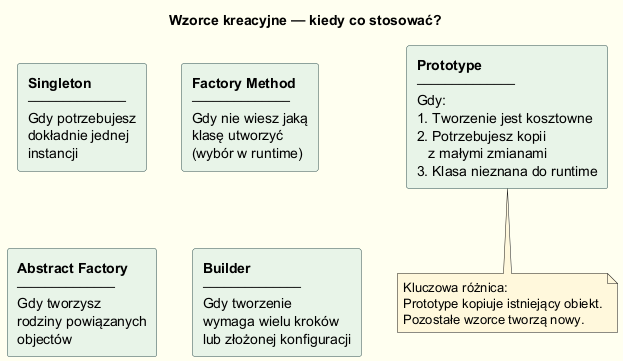
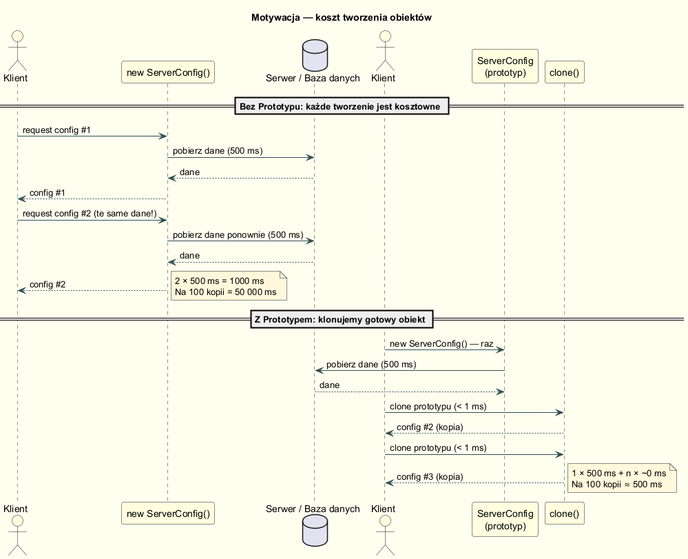

# 01 — Motywacja: Dlaczego potrzebujemy Prototypu?

## Znamy już trzy wzorce kreacyjne — po co jeszcze jeden?

Do tej pory poznaliśmy:
- **Singleton** — jeden egzemplarz klasy w całym systemie
- **Fabrykę** (`Factory Method`, `Abstract Factory`) — tworzy obiekty bez podawania konkretnej klasy
- **Buildera** — buduje złożone obiekty krok po kroku, z walidacją

Wszystkie powyższe wzorce mają wspólną cechę: **tworzą nowy obiekt od podstaw**.

Wzorzec **Prototyp** robi coś innego: **kopiuje istniejący obiekt**.

---

## Trzy scenariusze, w których Prototyp jest właściwym wyborem

### Scenariusz 1: Tworzenie obiektu jest kosztowne

Obiekt wymaga podczas inicjalizacji dostępu do zewnętrznego zasobu:

```
Baza danych → ładuj konfigurację (500 ms)
Serwer HTTP → pobierz dane (1000 ms)
Plik → parsuj XML/JSON (200 ms)
Model ML → załaduj wagi (5000 ms)
```

Jeśli potrzebujemy 100 takich obiektów z tymi samymi danymi:

| Podejście | Czas |
|-----------|------|
| `new Config()` × 100 | 100 × 500 ms = **50 000 ms** |
| `new Config()` + `clone()` × 99 | 500 ms + 99 × ~0 ms ≈ **500 ms** |

### Scenariusz 2: Chcemy kopię z niewielkimi modyfikacjami

```csharp
// Mamy prototyp konfiguracji produkcyjnej
var prodConfig = ServerConfig.LoadFromServer("production");

// Potrzebujemy wariantu testowego — identycznego, ale z innym pool size
var testConfig = prodConfig.CloneWith(poolSize: 5);

// Lub wariantu dla innego portu
var localConfig = prodConfig.CloneWith(port: 5433);
```

Zamiast konfigurować od nowa każdy wariant, **klonujemy i modyfikujemy**.

### Scenariusz 3: Typ obiektu nieznany do czasu wykonania

```csharp
// Mamy rejestr kształtów — nie znamy konkretnych typów w compile time
IShape templateShape = shapeRegistry.Get("star");   // Circle? Polygon? Star?

// Klonujemy bez znajomości konkretnego typu
IShape newShape = templateShape.Clone();
newShape.MoveTo(100, 200);
```

Fabryka wymagałaby `if/switch` na typach. Prototyp — nie.

---

## Diagram porównawczy wzorców kreacyjnych



---

## Diagram sekwencji — koszt tworzenia



W części z Prototypem poprawny koszt dla 100 instancji to:

- `1 × 500 ms` (utworzenie prototypu)
- `99 × < 1 ms` (klonowanie)
- razem: około `500-600 ms` zamiast `50 000 ms`

---

## Kod — porównanie wydajności

```csharp
// BEZ Prototypu: 3 × kosztowna inicjalizacja
var c1 = ServerConfig.LoadFromServer("production");   // 500 ms
var c2 = ServerConfig.LoadFromServer("production");   // 500 ms — identyczne!
var c3 = ServerConfig.LoadFromServer("production");   // 500 ms — identyczne!
// Łącznie: ~1500 ms

// Z Prototypem: 1 × inicjalizacja + klonowanie
var proto = ServerConfig.LoadFromServer("production");   // 500 ms
var c1 = proto.Clone();                                   // ~0 ms
var c2 = proto.Clone();                                   // ~0 ms
var c3 = proto.CloneWith(poolSize: 50);                  // ~0 ms + modyfikacja
// Łącznie: ~500 ms
```

### Implementacja `Clone()` i `CloneWith()`

```csharp
public sealed class ServerConfig
{
    public string Host     { get; private set; }
    public int    PoolSize { get; private set; }
    public IReadOnlyList<string> AllowedIps { get; private set; }

    // Kosztowna fabryka — jednokrotna
    public static ServerConfig LoadFromServer(string env)
    {
        Thread.Sleep(500);   // symulacja kosztownej operacji
        return new ServerConfig(...);
    }

    // Clone — blyadawiczny, tworzy niezależną kopię
    public ServerConfig Clone() => new ServerConfig(
        Host, Port, Database, PoolSize,
        new List<string>(AllowedIps)   // głęboka kopia listy!
    );

    // Klonuj z nadpisaniem wybranych pól
    public ServerConfig CloneWith(int? poolSize = null) =>
        new ServerConfig(Host, Port, Database, poolSize ?? PoolSize, ...);
}
```

---

## Kluczowa różnica: Prototype vs Factory vs Builder

| | Factory Method | Builder | Prototype |
|---|---|---|---|
| **Jak tworzy?** | `new ConcreteClass()` | Krok po kroku | Kopiuje istniejący |
| **Skąd bierze dane?** | Z parametrów | Z kroków konfiguracji | Ze źródłowego obiektu |
| **Koszt tworzenia** | Pełny (zależy od klasy) | Pełny | Minimalny (kopia) |
| **Zna konkretny typ?** | Tak (Factory decyduje) | Tak | Nie musi |
| **Modyfikacja kopii** | Nie dotyczy | Przez Builder | `CloneWith(...)` |

---

## Uruchomienie

```bash
cd 01-motywacja/Examples
dotnet run
```

---

## Literatura

- Gamma E. et al. — *Design Patterns*, Addison-Wesley 1994, s. 117–126 (Prototype)
- Shvets A. — *Prototype*, <https://refactoring.guru/design-patterns/prototype>
- Bloch J. — *Effective Java*, 3rd ed., Item 13: "*Override clone judiciously*"
