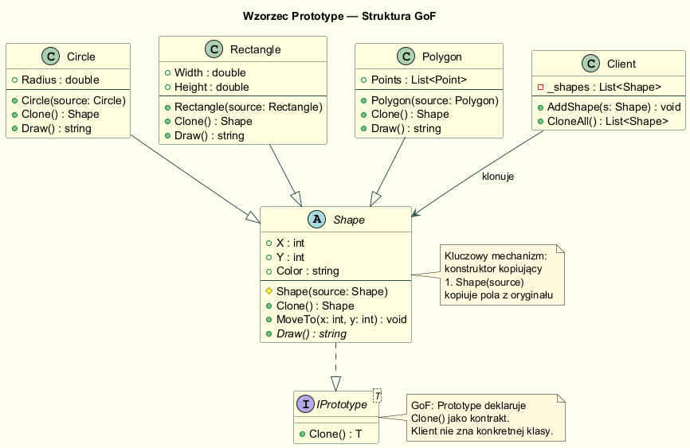
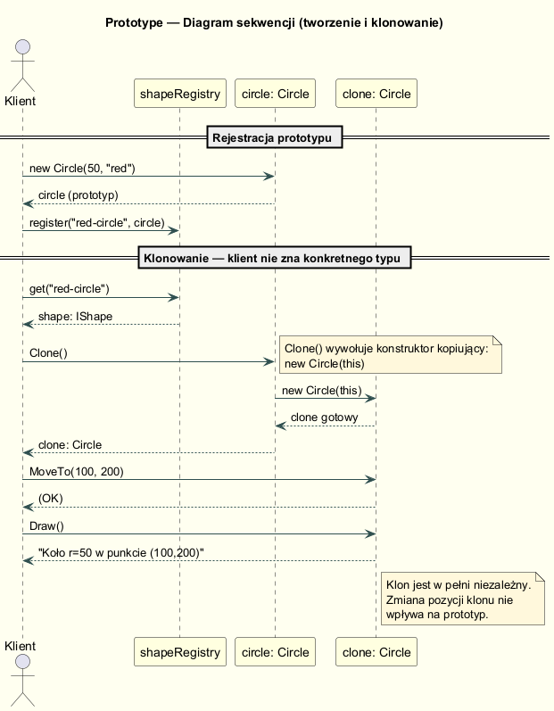
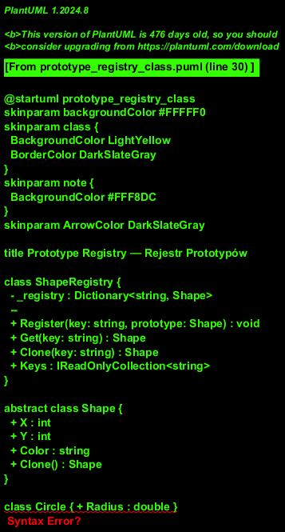

# 02 — Struktura GoF: Prototype

## Definicja GoF

> Określa rodzaj tworzonych obiektów za pomocą prototypowego egzemplarza
> i tworzy nowe obiekty, kopiując ten prototyp.
>
> — *Design Patterns: Elements of Reusable Object-Oriented Software*, GoF 1994

---

## Uczestnicy wzorca

| Rola | Odpowiedzialność |
|------|-----------------|
| `Prototype` (interfejs/abstrakcja) | Deklaruje metodę `Clone()` |
| `ConcretePrototype` | Implementuje `Clone()` przez skopiowanie własnych pól |
| `Client` | Tworzy nowe obiekty wywołując `prototype.Clone()` — nie używa `new` |
| `PrototypeRegistry` *(opcjonalny)* | Rejestr prototypów dostępnych po kluczu/nazwie |

---

## Diagram klas



---

## Diagram sekwencji



---

## Kluczowy mechanizm: Konstruktor kopiujący

Zamiast duplikować logikę kopiowania w każdej klasie, definiuje się **chroniony
konstruktor kopiujący** (*copy constructor*), który przyjmuje obiekt źródłowy:

```csharp
public abstract class Shape
{
    public int    X     { get; protected set; }
    public int    Y     { get; protected set; }
    public string Color { get; protected set; }

    // Normalny konstruktor
    protected Shape(int x, int y, string color) => (X, Y, Color) = (x, y, color);

    // Konstruktor kopiujący — wywoływany TYLKO przez Clone()
    protected Shape(Shape source)
        => (X, Y, Color) = (source.X, source.Y, source.Color);

    public abstract IShape Clone();
}

public sealed class Circle : Shape
{
    public double Radius { get; private set; }

    // Normalny
    public Circle(int x, int y, string color, double radius)
        : base(x, y, color) => Radius = radius;

    // Kopiujący — wywołuje base(source), kopiuje własne pola
    private Circle(Circle source) : base(source) => Radius = source.Radius;

    // Clone() — jedyna metoda, która używa konstruktora kopiującego
    public override IShape Clone() => new Circle(this);
}
```

### Zalety konstruktora kopiującego nad `MemberwiseClone()`

| | `MemberwiseClone()` | Konstruktor kopiujący |
|---|---|---|
| Typy wartościowe (int, double) | ✅ Kopiuje | ✅ Kopiuje |
| Typy referencyjne (List, klasy) | ❌ Współdzieli referencję | ✅ Można skopiować głęboko |
| Kontrola nad procesem kopiowania | ❌ Brak | ✅ Pełna |
| Bezpieczeństwo typów | ❌ Object → rzutowanie | ✅ Typ znany w compile time |
| Działa z `sealed`/`private` polami? | ✅ Tak | ✅ Tak |

---

## Prototype Registry (Prototype Manager)

Rejestr prototypów to opcjonalny element wzorca GoF — przechowuje nazwane szablony:



```csharp
public sealed class ShapeRegistry
{
    private readonly Dictionary<string, IShape> _registry = [];

    public void Register(string key, IShape prototype) => _registry[key] = prototype;

    // Zwraca KLON — gotowy do modyfikacji i użycia
    public IShape Clone(string key) => _registry[key].Clone();
}

// Użycie
var registry = new ShapeRegistry();
registry.Register("mały-czerwony-okrąg", new Circle(0, 0, "red", 25));
registry.Register("szary-prostokąt",     new Rectangle(0, 0, "gray", 80, 40));

// Klient nie wie, że to Circle ani Rectangle
IShape shape = registry.Clone("szary-prostokąt");
shape.MoveTo(100, 200);
Console.WriteLine(shape.Draw());
```

### Polimorficzne klonowanie bez `if/switch`

```csharp
// Bez Prototype — klient musi znać każdy typ
IShape CreateShape(string name) => name switch {
    "okrąg" => new Circle(...),
    "prostokąt" => new Rectangle(...),
    _ => throw new ArgumentException()
};

// Z Prototype Registry — klient nie zna żadnego konkretnego typu
IShape shape = registry.Clone(name);   // działa dla każdego zarejestrowanego klucza
```

---

## Rys historyczny

| Rok | Wydarzenie |
|-----|-----------|
| 1994 | GoF opisuje Prototype jako jeden z pięciu wzorców kreacyjnych |
| 1995 | JavaScript wprowadza prototypowy model obiektów (każdy obiekt ma `__proto__`) |
| 2001 | .NET 1.0 — interfejs `ICloneable` z metodą `Clone()` (patrz sekcja 04) |
| 2009 | Java — `Object.clone()` uznana za błąd projektowy przez twórców języka |
| 2020+ | C# 9 `record` z `with`-expression — lekka alternatywa dla prostych przypadków |

---

## Uruchomienie

```bash
cd 02-struktura-gof/Examples
dotnet run
```

---

## Literatura

- Gamma E. et al. — *Design Patterns*, Addison-Wesley 1994, s. 117–126
- Shvets A. — *Prototype*, <https://refactoring.guru/design-patterns/prototype>
- Bloch J. — *Effective Java*, 3rd ed., Item 13: "*Override clone judiciously*"
