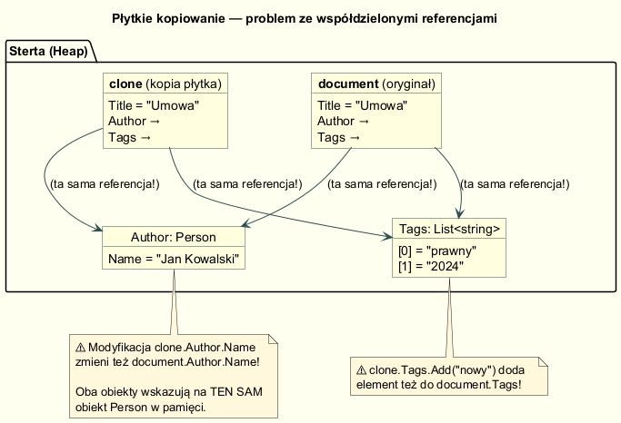
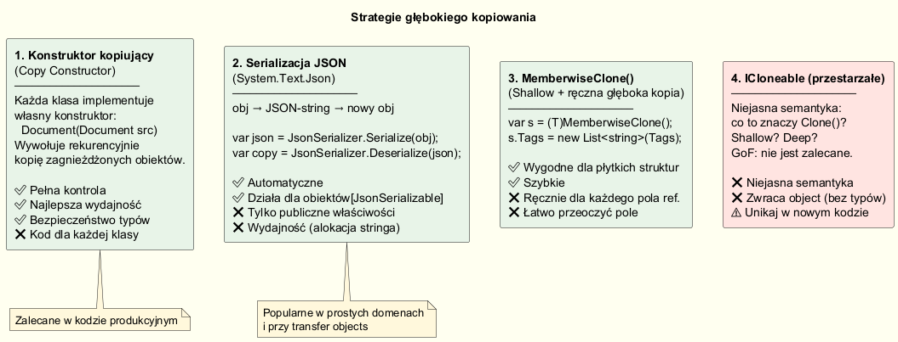

# 03 — Płytkie i Głębokie Kopiowanie

## Problem

Wzorzec Prototype wymaga `Clone()`. Ale co dokładnie kopiujemy?

W C# (jak w większości języków OOP) istnieją dwa typy danych:

| Typ | Kopiowanie przez | Przykłady |
|-----|-----------------|-----------|
| **Wartościowy** (`value type`) | Wartość (bitowa kopia) | `int`, `double`, `bool`, `struct`, `string`* |
| **Referencyjny** (`reference type`) | Referencja (wskaźnik) | `class`, `List<T>`, tablice |

> *\*`string` jest referencyjny, ale **immutable** — modyfikacja tworzy nowy string,
> więc zachowuje się jak wartościowy.*

---

## Płytka kopia (Shallow Copy)

`MemberwiseClone()` tworzy **płytkę kopię**: kopiuje wartości wszystkich pól.
Dla pól wartościowych to pełna kopia. Dla pól referencyjnych — kopiuje **wskaźnik**,
nie obiekt, na który wskazuje.



### Demonstracja pułapki

```csharp
var original = new Document(
    "Umowa",
    author: new Person("Jan Kowalski", "jan@firma.pl"),
    tags: ["prawny", "2024"]
);

var shallow = (Document)original.MemberwiseClone();

// ✅ Pole wartościowe (string) jest niezależne — string jest immutable
shallow.Title = "KOPIA";
Console.WriteLine(original.Title);  // "Umowa" — bez zmian ✅

// ⚠️ Pole referencyjne (object) — oba obiekty wskazują na TEN SAM Person!
shallow.Author.Name = "Anna Nowak";
Console.WriteLine(original.Author.Name);  // "Anna Nowak" — ZMIENIONY! ❌

// ⚠️ Lista jest współdzielona!
shallow.Tags.Add("pilne");
Console.WriteLine(original.Tags.Count);  // 3 — "pilne" w oryginale! ❌
```

---

## Trzy strategie głębokiego kopiowania



---

### Strategia 1: Konstruktor kopiujący (zalecana)

Każda klasa implementuje konstruktor przyjmujący obiekt źródłowy i kopiujący
wszystkie pola łącznie z głębokim kopiowaniem pól referencyjnych:

```csharp
public sealed class Document
{
    public string       Title  { get; set; }
    public Person       Author { get; set; }
    public List<string> Tags   { get; set; }

    // Konstruktor kopiujący
    public Document(Document source) => new Document(
        source.Title,
        new Person(source.Author),          // osoba: głęboka kopia
        new List<string>(source.Tags)       // lista: głęboka kopia
    );

    // Clone() wywołuje konstruktor kopiujący
    public Document Clone() => new Document(this);
}

public sealed class Person
{
    public string Name  { get; set; }
    public string Email { get; set; }

    // Konstruktor kopiujący dla Person
    public Person(Person source) => (Name, Email) = (source.Name, source.Email);
}
```

**Zalety:** pełna kontrola, najlepsza wydajność, bezpieczeństwo typów  
**Wady:** kod wymagany dla każdej klasy hierarchii

---

### Strategia 2: Serializacja JSON (System.Text.Json)

```csharp
public Document DeepCloneJson()
{
    var json = JsonSerializer.Serialize(new DocumentDto(this));
    var dto  = JsonSerializer.Deserialize<DocumentDto>(json)!;
    return dto.ToDocument();
}
```

**Zalety:** automatyczne, nie wymaga konstruktorów kopiujących  
**Wady:** wolniejsze (alokacja stringa), wymaga publicznych właściwości,
nie serializuje zamkniętych pól (private fields)

> ⚠️ **Uwaga historyczna:** Stary kod .NET używał `BinaryFormatter` do głębokiego
> kopiowania. Od .NET 5 `BinaryFormatter` jest **uznany za przestarzały i
> podatny na ataki deserializacji** (CVE). Nie używaj go w nowym kodzie. Użyj
> `System.Text.Json` lub konstruktora kopiującego.

---

### Strategia 3: MemberwiseClone + ręczna kopia pól referencyjnych

```csharp
public Document Clone()
{
    var clone = (Document)MemberwiseClone();   // skopiuj wartościowe pola
    clone.Author = new Person(Author);          // ręcznie — pole referencyjne
    clone.Tags   = new List<string>(Tags);      // ręcznie — kolekcja
    return clone;
}
```

**Zalety:** krótki kod dla klas z nielicznymi polami referencyjnymi  
**Wady:** łatwo zapomnieć o nowym polu; nie jest automatyczne

---

## Głębokość grafu obiektów

Z każdym poziomem zagłębienia musimy kopiować głębiej:

```
Document
 └── Author: Person                ← 1 poziom — kopiujemy Person
      └── Address: Address          ← 2 poziomy — kopiujemy Address
           └── City: City            ← 3 poziomy — kopiujemy City
```

```csharp
// 3-poziomowe zagłębienie — każda klasa na każdym poziomie
// musi mieć własny konstruktor kopiujący

public Address(Address source) => new Address(
    source.Street,
    new City(source.City)   // głęboka kopia City
);

public Person(Person source) => new Person(
    source.Name,
    new Address(source.Address)   // głęboka kopia Address (który kopiuje City)
);

public Document(Document source) => new Document(
    source.Title,
    new Person(source.Author)   // głęboka kopia Person (który kopiuje cały graaf)
);
```

---

## Kiedy płytka kopia jest bezpieczna?

Płytka kopia jest **wystarczająca**, gdy:

1. **Wszystkie pola są typami wartościowymi** (`int`, `double`, `struct`)
2. **Pola referencyjne są niemutowalne** (`string`, `ImmutableList<T>`, `readonly record`)
3. **Klony nie modyfikują zagnieżdżonych obiektów** (tylko czytają)

```csharp
// ✅ Bezpieczna płytka kopia — Color ma tylko typy wartościowe
public sealed class Color
{
    public byte R { get; }
    public byte G { get; }
    public byte B { get; }
    public Color Clone() => (Color)MemberwiseClone();   // płytka = głęboka w tym przypadku
}
```

---

## Uruchomienie

```bash
cd 03-plytkie-i-gleboke-kopiowanie/Examples
dotnet run
```

---

## Literatura

- Gamma E. et al. — *Design Patterns*, Addison-Wesley 1994, s. 117–126
- Microsoft — *Shallow and deep copy*, <https://learn.microsoft.com/en-us/dotnet/api/system.object.memberwiseclone>
- Bloch J. — *Effective Java*, 3rd ed., Item 13 *(Java, ale zasady ogólne)*
- CVE-2011-4337 — BinaryFormatter deserializacja: <https://learn.microsoft.com/en-us/dotnet/standard/serialization/binaryformatter-security-guide>
