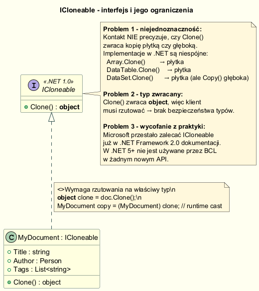
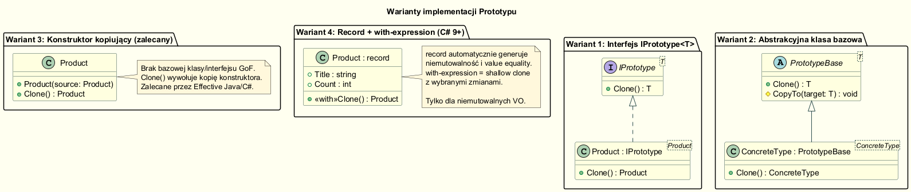

# 04 — Typy implementacji wzorca Prototyp

> **Cel sekcji:** Poznać wszystkie praktyczne warianty implementacji Prototypu,
> zrozumieć historię interfejsu `ICloneable` i wybrać odpowiednie podejście
> dla nowoczesnego kodu w C# (.NET 9).

---

## Spis treści

1. [Interfejs `ICloneable` — historia i kontrowersje](#1-interfejs-icloneable)
2. [Wariant 2: Własny `IPrototype<T>`](#2-własny-interfejs-iprototypet)
3. [Wariant 3: Abstrakcyjna klasa bazowa `PrototypeBase<T>`](#3-abstrakcyjna-klasa-bazowa)
4. [Wariant 4: Konstruktor kopiujący (zalecany)](#4-konstruktor-kopiujący)
5. [Wariant 5: `record` + `with`-expression](#5-record--with-expression)
6. [Tabela porównawcza](#6-tabela-porównawcza)
7. [Uruchomienie przykładu](#uruchomienie)

---

## 1. Interfejs `ICloneable`



`ICloneable` pojawił się w .NET 1.0 (2002) jako próba ustandaryzowania klonowania:

```csharp
// .NET 1.0 — interfejs wbudowany w BCL
public interface ICloneable
{
    object Clone();
}
```

### Dlaczego jest problematyczny?

**Problem 1 — niejednoznaczność kontraktu.**  
Dokumentacja Microsoft nigdy nie określiła, czy `Clone()` powinno zwracać
kopię płytką czy głęboką. W bibliotece .NET obydwie implementacje istniały:

| Klasa | `Clone()` zwraca |
|-------|-----------------|
| `Array` | Płytka kopia |
| `DataTable` | Płytka kopia (schema + constraints, bez wierszy) |
| `DataSet` | Płytka kopia (na ogół schema) |
| `XmlNode` | Głęboka kopia |

**Problem 2 — brak bezpieczeństwa typów.**  
`Clone()` zwraca `object` → każdy klient musi rzutować:

```csharp
var clone = (VehicleCard)original.Clone();   // runtime cast, możliwy InvalidCastException
```

**Problem 3 — wycofanie z praktyki.**  
Od .NET 2.0 Microsoft zaleca unikanie `ICloneable` w nowych API.
W .NET 5+ żadne nowe klasy w BCL nie implementują tego interfejsu.

### Pułapka płytkiej kopii przez `MemberwiseClone()`

```csharp
public class VehicleCardLegacy : ICloneable
{
    public List<string> Features { get; set; } = [];

    public object Clone() => MemberwiseClone(); // płytka!
}

var original = new VehicleCardLegacy { Features = ["ABS", "ESP"] };
var clone    = (VehicleCardLegacy)original.Clone();

clone.Features.Add("Heated seats");

// original.Features = ["ABS", "ESP", "Heated seats"]  ← zmieniony!
// clone.Features    = ["ABS", "ESP", "Heated seats"]
```

`MemberwiseClone()` kopiuje pola bit-po-bicie:
- typy wartościowe (`int`, `double`, `struct`) — kopiowane w całości ✔
- `string` — immutable, brak problemu ✔
- referencje do obiektów (`List<>`, klasy) — **współdzielone** ✗

---

## 2. Własny interfejs `IPrototype<T>`



Rozwiązanie problemu braku bezpieczeństwa typów: własny generyczny interfejs:

```csharp
public interface IPrototype<T>
{
    T Clone();                        // zwraca T, nie object
}

public class VehicleCard : IPrototype<VehicleCard>
{
    public List<string> Features { get; set; } = [];

    public VehicleCard Clone() => new()
    {
        Features = [.. Features]     // nowa lista — głęboka kopia
    };
}

VehicleCard clone = original.Clone();   // bez rzutowania!
```

**Wady:** klient musi znać konkretny typ (nie polimorfizm przez interfejs).  
**Zalety:** bezpieczeństwo typów, wyraźna sygnatura.

---

## 3. Abstrakcyjna klasa bazowa

Pozwala umieścić wspólną logikę w bazie i wymuszać implementację `Clone()`:

```csharp
public abstract class PrototypeBase<T> where T : PrototypeBase<T>
{
    public abstract T Clone();
}

public sealed class ServerConfig : PrototypeBase<ServerConfig>
{
    public string Environment  { get; init; } = "";
    public int    Port         { get; init; }
    public List<string> AllowedHosts { get; init; } = [];

    public static ServerConfig LoadFromServer(string env)
    {
        Thread.Sleep(100);   // symulacja sieci
        return new ServerConfig { Environment = env, Port = 443, ... };
    }

    public override ServerConfig Clone() => new()
    {
        Environment  = Environment,
        Port         = Port,
        AllowedHosts = [.. AllowedHosts]    // głęboka kopia
    };
}
```

```csharp
var master = ServerConfig.LoadFromServer("prod");   // 100 ms
var fork1  = master.Clone();                        // < 1 ms
var fork2  = master.Clone();                        // < 1 ms
```

**Kiedy stosować:** gdy wiele klas wymaga wspólnego mechanizmu klonowania
lub chcemy dodać rejestr prototypów do klasy bazowej.

---

## 4. Konstruktor kopiujący

Idiom z C++ — w C# działa doskonale i jest **zalecanym podejściem**
w nowoczesnym kodzie. Nie wymaga żadnego interfejsu.

```csharp
public class Address
{
    public string Street { get; set; } = "";
    public string City   { get; set; } = "";

    // Konstruktor kopiujący
    public Address(Address source)
    {
        Street = source.Street;
        City   = source.City;
    }
}

public class Employee
{
    public string  Name    { get; set; } = "";
    public Address Address { get; set; } = new();
    public List<string> Skills { get; set; } = [];

    // Konstruktor kopiujący — pełna kontrola nad głębią kopii
    public Employee(Employee source)
    {
        Name    = source.Name;
        Address = new Address(source.Address);   // rekurencyjnie głęboka kopia
        Skills  = [.. source.Skills];
    }

    // Opcjonalny helper dla wygody — wywołuje konstruktor kopiujący
    public Employee Clone() => new(this);
}
```

**Użycie:**

```csharp
var template = new Employee { Name = "Jan", Skills = ["C#", "SQL"] };
var newHire  = new Employee(template) { Name = "Anna" };   // inline override
```

**Zalety:**
- pełna kontrola, co jest kopiowane
- jawne, czytelne — każde pole explicite kopiowane
- bez rzutowania, bez interfejsów GoF
- dobre wsparcie refaktoryzacji (zmiana pola → kompilator wymusi update)

**Wada:** nieco więcej kodu niż `MemberwiseClone()`.

---

## 5. `record` + `with`-expression

Klasy `record` (C# 9+) mają wbudowany mechanizm niemutowalnego kopiowania:

```csharp
public record ConnectionOptions(
    string Host,
    int    Port,
    bool   UseSsl,
    int    TimeoutMs = 5000
);
```

```csharp
var dev  = new ConnectionOptions("localhost", 5432, UseSsl: false);
var prod = dev with { Host = "db.prod.com", Port = 5433, UseSsl = true };
var test = dev with { Host = "db.test.com" };
```

`with` tworzy nową instancję z podanymi polami nadpisanymi — reszta skopiowana.

### Semantyka `record`

| Właściwość | `class` | `record` |
|------------|---------|---------|
| Równość | `ReferenceEquals` (domyślnie) | Value equality |
| `==` | referencja | wartości pól |
| `Clone()` | ręcznie | automatycznie przez `with` |
| Niemutowalność | opcjonalna | `init`-only properties domyślnie |

### Kiedy `record` NIE wystarczy

`with` generuje **płytką kopię** — jeśli record zawiera mutowalną kolekcję,
problem nadal istnieje:

```csharp
// NIEBEZPIECZNE!
public record Config(List<string> Tags);

var a = new Config(["x", "y"]);
var b = a with { };
b.Tags.Add("z");
// a.Tags = ["x", "y", "z"]  ← ZMIENIONY!
```

W takim wypadku należy wrócić do konstruktora kopiującego.

---

## 6. Tabela porównawcza

| Wariant | Typ zwracany | Głębokość kopii | Dziedziczenie wymagane | Polimorfizm | Zalecane |
|---------|-------------|-----------------|------------------------|-------------|----------|
| `ICloneable` | `object` | Nieznana | `ICloneable` | Tak | ✗ Nie |
| `IPrototype<T>` | `T` | Głęboka (ręcznie) | `IPrototype<T>` | Przez interfejs | Opcjonalnie |
| `PrototypeBase<T>` | `T` | Głęboka (ręcznie) | `PrototypeBase<T>` | Przez klasę bazową | Opcjonalnie |
| Konstruktor kopiujący | `T` | Głęboka (pełna kontrola) | Brak | Brak (lub własny) | ✔ **Tak** |
| `record` + `with` | `record` | Płytka (!) | Brak | Value equality | ✔ Dla VO |

---

## Uruchomienie

```bash
cd Examples
dotnet run
```

**Oczekiwany wynik:**
- Wariant 1: adresy list identyczne = `True`, po modyfikacji klona — oryginał zmieniony
- Warianty 2–4: adresy list identyczne = `False`, oryginał nie zmieniony
- Wariant 5: `record` — value equality, `with` — nowe instancje

---

*Następna sekcja: [05 — Kiedy stosować Prototyp i kiedy nie](../05-kiedy-stosowac/README.md)*
