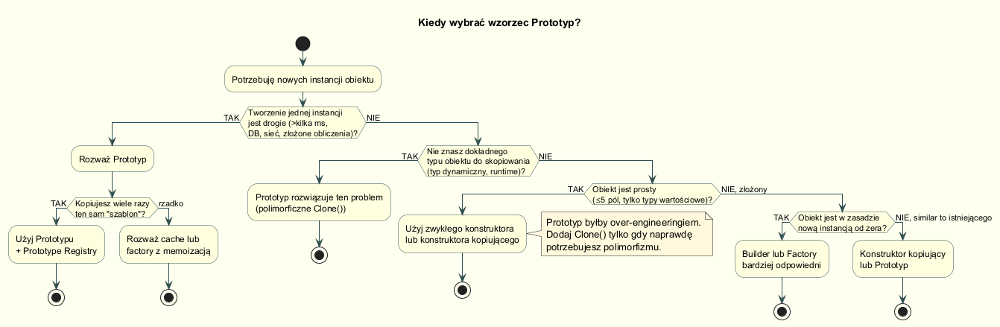
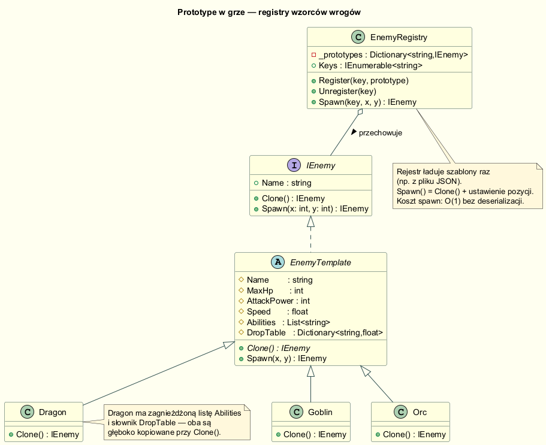

# 05 — Kiedy stosować wzorzec Prototyp

> **Cel sekcji:** Rozpoznać sytuacje, w których Prototyp rzeczywiście się opłaca,
> unikać over-engineeringu, wiedzieć kiedy Builder lub Factory są lepszym wyborem.

---

## Spis treści

1. [Kiedy Prototyp jest właściwym narzędziem](#1-kiedy-prototyp-jest-właściwym-narzędziem)
2. [Prototyp w praktyce: registry wrogów w grze](#2-registry-wrogów-w-grze)
3. [Kiedy NIE stosować Prototypu](#3-kiedy-nie-stosować)
4. [Prototyp a inne wzorce creational](#4-prototyp-a-inne-wzorce)
5. [Uruchomienie przykładu](#uruchomienie)

---

## 1. Kiedy Prototyp jest właściwym narzędziem



### Sytuacja A — droga inicjalizacja

Tworzenie jednej instancji kosztuje (sieć, baza danych, obliczenia), ale
potrzebujesz wielu podobnych instancji:

```text
BEZ PROTOTYPU:
  Instancja 1 → ładowanie z DB (200 ms)
  Instancja 2 → ładowanie z DB (200 ms)
  Instancja 3 → ładowanie z DB (200 ms)
  Razem:        600 ms

Z PROTOTYPEM:
  Szablon     → ładowanie z DB (200 ms)
  Klon 1      → kopia w pamięci (< 1 ms)
  Klon 2      → kopia w pamięci (< 1 ms)
  Razem:        ~202 ms
```

### Sytuacja B — polimorficzne klonowanie bez znajomości typu

Kiedy w runtime dostajemy obiekt przez interfejs/klasę bazową i chcemy go
skopiować — bez wiedzy, czym dokładnie jest:

```csharp
// Nie wiemy, czy to Goblin, Orc czy Dragon...
IEnemy template = registry.GetTemplate("spawner_config_key");

// ...ale clone działa polimorficznie:
IEnemy spawn1 = template.Clone();   // → Goblin.Clone() / Orc.Clone() etc.
```

### Sytuacja C — registry szablonów konfiguracji

Wzorzec pojawia się w:
- Konfiguracje środowiskowe (dev/test/prod jako warianty bazy)
- Szablony dokumentów w edytorach
- Presety z domyślnymi ustawieniami UI
- Węzły grafów obliczeniowych (klonowanie podgrafów)

---

## 2. Registry wrogów w grze



Klasyczny przykład ze świata gier komputerowych:

### Struktura

```csharp
public interface IEnemy
{
    IEnemy Clone();
    IEnemy Spawn(int x, int y);   // Clone + ustaw pozycję
}

public abstract class EnemyTemplate : IEnemy
{
    public string Name        { get; protected init; } = "";
    public int    MaxHp       { get; protected init; }
    public List<string>              _abilities = [];
    public Dictionary<string, float> _dropTable = [];

    // Konstruktor kopiujący — głęboka kopia kolekcji
    protected EnemyTemplate(EnemyTemplate source)
    {
        Name       = source.Name;
        MaxHp      = source.MaxHp;
        _abilities = [.. source._abilities];
        _dropTable = new Dictionary<string, float>(source._dropTable);
    }

    public abstract IEnemy Clone();

    public IEnemy Spawn(int x, int y)
    {
        var spawned = Clone();
        spawned.X = x;
        spawned.Y = y;
        return spawned;
    }
}

public sealed class Dragon : EnemyTemplate
{
    private Dragon(Dragon source) : base(source) { }   // copy ctor

    public Dragon() { Name = "Dragon"; MaxHp = 500; ... }

    public override IEnemy Clone() => new Dragon(this);
}
```

### Rejestr

```csharp
public sealed class EnemyRegistry
{
    private readonly Dictionary<string, IEnemy> _prototypes = [];

    public void   Register(string key, IEnemy prototype) => _prototypes[key] = prototype;
    public IEnemy Spawn(string key, int x, int y)        => _prototypes[key].Spawn(x, y);
}
```

### Użycie

```csharp
var registry = new EnemyRegistry();
registry.Register("goblin", new Goblin());   // załaduj raz z JSON/DB
registry.Register("dragon", new Dragon());

// Spawn jest tani — tylko kopia w pamięci
var wave = Enumerable.Range(0, 20)
    .Select(i => registry.Spawn("goblin", i * 5, 10))
    .ToList();

var boss = registry.Spawn("dragon", 100, 100);
```

### Gwarancja izolacji

Każdy `Spawn` tworzy **niezależną kopię** — modyfikacja pozycji/HP jednego wroga
nie wpływa na szablon ani na innych wrogów:

```csharp
var g1 = registry.Spawn("goblin", 0, 0);
var g2 = registry.Spawn("goblin", 5, 0);

ReferenceEquals(g1.Abilities, g2.Abilities)  // → False ✔
```

---

## 3. Kiedy NIE stosować

### Prosty Value Object

Gdy obiekt to tylko kilka pól typów wartościowych, zwykły konstruktor lub
`record` + `with` jest wystarczający:

```csharp
// ŹLE — niepotrzebna abstrakcja:
public class PointPrototype : IPrototype<PointPrototype>
{
    public double X { get; set; }
    public double Y { get; set; }
    public PointPrototype Clone() => new() { X = X, Y = Y };
}

// DOBRZE — wystarczy:
public record Point(double X, double Y);
var p2 = p1 with { X = 10.0 };
```

### Obiekt zawsze inny od wszystkich innych

Zamówienie e-commerce, transakcja finansowa, log zdarzenia — każda instancja
jest unikalna (ma własne ID, datę, dane klientów). Klonowanie "złego" zamówienia
to błąd domenowy:

```csharp
// ŹLE — powielamy unikalne ID i datę:
var order2 = order1.Clone();   // order2.OrderId == order1.OrderId ← błąd!

// DOBRZE — Factory/Builder dla każdego nowego zamówienia:
var order2 = OrderFactory.Create("CUST-002", newLines);
```

### Obiekt jest w rzeczywistości tworzony od zera

Jeśli "klon" różni się od oryginału w praktycznie każdym polu, nie zyskujesz
nic na klonowaniu — lepszy Builder:

```csharp
// Jeśli tak wygląda "klonowanie", użyj Buildera:
var clone = template.Clone();
clone.CustomerId = "...";
clone.OrderDate  = DateTime.UtcNow;
clone.Lines      = GetLinesForCustomer(customerId);
// po co clone jeśli nic z szablonu nie zostało?
```

---

## 4. Prototyp a inne wzorce

| Sytuacja | Wzorzec |
|----------|---------|
| Tworzysz obiekty od zera, typ znany z góry | **Factory Method** |
| Budujesz złożony obiekt krok po kroku | **Builder** |
| Chcesz skopiować istniejący obiekt (podobne instancje) | **Prototype** |
| Potrzebujesz jednej instancji globalnej | **Singleton** |
| Prototype + rejestr wielu szablonów | **Prototype + Registry** (= Prototype Manager) |
| Prototype + generowanie obiektów powiązanych rodzinami | **Prototype + Abstract Factory** |

### Komplementarność z Composite

Wzorce **Composite** i **Prototype** często współpracują:
w edytorach graficznych klonowalny `CompoundShape` może zawierać inne kształty —
każdy element drzewa ma własną metodę `Clone()`, a klonowanie węzła kopiuje
cały podgraf:

```csharp
public sealed class CompoundShape : Shape
{
    private List<Shape> _children = [];

    public override Shape Clone()
    {
        var copy = new CompoundShape();
        foreach (var child in _children)
            copy._children.Add(child.Clone());   // polimorfyczne Clone w dół drzewa
        return copy;
    }
}
```

---

## Uruchomienie

```bash
cd Examples
dotnet run
```

**Oczekiwany wynik:**
- Scenariusz 1: 3 gobliny i ork w fali, smok jako boss; `g1.Abilities == g2.Abilities → False`
- Scenariusz 2: benchmark — oba spawny kończą w milisekundach (Prototype nie ma overhead gdy init jest tania)
- Scenariusz 3: `Point`, `Order`, `ReportRow` — wystarczy konstruktor lub `record with`

---

*Powrót do głównego spisu: [../README.md](../README.md)*
