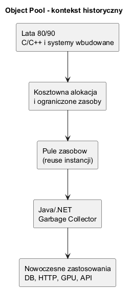
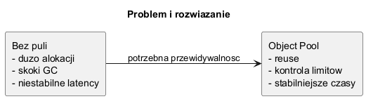

# 01. Idea i kontekst wzorca Object Pool

## Cel rozdziału

Po tym rozdziale student powinien:

- rozumieć, jaki problem rozwiązuje Object Pool,
- znać historyczny kontekst wzorca,
- umieć odróżnić „kosztowny zasób" od zwykłego obiektu domenowego.

---

## Problem

W wielu systemach tworzenie obiektu nie jest tanie. Dotyczy to szczególnie:

- połączeń do bazy danych,
- klientów HTTP/SOAP,
- buforów dużych tablic,
- obiektów używających natywnych zasobów systemowych.

Jeśli przy każdym żądaniu tworzysz nową instancję takiego obiektu, dostajesz:

- niestabilne czasy odpowiedzi,
- skoki narzutu GC,
- większe ryzyko wyczerpania limitów zasobów.

Object Pool przeciwdziała temu przez wielokrotne wykorzystanie już utworzonych instancji.

---

## Kontekst historyczny

- **Lata 80/90:** systemy C/C++, mało pamięci, kosztowna alokacja i ręczne zarządzanie pamięcią.
- **GoF 1994:** wzorce kreacyjne porządkują strategie tworzenia obiektów.
- **Java/.NET:** GC przyspiesza większość alokacji, ale nie eliminuje kosztu inicjalizacji zasobów I/O.
- **Nowoczesny backend:** pooling jest standardem m.in. dla połączeń DB, gniazd, buforów i parserów.

---

## Diagramy

### Diagram kontekstu historycznego



Źródło: [diagrams/01-history-context.puml](diagrams/01-history-context.puml)

### Problem vs rozwiązanie



Źródło: [diagrams/02-problem-vs-solution.puml](diagrams/02-problem-vs-solution.puml)

---

## Minimalny przykład C Sharp

Kod demonstracyjny: [Examples/Program.cs](Examples/Program.cs)

```csharp
var pool = new ObjectPool<ExpensiveResource>(maxSize: 4);
var resource = pool.Acquire();
resource.Use();
pool.Release(resource);
```

Uruchom:

```bash
cd src/05-object-pool/01-idea-i-kontekst/Examples
dotnet run
```

---

## Typowe problemy przy stosowaniu

1. Brak resetu stanu przy zwrocie obiektu do puli.
2. Zbyt duży rozmiar puli i sztuczne „trzymanie" pamięci.
3. Współdzielenie niethread-safe obiektu między wątkami.
4. Brak timeoutu przy oczekiwaniu na obiekt.

---

## Zadanie dla studentów

Zadanie: Zmodyfikuj przykład tak, aby `Acquire` zwracał błąd po przekroczeniu czasu oczekiwania 100 ms.

Wskazówka: użyj `SemaphoreSlim.WaitAsync(timeout)`.
