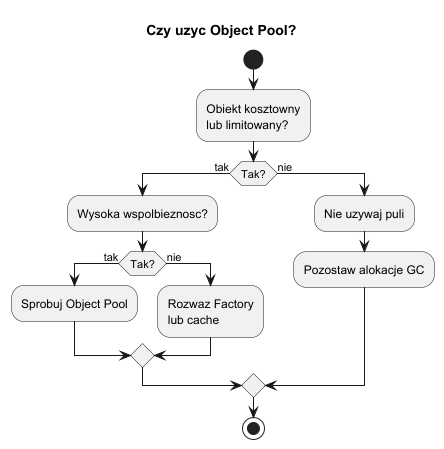
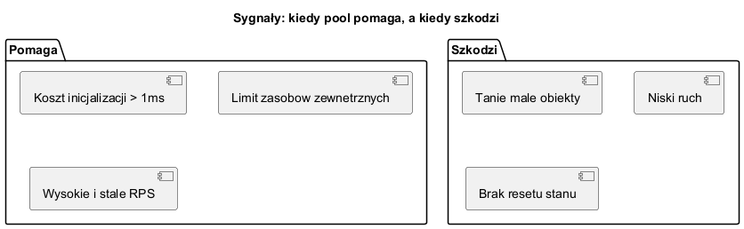

# 02. Kiedy stosować Object Pool

## Cel rozdziału

Po tym rozdziale student powinien:

- umieć podjąć decyzję, czy Object Pool ma sens,
- rozpoznać sygnały, że pula jest over-engineeringiem,
- znać metryki, które warto mierzyć przed wdrożeniem.

---

## Kryteria decyzyjne

Stosuj Object Pool, gdy spełnione są co najmniej 2-3 warunki:

- koszt stworzenia obiektu jest wysoki (np. > 1 ms lub koszt I/O),
- istnieje limit zasobów (licencje, API, liczba połączeń),
- obciążenie jest wysokie i współbieżne,
- obiekt da się bezpiecznie zresetować i ponownie użyć.

Nie stosuj, gdy:

- obiekt jest mały i tani,
- żyje bardzo krótko,
- koszt synchronizacji jest większy niż koszt `new`.

---

## Diagramy decyzyjne

### Drzewo decyzji



Źródło: [diagrams/01-decision-tree.puml](diagrams/01-decision-tree.puml)

### Sygnały „pomaga" vs „szkodzi"



Źródło: [diagrams/02-signals.puml](diagrams/02-signals.puml)

---

## Co mierzyć przed wdrożeniem

Przed podjęciem decyzji o wprowadzeniu puli trzeba zebrać twarde dane. Sama intuicja bardzo często prowadzi do over-engineeringu.

### Co oznacza P95/P99?

- P95 (95. percentyl) oznacza czas, poniżej którego kończy się 95% pomiarów, a 5% najwolniejszych trwa dłużej.
- P99 (99. percentyl) oznacza czas, poniżej którego kończy się 99% pomiarów, a 1% najwolniejszych trwa dłużej.
- To metryki ogona rozkładu (tail latency), więc pokazują opóźnienia, które najbardziej odczuwa użytkownik przy pikach obciążenia.

Przykład: jeśli P95 = 40 ms, a P99 = 120 ms, to większość żądań jest szybka, ale rzadkie przypadki są 3x wolniejsze i właśnie tam pooling może pomóc.

1. Średni i percentylowy czas utworzenia obiektu (P95/P99).
Co mówi ta metryka: czy tworzenie obiektu rzeczywiście boli wydajnościowo w ogonie rozkładu.
Jak interpretować: jeśli średnia jest niska, ale P95/P99 wysokie, to pool może stabilizować czasy odpowiedzi.

2. Liczba alokacji na pojedyncze żądanie.
Co mówi ta metryka: jak duża presja pamięci powstaje przy naturalnym użyciu komponentu.
Jak interpretować: dużo krótkotrwałych alokacji zwykle zwiększa częstotliwość GC, ale w .NET to nie zawsze oznacza, że pool będzie szybszy.

3. Narzut GC (Gen0, Gen1, Gen2) oraz czas pauz.
Co mówi ta metryka: czy garbage collector staje się wąskim gardłem.
Jak interpretować: wzrost Gen1/Gen2 i widoczne pauzy pod obciążeniem to sygnał, że warto rozważyć pooling lub inną strategię redukcji alokacji.

4. Przepustowość i opóźnienia pod obciążeniem.
Co mówi ta metryka: jak system zachowuje się przy rzeczywistym ruchu równoległym.
Jak interpretować: porównuj nie tylko średni czas, ale także P95/P99 oraz stabilność wyników przy tej samej liczbie równoległych operacji.

5. Czas oczekiwania na wolny obiekt w puli.
Co mówi ta metryka: czy pool nie staje się kolejką blokującą użytkowników.
Jak interpretować: jeśli wait-time rośnie, pula jest za mała albo obiekt jest przetrzymywany zbyt długo.

6. Bilans kosztów: synchronizacja kontra zysk z reuse.
W puli płacisz za koordynację (np. `SemaphoreSlim`, kolejki, reset stanu).
Jeżeli ten koszt jest większy niż koszt `new`, pool pogorszy wydajność.

Praktyczna procedura pomiarowa:

1. Zmierz wariant bez puli na danych zbliżonych do produkcyjnych.
2. Zmierz wariant z pulą przy kilku rozmiarach puli.
3. Porównaj średnią, P95/P99, GC i wait-time.
4. Wybierz rozwiązanie dopiero na podstawie wyników, nie na podstawie założeń.

---

## Przykład C Sharp

Kod demonstracyjny: [Examples/Program.cs](Examples/Program.cs)

Przykład uruchamia dwa warianty:

- bez puli (`new`),
- z pulą (`SemaphoreSlim` + kolejka).

Kluczowy fragment porównania:

```csharp
foreach (var simulatedInitMs in initCostsMs)
{
    var noPool = MeasureNoPool(operations, simulatedInitMs);
    var pooled = MeasureWithPool(operations, simulatedInitMs);

    Console.WriteLine(
        $"Init = {simulatedInitMs,2} ms | new = {noPool,5} ms | pool = {pooled,5} ms | delta = {noPool - pooled,5} ms");
}
```

Co robi ten kod:

1. Uruchamia test dla kilku kosztów inicjalizacji obiektu (`1, 3, 8, 20 ms`).
2. Dla każdego kosztu liczy czas wykonania wariantu bez puli i z pulą.
3. Wypisuje różnicę (`delta`), która pokazuje realny zysk albo stratę.

Dlaczego to ważne dydaktycznie:

1. Ten sam kod biznesowy może dawać odwrotne wyniki zależnie od kosztu tworzenia obiektu.
2. Przy taniej inicjalizacji koszt synchronizacji puli często zjada zysk.
3. Przy drogiej inicjalizacji pool zaczyna stabilnie wygrywać.

Na co zwrócić uwagę podczas uruchamiania:

1. Uruchamiaj w trybie Release.
2. Powtórz test kilka razy i policz medianę.
3. Zmieniaj liczbę operacji i współbieżność (np. `operations = 200, 1000, 5000`).
4. Sprawdzaj, czy wynik nie zmienia się po modyfikacji pojemności puli.

Uruchom:

```bash
cd src/05-object-pool/02-kiedy-stosowac/Examples
dotnet run -c Release
```

---

## Zadanie dla studentów

Zadanie: Zwiększ liczbę operacji i porównaj, przy jakim czasie inicjalizacji obiektu pool zaczyna dawać zysk.

Wskazówka: zmieniaj parametr `simulatedInitMs` w kodzie i zapisuj wyniki w tabeli.
