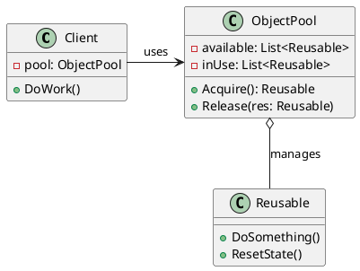
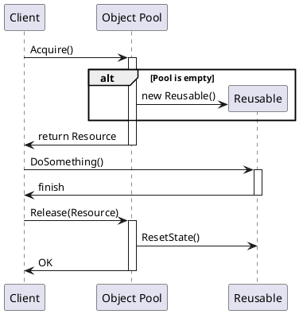

# Struktura i działanie wzorca Object Pool

Typowa struktura wzorca to:
1. **Client** - Klasa potrzebująca zasób.
2. **ReusablePool** - Pula, zarządca utrzymujący obiekty.
3. **Reusable** - Sam unikatowy zasób, obiekty przechowywane w puli. Posiadają odpowiednie stany `acquired`/`free`.

## Działanie:
Klient wypożycza z puli obiekt klasy "Reusable" poprzez metodę np. `Acquire()`. Po użyciu, klient go zwraca używając metody `Release()`, jednak z uwagą na czyszczenie danych na obiekcie tak, żeby nie istniało okno wycieku danych z jednego zdarzenia użytkowego do kolejnego (reset stanu do punktu domyślnego). Jeśli pula jest pusta lub cała zajęta:
1. Pula buduje u siebie nowy obiekt, o ile to możliwe (bo np. limit max to 10 i wydać jeszcze można lub pool prealokuje na bieżąco - rośnie).
2. Jeśli Pula osiągnęła limit wielkości, może na `Acquire` wyrzucać wyjątek, zablokować się z obietnicą dostępności (`Task / Promise`) i zwrócić, gdy coś się zwolni.

## Diagram UML (klasy):

## Diagram Sekwencji:
W typowym powolnym systemie:

Wewnątrz folderu `StructureSample` można zaleźć pierwszy najprostszy kod do prześledzenia jak implementuje się `Acquire` i `Release`.
