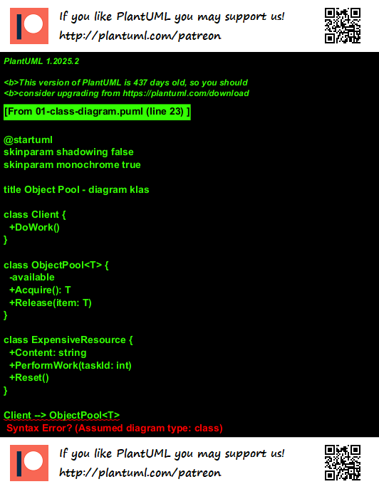
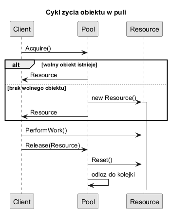

# 03. Struktura i działanie wzorca

## Szczegółowy opis

### Role w klasycznej strukturze

1. **Client** - pobiera obiekt z puli i oddaje go po użyciu.
2. **ObjectPool** - zarządza kolekcją wolnych i używanych obiektów.
3. **Reusable/Resource** - kosztowny obiekt wielokrotnego użycia.

---

### Cykl życia obiektu

1. `Acquire()` - klient prosi o zasób.
2. Pool zwraca wolny obiekt albo tworzy nowy (do limitu).
3. Klient używa zasobu.
4. `Release()` - klient oddaje obiekt.
5. Pool resetuje stan i odkłada obiekt do ponownego użycia.

---

## Diagram wyjaśniający

### Diagram klas



Źródło: [diagrams/01-class-diagram.puml](diagrams/01-class-diagram.puml)

### Diagram sekwencji



Źródło: [diagrams/02-sequence-lifecycle.puml](diagrams/02-sequence-lifecycle.puml)

---

## Kod C#

### Przykład

Kod: [StructureSample/Program.cs](StructureSample/Program.cs)

W przykładzie pokazano:

- implementację `Acquire()` i `Release()`,
- reset stanu obiektu przed oddaniem,
- limit maksymalnej liczby obiektów.

Uruchom:

```bash
cd src/05-object-pool/03-struktura-dzialanie/StructureSample
dotnet run
```

---

## Najczęstsze błędy implementacyjne

1. Brak resetu stanu obiektu.
2. Brak limitu rozmiaru puli.
3. Brak synchronizacji przy współbieżnym dostępie.
4. Podwójny `Release` tego samego obiektu.
