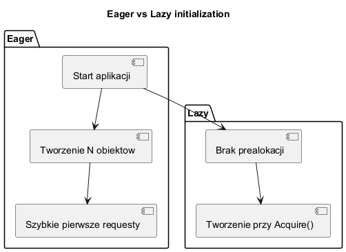
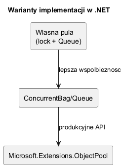

# 04. Implementacje i warianty

## Cel rozdziału

Po tym rozdziale student powinien umieć dobrać wariant implementacji do wymagań systemu.

---

## Główne warianty w .NET

1. **Manualny pool (`lock` + `Queue`)**

- prosty didaktycznie,
- słaby przy dużej współbieżności.

1. **Pool oparty o `ConcurrentBag`/`ConcurrentQueue`**

- mniejszy narzut blokad,
- nadal wymaga poprawnego resetu stanu.

1. **`Microsoft.Extensions.ObjectPool`**

- produkcyjne API,
- polityki tworzenia i zwrotu (`IPooledObjectPolicy<T>`),
- integracja z ASP.NET Core.

---

## Diagramy

### Eager vs Lazy



Źródło: [diagrams/01-eager-vs-lazy.puml](diagrams/01-eager-vs-lazy.puml)

### Mapa wariantów



Źródło: [diagrams/02-variants-map.puml](diagrams/02-variants-map.puml)

---

## Przykład C Sharp

Kod: [VariantsSample/Program.cs](VariantsSample/Program.cs)

Przykład używa `DefaultObjectPool<StringBuilder>` i własnej polityki resetu.

Uruchom:

```bash
cd src/05-object-pool/04-implementacje-warianty/VariantsSample
dotnet run
```

---

## Rys historyczny (skrót)

| Okres | Dominujące podejście |
| --- | --- |
| .NET Framework (wczesne) | manualne pule i `lock` |
| .NET Core | `Concurrent*` + custom pools |
| ASP.NET Core | `Microsoft.Extensions.ObjectPool` |
