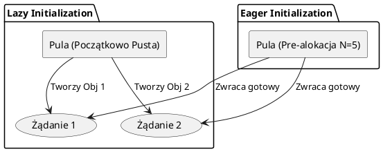

# Różne implementacje i warianty wzorca Object Pool

Wzorzec Object Pool ewoluował na przestrzeni lat wraz z rozwojem platform i języków programowania. W języku C# (i generalnie w ekosystemie .NET) można wyróżnić kilka głównych wariantów implementacji:

## 1. Podejście klasyczne (lock + Queue/Stack)
W starszych wersjach C# do zapewnienia bezpieczeństwa wątkowego (thread-safety) wykorzystywano standardowe kolekcje (`Queue<T>` lub `Stack<T>`) otoczone słowem kluczowym `lock`.
- **Zalety:** Proste w zrozumieniu.
- **Wady:** W systemach o wysokiej współbieżności blokady (locks) tworzą wąskie gardła i tzw. *lock contention*, drastycznie obniżając wydajność.

## 2. Podejście nowoczesne (ConcurrentBag / ConcurrentQueue)
Wykorzystanie przestrzeni nazw `System.Collections.Concurrent`. Kolekcja `ConcurrentBag<T>` jest zoptymalizowana pod kątem scenariuszy, w których ten sam wątek dodaje i pobiera elementy z puli. To podejście zostało wdrożone w naszym pierwszym przykładzie z sekcji 03.

## 3. Strategie alokacji: Eager vs Lazy Initialization
- **Eager Initialization (Zachłanna):** Pula od razu przy starcie alokuje N obiektów i trzyma je w pamięci. 
    - *Zastosowanie:* Kiedy zależy nam na maksymalnie krótkim czasie pierwszych żądań (od razu gotowe).
- **Lazy Initialization (Leniwa):** Pula startuje pusta i tworzy obiekty na bieżąco, aż do osiągnięcia maksymalnego limitu.
    - *Zastosowanie:* Kiedy chcemy oszczędzać pamięć i nie mamy pewności, czy wszystkie zasoby będą potrzebne.

## 4. Natywne podejście z .NET: `Microsoft.Extensions.ObjectPool`
Obecnie w nowoczesnych aplikacjach (szczególnie w ASP.NET Core) rzadko pisze się własne implementacje. .NET oferuje gotową, niezwykle zoptymalizowaną bibliotekę `Microsoft.Extensions.ObjectPool`. Gwarantuje ona topową wydajność przy minimalnym narzucie na synchronizację w środowiskach wielowątkowych.

### Diagram: Różnica między Lazy i Eager



## Przykład w kodzie
W podkatalogu `VariantsSample` pokazano wykorzystanie profesjonalnego, wbudowanego z .NET mechanizmu `DefaultObjectPool<T>` z biblioteki `Microsoft.Extensions.ObjectPool`.

Aby uruchomić:
```bash
cd VariantsSample
dotnet add package Microsoft.Extensions.ObjectPool
dotnet run
```
