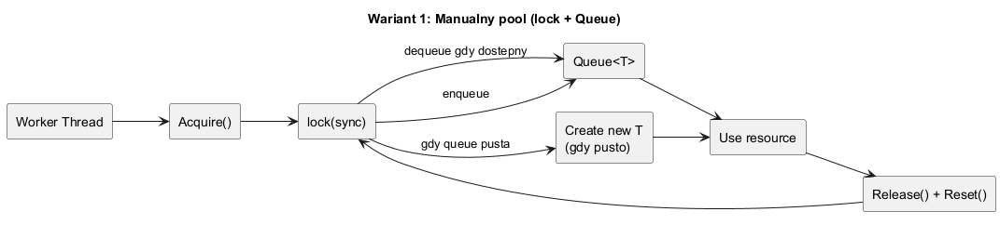
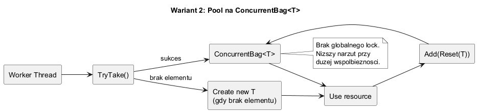
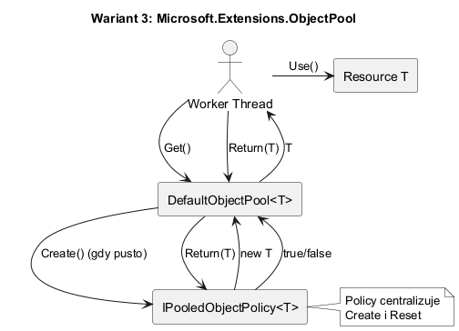

# 04. Implementacje i warianty

## Cel rozdziału

Po tym rozdziale student powinien umieć dobrać wariant implementacji do wymagań systemu.

Każdy wariant poniżej zawiera:

- szczegółowy opis działania,
- diagram wyjaśniający przepływ,
- przykładowy kod w C#.

---

## Wariant 1. Manualny pool (`lock` + `Queue<T>`)

### Szczegółowy opis

To najbardziej klasyczna implementacja puli:

- struktura danych: zwykła `Queue<T>`,
- synchronizacja: wspólny `lock`,
- zwrot obiektu: reset stanu i odłożenie do kolejki.

Cykl życia obiektu:

1. `Acquire()` pobiera element spod `lock`.
2. Jeśli kolejka jest pusta, tworzy nowy obiekt (`new T()`).
3. Kod biznesowy używa obiektu.
4. `Release()` resetuje stan i odkłada obiekt do kolejki.

Mocne strony:

- bardzo czytelny model dla nauki wzorca,
- pełna kontrola nad logiką resetu i limitem retencji.

Słabe strony:

- globalna sekcja krytyczna ogranicza skalowanie,
- łatwo o błędy (brak resetu, deadlocki przy złożonych scenariuszach).

### Diagram



Źródło: [diagrams/03-variant-manual-lock-queue.puml](diagrams/03-variant-manual-lock-queue.puml)

### Kod C#

```csharp
public sealed class LockedPool<T>
{
	private readonly Queue<T> _queue = new();
	private readonly object _sync = new();
	private readonly Func<T> _factory;
	private readonly Action<T> _reset;

	public LockedPool(Func<T> factory, Action<T> reset, int preload = 0)
	{
		_factory = factory;
		_reset = reset;
		for (var i = 0; i < preload; i++)
		{
			_queue.Enqueue(_factory());
		}
	}

	public T Acquire()
	{
		lock (_sync)
		{
			return _queue.Count > 0 ? _queue.Dequeue() : _factory();
		}
	}

	public void Release(T item)
	{
		_reset(item);
		lock (_sync)
		{
			_queue.Enqueue(item);
		}
	}
}
```

---

## Wariant 2. Pool oparty o `ConcurrentBag<T>`

### Szczegółowy opis

Ten wariant zmniejsza koszt synchronizacji:

- `TryTake()` i `Add()` działają bez jednego globalnego `lock`,
- przy dużej współbieżności zwykle daje lepszy throughput niż wariant z `lock + Queue`,
- nadal wymaga poprawnego resetu stanu przed zwrotem.

Cykl życia obiektu:

1. Wątek wywołuje `TryTake(out item)`.
2. Jeśli brak elementu, tworzony jest nowy obiekt.
3. Po użyciu obiekt jest resetowany i zwracany przez `Add()`.

Mocne strony:

- prosta implementacja,
- lepsza skalowalność niż globalny `lock`.

Słabe strony:

- mniejsza kontrola nad kolejnością (to nie FIFO),
- przy braku limitu retencji pula może rosnąć bardziej niż potrzeba.

### Diagram



Źródło: [diagrams/04-variant-concurrentbag.puml](diagrams/04-variant-concurrentbag.puml)

### Kod C#

Kod użyty w próbce z tego rozdziału:

```csharp
public sealed class ManualStringBuilderPool
{
	private readonly ConcurrentBag<StringBuilder> _items = new();

	public ManualStringBuilderPool(int preload)
	{
		for (var i = 0; i < preload; i++)
		{
			_items.Add(new StringBuilder(capacity: 256));
		}
	}

	public StringBuilder Acquire()
	{
		return _items.TryTake(out var item)
			? item
			: new StringBuilder(capacity: 256);
	}

	public void Release(StringBuilder item)
	{
		item.Clear();
		_items.Add(item);
	}
}
```

---

## Wariant 3. `Microsoft.Extensions.ObjectPool`

### Szczegółowy opis

To wariant biblioteczny, zwykle najlepszy punkt startowy dla kodu produkcyjnego:

- gotowe API (`ObjectPool<T>`, `DefaultObjectPool<T>`),
- centralna polityka tworzenia i zwrotu (`IPooledObjectPolicy<T>`),
- spójna semantyka i dobra integracja z ekosystemem ASP.NET Core.

Cykl życia obiektu:

1. `Get()` pobiera obiekt z puli lub tworzy nowy przez politykę.
2. Kod biznesowy używa obiektu.
3. `Return()` wywołuje logikę resetu z polityki i decyduje o retencji.

Mocne strony:

- mniej kodu własnego i mniej błędów implementacyjnych,
- łatwiejsze utrzymanie,
- sensowny domyślny wybór dla większości projektów .NET.

Słabe strony:

- dodatkowa zależność pakietowa,
- mniejsza swoboda eksperymentalnych zachowań niż we własnej implementacji.

### Diagram



Źródło: [diagrams/05-variant-dotnet-objectpool.puml](diagrams/05-variant-dotnet-objectpool.puml)

### Kod C#

Kod użyty w próbce z tego rozdziału:

```csharp
public sealed class StringBuilderPolicy : IPooledObjectPolicy<StringBuilder>
{
	public StringBuilder Create() => new(capacity: 256);

	public bool Return(StringBuilder obj)
	{
		obj.Clear();
		return true;
	}
}

var pool = new DefaultObjectPool<StringBuilder>(
	new StringBuilderPolicy(),
	maximumRetained: Environment.ProcessorCount);

var sb = pool.Get();
try
{
	sb.Append("payload");
}
finally
{
	pool.Return(sb);
}
```

---

## Przykład C Sharp

Kod: [VariantsSample/Program.cs](VariantsSample/Program.cs)

Przykład uruchamia trzy warianty w tym samym scenariuszu:

1. `new StringBuilder` (baseline bez puli),
2. manualny pool oparty o `ConcurrentBag`,
3. `DefaultObjectPool<StringBuilder>` z własną polityką resetu.

Kluczowy fragment porównania:

```csharp
var noPoolMs = MeasureNoPool();
var manualMs = MeasureManualPool(manualPool);
var dotnetMs = MeasureDotnetPool(dotnetPool);

Console.WriteLine($"new StringBuilder   : {noPoolMs,5} ms");
Console.WriteLine($"manual ConcurrentBag: {manualMs,5} ms");
Console.WriteLine($"ObjectPool<T>       : {dotnetMs,5} ms");
```

Co to daje dydaktycznie:

1. Studenci widzą, że sam wzorzec to za mało, liczy się jakość implementacji.
2. Mają punkt odniesienia, czy pooling faktycznie poprawia wynik względem `new`.
3. Łatwo pokazać, że biblioteka platformowa często upraszcza kod i bywa szybsza.

Uruchom:

```bash
cd src/05-object-pool/04-implementacje-warianty/VariantsSample
dotnet run
```

---

## Najczęstsze błędy implementacyjne

1. Brak resetu stanu obiektu przy zwrocie do puli.
2. Brak limitu retencji i niekontrolowany wzrost pamięci.
3. Mieszanie obiektów współdzielonych między wątkami bez kontraktu thread-safe.

---

## Rys historyczny (skrót)

| Okres | Dominujące podejście |
| --- | --- |
| .NET Framework (wczesne) | manualne pule i `lock` |
| .NET Core | `Concurrent*` + custom pools |
| ASP.NET Core | `Microsoft.Extensions.ObjectPool` |

---

## Jak interpretować wyniki

1. Jeśli `new` jest porównywalne z pulą, obiekt może być zbyt tani, aby uzasadnić pooling.
2. Jeśli manualny pool przegrywa z biblioteką, problemem jest narzut i jakość synchronizacji.
3. Jeśli pool wygrywa dopiero przy wyższej współbieżności, opłacalność zależy od ruchu produkcyjnego.
