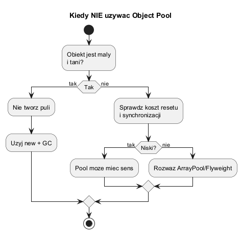
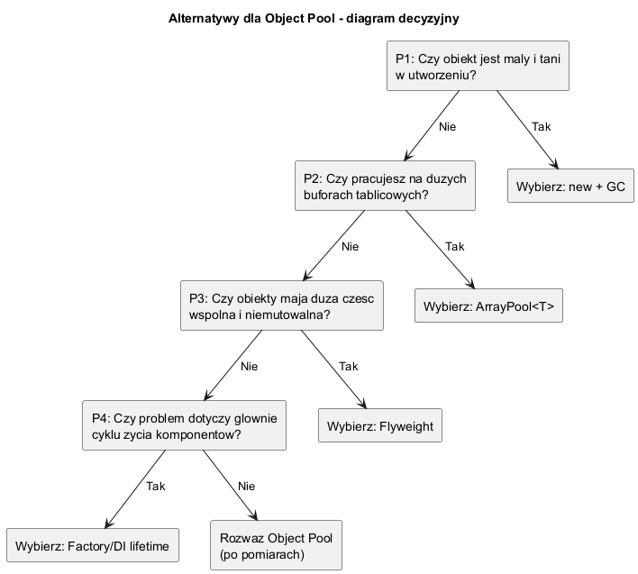

# 05. Over-engineering i alternatywy

## Szczegółowy opis

### Kluczowa teza

W .NET Object Pool nie jest „domyślną optymalizacją". Dla wielu małych i tanich obiektów pool pogarsza wydajność.

---

### Kiedy pool szkodzi

1. Obiekt jest mały i tani w utworzeniu.
2. Koszt resetu i synchronizacji jest wyższy niż koszt `new`.
3. Ruch jest niski, więc pula prawie nie reuse'uje instancji.
4. Pula utrzymuje niepotrzebnie dużą liczbę obiektów i zwiększa zużycie pamięci.

Dodatkowe symptomy over-engineeringu:

1. Kod puli jest większy i bardziej skomplikowany niż kod właściwej logiki biznesowej.
2. Trzeba dodawać wiele zabezpieczeń (`try/finally`, timeouty, walidacje stanu), żeby utrzymać poprawność.
3. Zysk jest widoczny tylko w mikromiernikach, ale znika w realnym scenariuszu aplikacji.

---

## Diagram wyjaśniający

### Diagram 1: kiedy nie stosować



Źródło: [diagrams/01-when-not-to-use.puml](diagrams/01-when-not-to-use.puml)

### Diagram 2: alternatywy



Źródło: [diagrams/02-alternatives.puml](diagrams/02-alternatives.puml)

---

### Alternatywy techniczne

- zwykłe `new` i zaufanie GC,
- `ArrayPool<T>` dla dużych buforów,
- Flyweight dla współdzielenia niezmiennych danych,
- Factory + poprawny lifetime w DI.

Kiedy wybrać którą alternatywę:

1. `new + GC`: małe obiekty, krótki czas życia, wysoka czytelność kodu.
2. `ArrayPool<T>`: duże i częste bufory tablicowe.
3. Flyweight: bardzo dużo obiektów z dużą częścią wspólną i niezmienną.
4. DI lifetime: kontrola cyklu życia komponentów usługowych, nie surowych buforów.

---

## Kod C#

### Kontrprzykład

Kod: [OverEngineeringSample/Program.cs](OverEngineeringSample/Program.cs)

Przykład porównuje trzy scenariusze:

- tworzenie lekkich obiektów przez `new`,
- tworzenie lekkich obiektów przez pool.
- użycie `ArrayPool<byte>` jako alternatywy platformowej.

Kluczowy fragment:

```csharp
Console.WriteLine($"> Standardowa alokacja (new obj) zajęła:\t{newTime} ms | Gen0={gcNewAfter - gcNewBefore}");
Console.WriteLine($"> Własny Object Pool zajął:\t\t{poolTime} ms | Gen0={gcPoolAfter - gcPoolBefore}");
Console.WriteLine($"> Alternatywa ArrayPool<byte>:\t{arrayPoolTime} ms | Gen0={gcArrayPoolAfter - gcArrayPoolBefore}");
```

Wniosek z przykładu:

1. Dla lekkich obiektów Object Pool często przegrywa z prostym `new`.
2. Dla buforów tablicowych warto zacząć od `ArrayPool<T>`, bo to gotowy, sprawdzony mechanizm platformy.
3. Nie wystarczy patrzeć na czas, trzeba sprawdzać także zachowanie GC.

Uruchom:

```bash
cd src/05-object-pool/05-over-engineering-alternatywy/OverEngineeringSample
dotnet run -c Release
```

---

## Wniosek dydaktyczny

Najpierw mierz, potem optymalizuj. Object Pool ma sens tylko tam, gdzie realnie redukuje koszt.

Checklista przed wdrożeniem puli:

1. Czy mam twarde dane z benchmarku i testu obciążeniowego?
2. Czy potrafię bezpiecznie resetować obiekt po każdym użyciu?
3. Czy koszt synchronizacji jest niższy niż koszt ponownej alokacji?
4. Czy prostsza alternatywa (`new`, `ArrayPool<T>`, DI lifetime) nie daje podobnego efektu?
