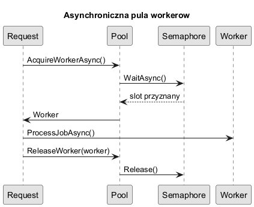
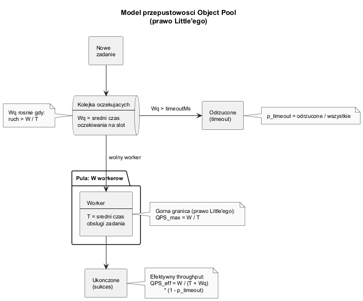

# 06. Asynchroniczni workerzy i pomiar wydajności

## Cel rozdziału

Pokazać scenariusz, w którym Object Pool daje realną przewagę: kosztowne, niezależne workery I/O oraz limit zasobów zewnętrznych.

---

## Założenia przykładu

- mamy tylko `W` drogich workerów (limit licencji/API),
- napływa dużo żądań równolegle,
- żądania czekają asynchronicznie na wolnego workera,
- po użyciu worker wraca do puli.

Wersja rozszerzona przykładu obejmuje dodatkowo:

1. timeout oczekiwania na workera,
2. pomiar średniego wait-time,
3. liczbę timeoutów,
4. szacowanie throughput (req/s).

---

## Diagram sekwencji



Źródło: [diagrams/01-async-pool-sequence.puml](diagrams/01-async-pool-sequence.puml)

## Model przepustowości



Źródło: [diagrams/02-throughput-model.puml](diagrams/02-throughput-model.puml)

Przybliżenie:

$$QPS \approx \frac{W}{T}$$

gdzie:

- $W$ - liczba workerów,
- $T$ - średni czas obsługi pojedynczego zadania (sekundy).

---

## Przykład C Sharp

Kod: [AsyncWorkersSample/Program.cs](AsyncWorkersSample/Program.cs)

Implementacja używa:

- `ConcurrentQueue<HeavyWorker>` - kolejka wolnych workerów,
- `SemaphoreSlim` - kontrola równoległości i czekanie asynchroniczne,
- `Stopwatch` - pomiar całkowitego czasu obsługi.

Dodatkowo implementacja mierzy:

1. czas oczekiwania na slot (`WaitAsync`) dla każdego żądania,
2. liczbę zadań zakończonych timeoutem,
3. końcowy throughput na podstawie liczby ukończonych zadań i czasu testu.

Kluczowy fragment:

```csharp
var acquired = await pool.AcquireWorkerAsync(timeout);
if (acquired is null)
{
    onTimeout();
    return;
}

var result = acquired.Value;
await result.Worker.ProcessJobAsync(requestJobId);
onSuccess(result.WaitMs);
```

Co to pokazuje:

1. Pool może być nie tylko źródłem obiektów, ale też mechanizmem kontroli przeciążenia.
2. Timeout chroni system przed nieograniczonym kolejkowaniem.
3. Mierzenie wait-time pomaga dobrać liczbę workerów na podstawie danych.

Uruchom:

```bash
cd src/05-object-pool/06-asynchroniczne-workery/AsyncWorkersSample
dotnet run
```

Warianty uruchomienia:

```bash
dotnet run -- --workers 3 --jobs 20 --timeoutMs 1000
dotnet run -- --workers 2 --jobs 100 --timeoutMs 300
dotnet run -- --workers 6 --jobs 200 --timeoutMs 1500
```

Interpretacja wyników:

1. rosnące timeouty oznaczają zbyt małą pulę lub zbyt długi czas pracy workera,
2. wysokie wait-time przy niskim timeoutie zwiastuje niestabilne SLA,
3. wzrost workerów poprawia throughput tylko do momentu, gdy ograniczeniem staje się zasób zewnętrzny.

---

## Jak dobrać liczbę workerów

1. Zmierz średni czas zadania (`T`) i wymagany QPS.
2. Policz wstępnie `W = QPS * T`.
3. Przetestuj `W-1`, `W`, `W+1` pod obciążeniem i porównaj P95/P99.
4. Dodaj limit timeoutu oczekiwania na worker.
5. Ustal próg akceptowalnego wait-time (np. średnio < 50 ms, P95 < 200 ms).
6. Dobierz minimalne `W`, które spełnia throughput i SLA jednocześnie.
