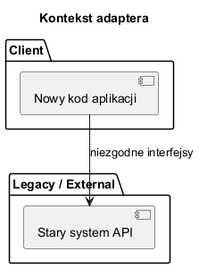
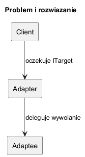

# 01. Idea i kontekst wzorca Adapter

## Cel rozdziału

Po tym rozdziale student powinien:

- rozumieć problem niezgodnych interfejsów,
- znać kontekst historyczny powstania wzorca,
- umieć wskazać miejsce adaptera w architekturze integracyjnej.

## Dlaczego Adapter powstał

W systemach rozwijanych latami często pojawiają się komponenty o różnych kontraktach API:

- legacy biblioteki,
- zewnętrzne SDK,
- stare moduły monolitu,
- nowe mikroserwisy.

Adapter pozwala nie przepisywać całego klienta, tylko dodać warstwę tłumaczącą dane i wywołania.

## Rys historyczny

1. Integracje EAI i SOA z lat 90/2000 wymagały łączenia systemów o różnych kontraktach i formatach wiadomości.
2. W monolitach ewoluujących przez lata nowe moduły często nie mogły naruszać stabilnego API starego rdzenia.
3. W erze mikroserwisów i zewnętrznych SDK problem wrócił jako różnice w semantyce endpointów, nazwach pól i modelach błędów.
4. Adapter utrwalił się jako bezpieczna strategia migracji etapowej: klient pozostaje stabilny, a integracja jest izolowana w jednej warstwie.

Wyjaśnienie skrótów:

- EAI (Enterprise Application Integration): podejście do łączenia wielu systemów firmowych (ERP, CRM, billing), które mają różne formaty danych i protokoły.
- SOA (Service-Oriented Architecture): architektura oparta o usługi z jasno zdefiniowanymi kontraktami; adapter bywa używany, gdy kontrakty usług nie są zgodne między wersjami lub dostawcami.

## Diagramy



Źródło: [diagrams/01-context.puml](diagrams/01-context.puml)

Opis diagramu:

1. Nowy kod aplikacji nie potrafi bezpośrednio użyć starego systemu API z powodu niezgodności interfejsów.
2. Strzałka pokazuje problem kontraktowy, a nie wywołanie poprawnej integracji.
3. Diagram uzasadnia potrzebę dodatkowej warstwy translacji.



Źródło: [diagrams/02-problem-solution.puml](diagrams/02-problem-solution.puml)

Opis diagramu:

1. Klient rozmawia tylko z Adapterem przez oczekiwany kontrakt.
2. Adapter deleguje wywołanie do Adaptee i tłumaczy dane między światami API.
3. Dzięki temu Adaptee pozostaje bez zmian, a klient zachowuje spójny interfejs.

## Przykład C Sharp

Kod: [Examples/Program.cs](Examples/Program.cs)

Co pokazuje program:

1. Klient używa stabilnego interfejsu `IPaymentGateway` i metody `Charge(...)`.
2. System legacy udostępnia inny kontrakt: `MakePayment(double, string)`.
3. `LegacyGatewayAdapter` tłumaczy wywołanie klienta na wywołanie legacy i mapuje typ `decimal` na `double`.
4. Program demonstruje izolację zależności: kod klienta nie zna klasy `LegacyPaymentSystem`.

Fragment:

```csharp
IPaymentGateway gateway = new LegacyGatewayAdapter(new LegacyPaymentSystem());
var result = gateway.Charge(120.50m, "PLN");
Console.WriteLine(result);
```

Interpretacja wyniku:

1. W konsoli pojawi się wartość w stylu `LEGACY_OK:120.50:PLN`.
2. Odpowiedź pochodzi z systemu legacy, ale została wywołana przez kontrakt nowego klienta.
3. To właśnie podstawowa korzyść adaptera: kompatybilność bez przepisywania klienta i dostawcy.

Uruchom:

```bash
cd src/06-adapter/01-idea-i-kontekst/Examples
dotnet run
```
