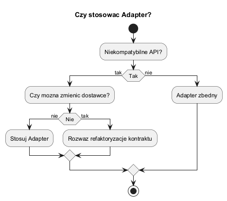
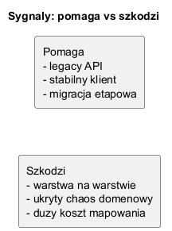

# 02. Kiedy stosować Adapter

## Kryteria

Stosuj Adapter, gdy:

- klient musi działać na stabilnym interfejsie,
- nie możesz zmienić kodu dostawcy (zewnętrzne API, legacy),
- migracja ma być etapowa i niskiego ryzyka.

Nie stosuj, gdy:

- możesz bezpiecznie zmienić oba końce kontraktu,
- adapter ukrywa złą granicę domenową,
- rośnie liczba warstw tłumaczących i koszt utrzymania.

## Co mierzyć

1. Czas mapowania danych w adapterze.
2. Częstotliwość błędów transformacji.
3. Stabilność kontraktu po stronie klienta.
4. Koszt utrzymania przy dodawaniu nowych pól.

Jak to mierzyć na bazie programu z tego rozdziału:

1. Użyj `Benchmark.Run(operations, mapCostMs)` i porównaj `NoAdapterMs` vs `AdapterMs`.
2. Zmieniaj `mapCostMs`, aby symulować coraz cięższe mapowanie i walidację danych.
3. Zmieniaj `operations`, aby sprawdzić wpływ skali ruchu na koszt warstwy adaptera.
4. Oblicz narzut adaptera jako:

$$overhead = \frac{AdapterMs - NoAdapterMs}{NoAdapterMs} \cdot 100$$

Wyjaśnienie symboli:

- `NoAdapterMs` - czas wykonania scenariusza bez warstwy adaptera (w milisekundach),
- `AdapterMs` - czas wykonania tego samego scenariusza z adapterem (w milisekundach),
- `overhead` - procentowy narzut czasu wynikający z dodania adaptera.

Jednostki:

1. Czas (`NoAdapterMs`, `AdapterMs`) licz w tych samych jednostkach, najlepiej w `ms`.
2. Wynik `overhead` jest bezwymiarowy i podawany w `%`.
3. Dla porównań między scenariuszami utrzymuj stałe warunki testu (ta sama maszyna, ten sam build, ta sama liczba operacji).

Szybka interpretacja wyniku:

- `overhead < 5%` - zwykle mały koszt adaptera,
- `5%-20%` - koszt umiarkowany, wymaga oceny korzyści architektonicznych,
- `> 20%` - wysoki narzut, warto uprościć mapowanie lub rozważyć inny punkt integracji.

Wersja tekstowa (gdy renderer matematyki jest wyłączony):

`overhead[%] = ((AdapterMs - NoAdapterMs) / NoAdapterMs) * 100`

5. Uruchamiaj każdy scenariusz kilka razy i porównuj medianę, nie pojedynczy pomiar.

## Diagramy



Źródło: [diagrams/01-decision-tree.puml](diagrams/01-decision-tree.puml)

Opis diagramu 1:

1. Pierwsze pytanie sprawdza, czy rzeczywiście występuje niekompatybilność API.
2. Jeśli API nie są konfliktowe, adapter jest zbędny i tylko zwiększa złożoność.
3. Jeśli API są niekompatybilne, decyzja zależy od możliwości zmiany dostawcy.
4. Gdy dostawcy nie można zmienić, adapter jest najbezpieczniejszą opcją niskiego ryzyka.
5. Gdy dostawcę można zmienić, warto rozważyć refaktoryzację kontraktu zamiast dokładania kolejnej warstwy.



Źródło: [diagrams/02-signals.puml](diagrams/02-signals.puml)

Opis diagramu 2:

1. Strona Pomaga grupuje sytuacje, w których adapter daje izolację i stabilność klienta.
2. Strona Szkodzi pokazuje koszt uboczny: kolejne warstwy translacji i ryzyko ukrycia problemu domenowego.
3. Diagram przypomina, że sam fakt działania integracji nie wystarcza; ważny jest koszt utrzymania w czasie.
4. Dla decyzji architektonicznej należy zestawić sygnały z obu stron i potwierdzić je pomiarem.

## Przykład C Sharp

Kod: [Examples/Program.cs](Examples/Program.cs)

Co robi program:

1. Definiuje benchmark z dwoma przebiegami: bez kosztu mapowania (`NoAdapter`) i z kosztem mapowania (`Adapter`).
2. Symuluje narzut mapowania przez `Thread.Sleep(mapCostMs)` w pętli równoległej.
3. Mierzy całkowity czas wariantów przez `Stopwatch` i zwraca wynik w `DecisionMetrics`.
4. W `Main()` uruchamia scenariusz testowy i wypisuje porównanie czasów.

Jak wykonać pomiar krok po kroku:

1. Uruchom bazowy scenariusz:

```bash
cd src/06-adapter/02-kiedy-stosowac/Examples
dotnet run -c Release
```

2. Zmień w kodzie parametry `operations` i `mapCostMs`, na przykład:

- `operations: 1000, mapCostMs: 1`
- `operations: 1000, mapCostMs: 3`
- `operations: 5000, mapCostMs: 3`

3. Zapisz wyniki dla `NoAdapterMs` i `AdapterMs`.
4. Policz narzut procentowy adaptera i sprawdź, czy zysk izolacji kontraktu uzasadnia koszt.

Przykładowe obliczenie:

1. Załóżmy, że `NoAdapterMs = 120`, a `AdapterMs = 150`.
2. Różnica to `30 ms`.
3. Narzut procentowy:

$$overhead = \frac{150 - 120}{120} \cdot 100 = 25\%$$

4. Interpretacja: adapter zwiększa czas o 25%. Taki koszt może być akceptowalny tylko wtedy, gdy zyskujesz wyraźną stabilność kontraktu i niższe ryzyko migracji.

Fragment:

```csharp
var metrics = Benchmark.Run(operations: 1000, mapCostMs: 2);
Console.WriteLine($"NoAdapter={metrics.NoAdapterMs} ms, Adapter={metrics.AdapterMs} ms");
```

Interpretacja przykładu:

1. Gdy `mapCostMs` rośnie, `AdapterMs` rośnie zwykle szybciej niż `NoAdapterMs`.
2. Jeśli narzut jest mały, adapter może być akceptowalnym kosztem za stabilność kontraktu.
3. Jeśli narzut jest duży i rośnie z ruchem, warto ograniczyć mapowanie, uprościć kontrakt albo rozważyć inny punkt integracji.
