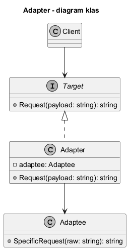
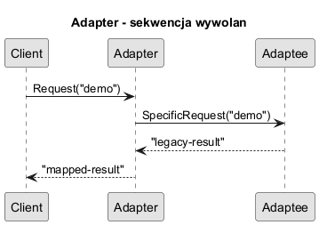

# 03. Struktura GoF Adapter

## Role we wzorcu

1. `Target` - interfejs oczekiwany przez klienta.
2. `Adaptee` - istniejąca klasa o niekompatybilnym API.
3. `Adapter` - tłumacz pomiędzy `Target` i `Adaptee`.
4. `Client` - używa wyłącznie `Target`.

## Diagramy



Źródło: [diagrams/01-class-diagram.puml](diagrams/01-class-diagram.puml)



Źródło: [diagrams/02-sequence.puml](diagrams/02-sequence.puml)

## Przykład C Sharp

Kod: [Examples/Program.cs](Examples/Program.cs)

```csharp
ITarget target = new LegacyAdapter(new Adaptee());
Console.WriteLine(target.Request("demo"));
```
