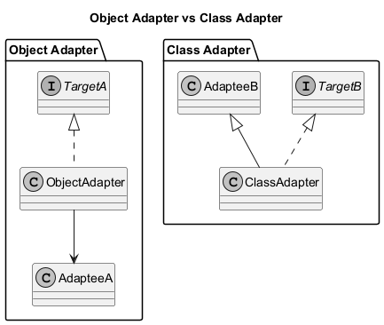
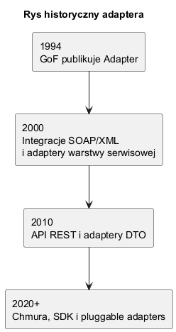

# 04. Implementacje i warianty Adaptera

## Cel rozdziału

Porównać dwa warianty implementacji Adaptera i umieć dobrać je do kontekstu technicznego.

---

## Wariant 1. Object Adapter (kompozycja)

### Szczegółowy opis

To wariant preferowany w C#:

1. Adapter implementuje interfejs klienta (`IFileExporter`).
2. Adapter posiada pole z instancją adaptee (`LegacyCsvService`).
3. Wywołanie `Export(...)` jest delegowane do `SaveCsv(...)`.
4. Dzięki kompozycji łatwo podmienić adaptee (np. mock, inna implementacja, dekorator).

Mocne strony:

- niski poziom sprzężenia,
- dobra testowalność,
- bezpieczna ewolucja kodu przy zmianach adaptee.

Słabe strony:

- dodatkowa warstwa obiektu i delegacji,
- więcej kodu niż w wariancie dziedziczenia.

### Diagram



Źródło: [diagrams/01-object-vs-class.puml](diagrams/01-object-vs-class.puml)

Opis części Object Adapter na diagramie:

1. `TargetA <|.. ObjectAdapter` - adapter realizuje kontrakt klienta.
2. `ObjectAdapter --> AdapteeA` - adapter trzyma referencję i deleguje wywołanie.
3. Relacja kompozycji oznacza, że adaptee może być dostarczony z zewnątrz (DI).

### Kod C#

Kod: [Examples/Program.cs](Examples/Program.cs)

Fragment wariantu Object Adapter:

```csharp
public sealed class ObjectAdapter : IFileExporter
{
	private readonly LegacyCsvService _service;

	public ObjectAdapter(LegacyCsvService service)
	{
		_service = service;
	}

	public string Export(string input) => _service.SaveCsv(input);
}
```

Jak czytać ten kod:

1. `ObjectAdapter` nie dziedziczy po legacy, tylko je opakowuje.
2. Metoda `Export` tłumaczy kontrakt klienta na metodę legacy.
3. Wstrzyknięcie `LegacyCsvService` w konstruktorze ułatwia testy jednostkowe.

---

## Wariant 2. Class Adapter (dziedziczenie)

### Szczegółowy opis

To wariant oparty o dziedziczenie po adaptee:

1. Adapter jednocześnie implementuje interfejs klienta i dziedziczy po klasie legacy.
2. `Export(...)` wywołuje bezpośrednio odziedziczoną metodę `SaveCsv(...)`.
3. Mniej kodu pośredniczącego, ale silniejsze sprzężenie strukturalne.

Mocne strony:

- prostszy kod w bardzo małych adapterach,
- brak osobnego pola z adaptee.

Słabe strony:

- silne powiązanie z konkretną klasą bazową,
- gorsza elastyczność przy zmianach hierarchii,
- trudniejsze łączenie z innymi wariantami zachowania niż w kompozycji.

### Diagram


Źródło: [diagrams/01-object-vs-class.puml](diagrams/01-object-vs-class.puml)

Opis części Class Adapter na diagramie:

1. `TargetB <|.. ClassAdapter` - adapter udostępnia oczekiwany kontrakt klienta.
2. `AdapteeB <|-- ClassAdapter` - adapter dziedziczy po adaptee.
3. Dziedziczenie upraszcza wywołanie, ale zwiększa zależność od implementacji legacy.

### Kod C#

Kod: [Examples/Program.cs](Examples/Program.cs)

Fragment wariantu Class Adapter:

```csharp
public sealed class ClassAdapter : LegacyCsvService, IFileExporter
{
	public string Export(string input) => SaveCsv(input);
}
```

Jak czytać ten kod:

1. `ClassAdapter` korzysta z dziedziczonego API legacy bez pola pośredniego.
2. `Export` mapuje kontrakt klienta na metodę klasy bazowej.
3. To dobre rozwiązanie tylko wtedy, gdy świadomie akceptujesz mocne sprzężenie z `LegacyCsvService`.

---

## Porównanie praktyczne

1. Gdy zależy Ci na testowalności i niskim sprzężeniu, wybierz Object Adapter.
2. Gdy adapter jest bardzo prosty i kontrolujesz klasę legacy, Class Adapter może być wystarczający.
3. W nowoczesnym C# domyślnym wyborem jest zwykle kompozycja.

---

## Przykład C Sharp

Kod: [Examples/Program.cs](Examples/Program.cs)

Program uruchamia oba warianty i porównuje efekt mapowania:

```csharp
IFileExporter objectAdapter = new ObjectAdapter(new LegacyCsvService());
IFileExporter classAdapter = new ClassAdapter();

Console.WriteLine($"ObjectAdapter: {objectAdapter.Export("report")}");
Console.WriteLine($"ClassAdapter : {classAdapter.Export("report")}");
```

Interpretacja:

1. Oba warianty zwracają zgodny wynik biznesowy (`CSV::report`).
2. Różnica dotyczy głównie architektury i kosztu utrzymania, nie samego rezultatu funkcjonalnego.

Uruchom:

```bash
cd src/06-adapter/04-implementacje-i-warianty/Examples
dotnet run
```

---

## Rys historyczny (opcjonalny w tym rozdziale)

Rys historyczny jest przydatny jako tło, ale merytorycznie bardziej pasuje do rozdziału 01 (Idea i kontekst). W rozdziale 04 najważniejsze jest porównanie implementacji.



Źródło: [diagrams/02-history.puml](diagrams/02-history.puml)
