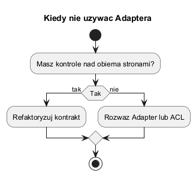
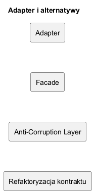

# 05. Kiedy nie stosować Adaptera i jakie są alternatywy

## Kiedy Adapter to zły wybór

1. Gdy oba systemy możesz zmienić i prościej ujednolicić kontrakt.
2. Gdy pojawia się wielowarstwowy łańcuch adapterów.
3. Gdy mapowanie zaciera semantykę danych i utrudnia testowanie.

W praktyce oznacza to, że adapter przestaje być cienką warstwą translacji, a staje się ukrytą logiką biznesową. To sygnał, że należy się zatrzymać i zmienić kierunek architektury.

## Czerwone flagi over-engineeringu

1. Adapter ma więcej kodu niż klient i adaptee razem.
2. Jedno pole wejściowe jest mapowane przez wiele reguł warunkowych.
3. Każda nowa wersja API wymaga zmian w wielu adapterach naraz.
4. Testy adaptera są kruche i zależne od kolejności mapowań.

Jeśli widzisz kilka z tych sygnałów jednocześnie, rozważ uproszczenie granicy integracji.

## Alternatywy

- Facade: uproszczenie API bez translacji semantycznej.
- Anti-Corruption Layer: większa warstwa izolacji między bounded contexts.
- Refaktoryzacja kontraktu: najczystsza opcja, jeśli obie strony są pod kontrolą.

## Jak podjąć decyzję

1. Oszacuj koszt zmiany klienta i koszt zmiany dostawcy API.
2. Oceń ryzyko semantyczne mapowania (czy znaczenie danych pozostanie czytelne).
3. Sprawdź horyzont czasowy: tymczasowa migracja czy wieloletnia integracja.
4. Porównaj koszt utrzymania po 6-12 miesiącach, a nie tylko koszt startu.

Krótka heurystyka:

- jeśli integracja jest tymczasowa i API zewnętrzne jest poza kontrolą zespołu: Adapter,
- jeśli granica domen jest trwała i złożona: Anti-Corruption Layer,
- jeśli oba moduły są pod Twoją kontrolą: refaktoryzacja kontraktu.

## Diagramy

Źródło: [diagrams/01-decision-not-use.puml](diagrams/01-decision-not-use.puml)

Źródło: [diagrams/02-alternatives-map.puml](diagrams/02-alternatives-map.puml)

## Przykład C Sharp

Kod: [Examples/Program.cs](Examples/Program.cs)

Przykład porównuje trzy ścieżki (`Adapter`, `Facade`, `Refactor`) na podstawie prostego modelu kosztu i ryzyka.

Co zobaczysz po uruchomieniu:

1. Tabelę opcji z kosztem startowym i kosztami utrzymania.
2. Koszt całkowity dla zadanego horyzontu czasowego.
3. Rekomendację opartą o najniższy łączny koszt skorygowany ryzykiem.

To celowo uproszczony model, ale dobrze wspiera dyskusję na zajęciach: wzorzec to decyzja ekonomiczna i organizacyjna, a nie wyłącznie techniczna.
