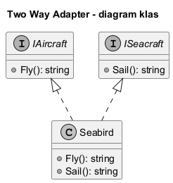
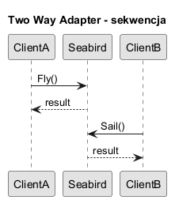

# 06. Two Way Adapter

## O co chodzi

Two Way Adapter implementuje dwa interfejsy jednocześnie i pozwala używać jednego obiektu w dwóch kierunkach integracji.

Kluczowa różnica względem klasycznego adaptera: translacja działa w obie strony, więc obiekt pełni dwie role naraz. To zwiększa elastyczność migracji, ale rośnie też ryzyko niezgodności semantycznej.

## Zastosowanie

- migracje systemów, gdzie stary i nowy interfejs muszą działać równolegle,
- kompatybilność wsteczna API,
- scenariusze, gdzie moduł bywa klientem i serwerem różnych kontraktów.

## Na co uważać

1. Niespójny stan: operacje z interfejsu A mogą unieważniać założenia interfejsu B.
2. Dwuznaczna semantyka: te same pola mogą znaczyć co innego po obu stronach.
3. Trudniejsze testy: trzeba testować oba kierunki oraz przejścia A -> B i B -> A.
4. Ryzyko „god object”: adapter staje się zbyt rozbudowany i przejmuje logikę domenową.

Praktyczna zasada: utrzymuj adapter cienki, a reguły domenowe zostawiaj w osobnych serwisach.

## Historia

Wariant pojawił się jako rozszerzenie klasycznego Adaptera przy projektach modernizacyjnych legacy, gdy jedna translacja nie wystarczała.

## Diagramy

Źródło: [diagrams/01-two-way-class.puml](diagrams/01-two-way-class.puml)

Źródło: [diagrams/02-two-way-sequence.puml](diagrams/02-two-way-sequence.puml)

## Przykład C Sharp

Kod: [Examples/Program.cs](Examples/Program.cs)

Przykład pokazuje obiekt `Seabird`, który jest jednocześnie widziany jako `IAircraft` i `ISeacraft`.

Zakres przykładu:

1. Wspólny stan (prędkość, wysokość, zanurzenie) używany przez oba interfejsy.
2. Walidacja domenowa i czytelne wyjątki przy błędnym użyciu.
3. Demonstracja przełączania kontekstu pracy między „lot” i „rejs”.

Wniosek dydaktyczny: Two Way Adapter jest użyteczny w migracji etapowej, ale wymaga silnych testów kontraktowych dla obu widoków interfejsu.
