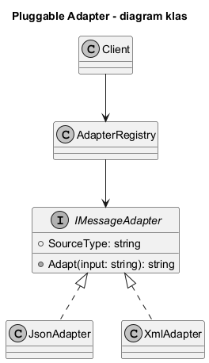
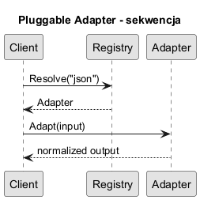

# 07. Pluggable Adapter

## O co chodzi

Pluggable Adapter polega na dynamicznym doborze adaptera na podstawie typu źródła danych lub konfiguracji. Klient korzysta z jednego interfejsu, a adapter wybierany jest z rejestru.

W praktyce to wzorzec często łączony z pluginami i DI: nowe adaptery dodajesz przez rejestrację komponentu, bez zmian w kodzie klienta.

## Zastosowanie

- integracja wielu dostawców API,
- architektura pluginowa,
- stopniowe podpinanie nowych źródeł danych bez zmiany klienta.

## Korzyści i koszty

Korzyści:

1. Rozszerzalność zgodna z Open/Closed.
2. Mniejszy wpływ zmian dostawcy na logikę biznesową.
3. Możliwość aktywacji adapterów przez konfigurację środowiska.

Koszty:

1. Dodatkowa warstwa diagnostyki (co wybrało się i dlaczego).
2. Potrzeba obsługi błędów rejestracji i konfliktów kluczy.
3. Konieczność wersjonowania kontraktów adapterów.

## Historia

Wariant popularyzował się wraz z systemami ETL i middleware, gdzie źródła danych zmieniały się częściej niż logika biznesowa klienta.

## Dobre praktyki

1. Loguj decyzję wyboru adaptera (source type, wersja, wynik).
2. Waliduj rejestr przy starcie aplikacji (brak duplikatów i pustych kluczy).
3. Dodaj strategię fallback, gdy adapter nie istnieje.
4. Trzymaj mapowanie formatu poza kodem klienta (konfiguracja, DI, plugin manifest).

## Diagramy

Źródło: [diagrams/01-pluggable-class.puml](diagrams/01-pluggable-class.puml)

Źródło: [diagrams/02-pluggable-sequence.puml](diagrams/02-pluggable-sequence.puml)

## Przykład C Sharp

Kod: [Examples/Program.cs](Examples/Program.cs)

W przykładzie klient korzysta z rejestru adapterów, a wybór odbywa się po `sourceType` (`json`, `xml`, `csv`).

Zakres przykładu:

1. Dynamiczna rejestracja adapterów.
2. Bezpieczne rozwiązywanie adaptera z czytelnym błędem.
3. Demonstracja rozszerzenia o nowy adapter bez modyfikacji logiki klienta.
