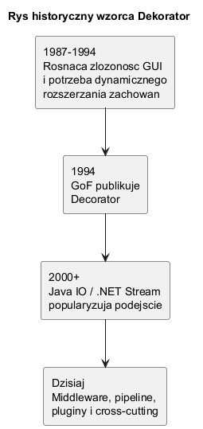
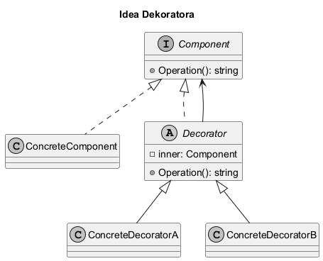

# 01. Idea i kontekst wzorca Dekorator

## Cel tematu

Zrozumieć po co powstał Dekorator i jakie potrzeby zaspokaja: rozszerzanie zachowania obiektów bez rozbudowy dziedziczenia.

## Problem, który rozwiązuje Dekorator

Gdy zachowanie klasy trzeba rozszerzać wariantowo (logowanie, podpis, cache, walidacja), dziedziczenie prowadzi do eksplozji klas.
Dekorator zamienia ten problem na kompozycję obiektów, które można składać runtime.

## Rys historyczny



Źródło: [diagrams/01-history.puml](diagrams/01-history.puml)

Interpretacja:

1. Wzorzec został spopularyzowany przez GoF.
2. Praktyka bibliotek I/O (Java/.NET) pokazała, że dekorowanie strumieni działa świetnie.
3. Dzisiaj mechanika dekorowania pojawia się też w pipeline i middleware.

## Idea wzorca



Źródło: [diagrams/02-idea.puml](diagrams/02-idea.puml)

Interpretacja:

1. `ConcreteComponent` daje bazowe zachowanie.
2. Każdy dekorator trzyma referencję do komponentu i dodaje własną logikę.
3. Dekoratory można łączyć łańcuchowo.

## Kod C# (minimum)

Kod: [Examples/Program.cs](Examples/Program.cs)

Fragment:

```csharp
IMessageSender sender = new LoggingDecorator(
    new SignatureDecorator(
        new EmailSender()));

var output = sender.Send("Witaj na wykladzie o Dekoratorze");
```

Co to pokazuje:

1. Klient widzi tylko `IMessageSender`.
2. Zachowanie jest rozszerzone o logowanie i podpis bez zmian w `EmailSender`.
3. Kolejność dekoratorów wpływa na wynik.

## Uruchom

```bash
cd src/07-dekorator/01-idea-i-kontekst/Examples
dotnet run
```

## Zadania z rozwiązaniami

1. Zadanie: dodaj `UppercaseDecorator`, który zamienia treść na wielkie litery.
Rozwiązanie: implementacja dekoratora dziedziczącego po `SenderDecorator`, w `Send` wywołaj `Inner.Send(message.ToUpperInvariant())`.

2. Zadanie: zamień kolejność `LoggingDecorator` i `SignatureDecorator` i porównaj logi.
Wyjaśnienie: Dekorator działa warstwowo, więc kolejność to część logiki biznesowej.

## Literatura

- Refactoring.Guru: https://refactoring.guru/design-patterns/decorator
- GoF, Design Patterns, rozdział Decorator
