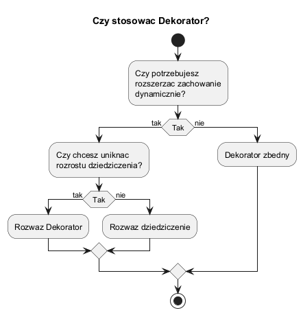
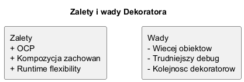

# 02. Kiedy stosować Dekorator

## Kryteria decyzyjne

Stosuj Dekorator, gdy:

1. Chcesz dodawać funkcje obiektowi dynamicznie.
2. Nie chcesz mnożyć klas pochodnych.
3. Funkcje mają charakter orthogonalny (np. walidacja, audyt, szyfrowanie).

Nie stosuj, gdy:

1. Kolejność warstw jest niejawna i zespół jej nie kontroluje.
2. Dekoratory zaczynają zawierać logikę domenową zamiast technicznej.
3. Łańcuch dekoratorów staje się trudny do diagnozy.

## Diagramy



Źródło: [diagrams/01-decision-tree.puml](diagrams/01-decision-tree.puml)



Źródło: [diagrams/02-tradeoffs.puml](diagrams/02-tradeoffs.puml)

## Pomiar narzutu (przykład)

Kod: [Examples/Program.cs](Examples/Program.cs)

Program porównuje:

- łańcuch minimalny (`BaseExporter`),
- łańcuch rozbudowany (`Validation + Audit + Encryption + Base`).

Wynik:

$$overhead = \frac{RichMs - LeanMs}{LeanMs} \cdot 100$$

Interpretacja:

1. Mały narzut jest często akceptowalny za lepszą separację odpowiedzialności.
2. Duży narzut wymaga przeglądu warstw i ewentualnego uproszczenia.

## Uruchom

```bash
cd src/07-dekorator/02-kiedy-stosowac/Examples
dotnet run
```

## Zadania z rozwiązaniami

1. Zadanie: dodaj dekorator `CompressionDecorator` i zmierz nowy narzut.
Rozwiązanie: dodaj kolejną klasę po `ExporterDecorator`, użyj `Thread.SpinWait` do symulacji kosztu i porównaj czasy.

2. Zadanie: uruchom test dla różnych `Iterations` (1000, 4000, 10000).
Wyjaśnienie: narzut względny może się zmieniać wraz ze skalą obciążenia.

## Literatura

- Martin Fowler, Refactoring patterns for composition
- Refactoring.Guru: https://refactoring.guru/design-patterns/decorator
