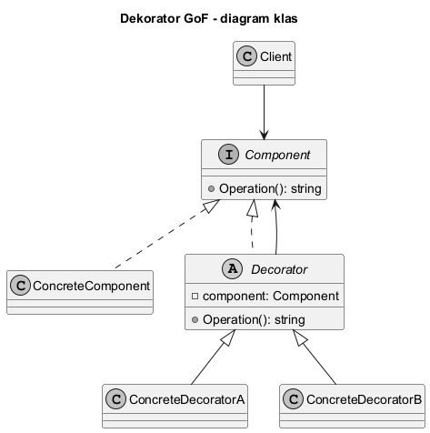
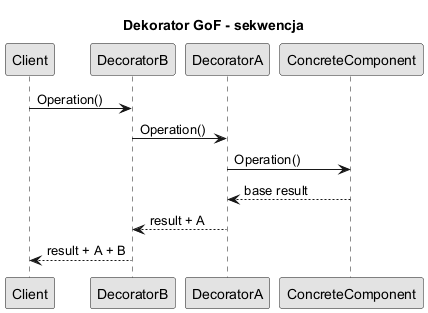

# 03. Struktura GoF wzorca Dekorator

## Role we wzorcu

1. `Component` - wspólny kontrakt.
2. `ConcreteComponent` - bazowa implementacja.
3. `Decorator` - klasa bazowa opakowująca `Component`.
4. `ConcreteDecorator` - dodaje konkretne zachowanie.

## Diagram klas



Źródło: [diagrams/01-class-diagram.puml](diagrams/01-class-diagram.puml)

## Diagram sekwencji



Źródło: [diagrams/02-sequence.puml](diagrams/02-sequence.puml)

## Jak działa przepływ

1. Klient wywołuje `Operation()` na zewnętrznym dekoratorze.
2. Dekorator deleguje wywołanie do warstwy wewnętrznej.
3. Każda warstwa dodaje własną odpowiedzialność.
4. Ostateczny wynik wraca do klienta.

## Kod C#

Kod: [Examples/Program.cs](Examples/Program.cs)

Fragment:

```csharp
IText text = new ItalicDecorator(
    new BoldDecorator(
        new PlainText("Decorator GoF structure")));

Console.WriteLine(text.Render());
```

## Uruchom

```bash
cd src/07-dekorator/03-struktura-gof/Examples
dotnet run
```

## Zadania z rozwiązaniami

1. Zadanie: dodaj `UnderlineDecorator`.
Rozwiązanie: nowa klasa dziedzicząca po `TextDecorator`, wynik `"<u>...</u>"`.

2. Zadanie: pokaż różnicę wyniku dla kolejności `Bold(Italic(text))` i `Italic(Bold(text))`.
Wyjaśnienie: chociaż efekt wizualny może być podobny, w innych domenach kolejność bywa krytyczna.

## Literatura

- GoF, Design Patterns, Decorator
- Refactoring.Guru: https://refactoring.guru/design-patterns/decorator
