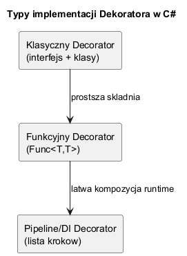
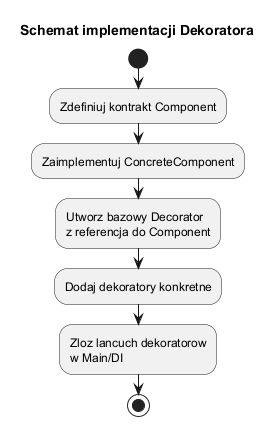

# 04. Przykłady zastosowania i typy implementacji

## Cel tematu

Pokazać różne style implementacji Dekoratora w C# i wskazać ich trade-offy.

## Diagram mapy wariantów



Źródło: [diagrams/01-variants-map.puml](diagrams/01-variants-map.puml)

## Schemat implementacji



Źródło: [diagrams/02-implementation-schema.puml](diagrams/02-implementation-schema.puml)

## Typy implementacji

1. Klasyczny (interfejs + klasy dekoratorów): najbardziej czytelny dydaktycznie.
2. Funkcyjny (`Func<string,string>`): lekki i zwięzły dla prostych przypadków.
3. Pipeline/DI (lista kroków): dobry przy konfigurowalnych łańcuchach runtime.

## Kod C#

Kod: [Examples/Program.cs](Examples/Program.cs)

Program pokazuje wszystkie trzy style w jednym miejscu.

Kluczowe fragmenty:

```csharp
var classic = new TimestampDecorator(new ConsoleNotifier());
Func<string, string> withSuffix = msg => $"{withPrefix(msg)}[SFX]";
var pipeline = new List<Func<string, string>> { ... };
```

## Uruchom

```bash
cd src/07-dekorator/04-implementacje-i-typy/Examples
dotnet run
```

## Zadania z rozwiązaniami

1. Zadanie: dodaj w pipeline krok `Sanitize`, który usuwa niepożądane znaki.
Rozwiązanie: dodaj funkcję do listy pipeline i przetestuj kolejność kroków.

2. Zadanie: rozbuduj wariant klasyczny o `CorrelationIdDecorator`.
Wyjaśnienie: dekorator jest naturalny dla cross-cutting concerns.

## Literatura

- Microsoft Docs DI: https://learn.microsoft.com/dotnet/core/extensions/dependency-injection
- Refactoring.Guru: https://refactoring.guru/design-patterns/decorator
