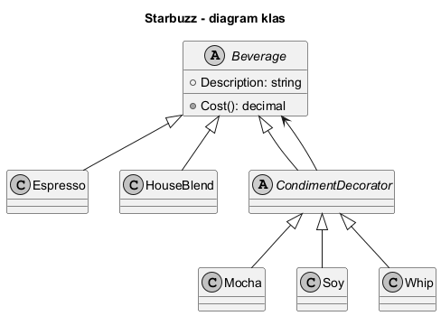
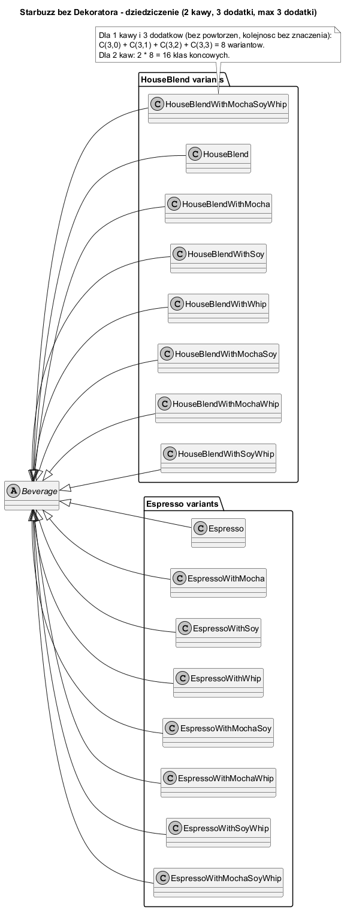
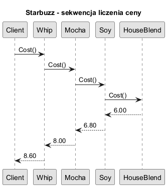
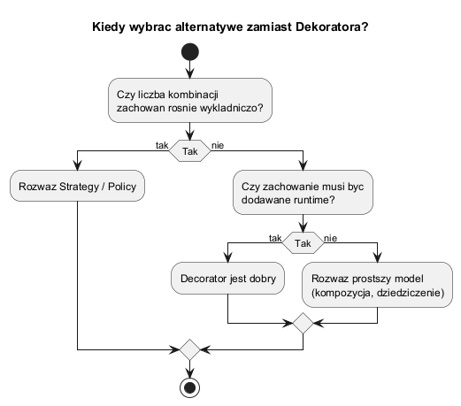

# 05. Większy przykład: Starbuzz Coffee

## Cel tematu

Przejść przez klasyczny przykład z książki Head First (Rusz Głową) i zrozumieć kiedy Dekorator jest dobrym wyborem, a kiedy warto rozważyć alternatywy.

## Kontekst biznesowy

Mamy bazowe napoje (`Espresso`, `HouseBlend`) i dodatki (`Mocha`, `Soy`, `Whip`).
Każde zamówienie to inna kombinacja dodatków, więc dziedziczenie prowadziłoby do eksplozji klas.

## Diagram klas



Źródło: [diagrams/01-starbuzz-class.puml](diagrams/01-starbuzz-class.puml)

## Jak wyglądałby system przy samym dziedziczeniu

Załóżmy dokładnie ten sam zakres co w przykładzie:

- 2 kawy bazowe: `Espresso`, `HouseBlend`,
- 3 dodatki: `Mocha`, `Soy`, `Whip`,
- maksymalnie 3 dodatki do jednej kawy.

Jeśli modelujemy to tylko przez dziedziczenie, to musimy utworzyć osobne klasy dla każdej kombinacji dodatków dla każdej kawy.



Źródło: [diagrams/04-inheritance-explosion-limit3.puml](diagrams/04-inheritance-explosion-limit3.puml)

Interpretacja diagramu:

1. Dla jednej kawy liczba kombinacji dodatków (bez powtórzeń, kolejność bez znaczenia) to:

	`C(3,0) + C(3,1) + C(3,2) + C(3,3) = 1 + 3 + 3 + 1 = 8`.

2. Dla dwóch kaw dostajemy:

	`2 * 8 = 16` klas końcowych napojów.

3. To już przy bardzo małej skali daje dużo klas, a każda kolejna kawa lub dodatek zwiększa liczbę wariantów kombinatorycznie.

Wniosek: Dekorator eliminuje potrzebę tworzenia wszystkich tych klas z góry, bo dodatki składamy dynamicznie w runtime.

## Diagram sekwencji ceny



Źródło: [diagrams/02-starbuzz-sequence.puml](diagrams/02-starbuzz-sequence.puml)

## Kiedy stosować / kiedy nie



Źródło: [diagrams/03-when-not.puml](diagrams/03-when-not.puml)

## Kod C#

Kod: [Examples/Program.cs](Examples/Program.cs)

Przykład tworzy dwa zamówienia:

```csharp
Beverage order1 = new Espresso();
Beverage order2 = new Whip(new Mocha(new Soy(new HouseBlend())));
```

Co to pokazuje:

1. Każdy dodatek opakowuje napój i dodaje koszt.
2. Końcowy koszt to suma warstw.
3. Opis zamówienia buduje się dynamicznie przy dekorowaniu.

## Alternatywy

1. Strategy/Policy - gdy konfigurujesz algorytm, a nie warstwy odpowiedzialności.
2. Prosta kompozycja danych - gdy dodatki są tylko listą cech bez logiki.
3. Dziedziczenie - tylko dla bardzo małej i stabilnej liczby wariantów.

## Uruchom

```bash
cd src/07-dekorator/05-kawiarnia-starbuzz/Examples
dotnet run
```

## Zadania z rozwiązaniami

1. Zadanie: dodaj nowy dodatek `Caramel` (+1.50).
Rozwiązanie: nowa klasa dekoratora dziedzicząca po `CondimentDecorator`.

2. Zadanie: dodaj promocję Happy Hour jako dekorator obniżający cenę o 10%.
Wyjaśnienie: dekorator może też modyfikować wynik kosztu, nie tylko zwiększać.

## Literatura

- Head First Design Patterns (Starbuzz Coffee)
- Refactoring.Guru: https://refactoring.guru/design-patterns/decorator
