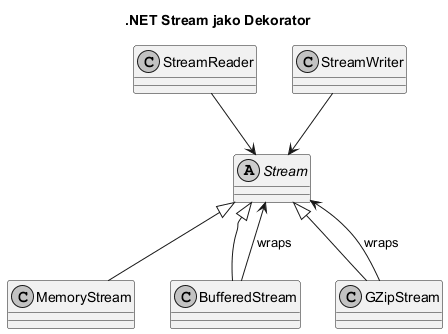
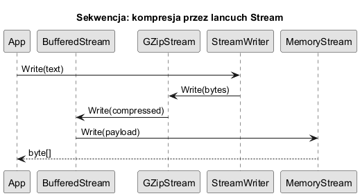

# 06. Dekorator w standardowych bibliotekach: Stream

## Cel tematu

Pokazać, że Dekorator jest realnie używany w .NET BCL i nie jest wyłącznie wzorcem akademickim.

## Diagram klas Stream



Źródło: [diagrams/01-stream-class.puml](diagrams/01-stream-class.puml)

## Diagram sekwencji zapisu



Źródło: [diagrams/02-stream-sequence.puml](diagrams/02-stream-sequence.puml)

## Wyjaśnienie

Przykładowy łańcuch:

`MemoryStream -> BufferedStream -> GZipStream -> StreamWriter`

Każda warstwa dodaje odpowiedzialność:

1. `MemoryStream`: nośnik danych w pamięci.
2. `BufferedStream`: buforowanie I/O.
3. `GZipStream`: kompresja/dekompresja.
4. `StreamWriter` / `StreamReader`: konwersja tekst <-> bajty.

## Kod C#

Kod: [Examples/Program.cs](Examples/Program.cs)

Program:

1. kompresuje tekst do `byte[]`,
2. dekompresuje z powrotem,
3. pokazuje rozmiar oryginału i payloadu.

To praktyczny, produkcyjny przykład Dekoratora.

## Uruchom

```bash
cd src/07-dekorator/06-dekoratory-bcl-stream/Examples
dotnet run
```

## Zadania z rozwiązaniami

1. Zadanie: zamień `GZipStream` na `BrotliStream` i porównaj rozmiar.
Rozwiązanie: użyj `BrotliStream` z `CompressionLevel.Optimal`.

2. Zadanie: dodaj warstwę szyfrowania (np. `CryptoStream`) po kompresji.
Wyjaśnienie: Dekorator umożliwia dokładanie funkcji warstwowo.

## Literatura

- Stream: https://learn.microsoft.com/dotnet/api/system.io.stream
- GZipStream: https://learn.microsoft.com/dotnet/api/system.io.compression.gzipstream
- BufferedStream: https://learn.microsoft.com/dotnet/api/system.io.bufferedstream
