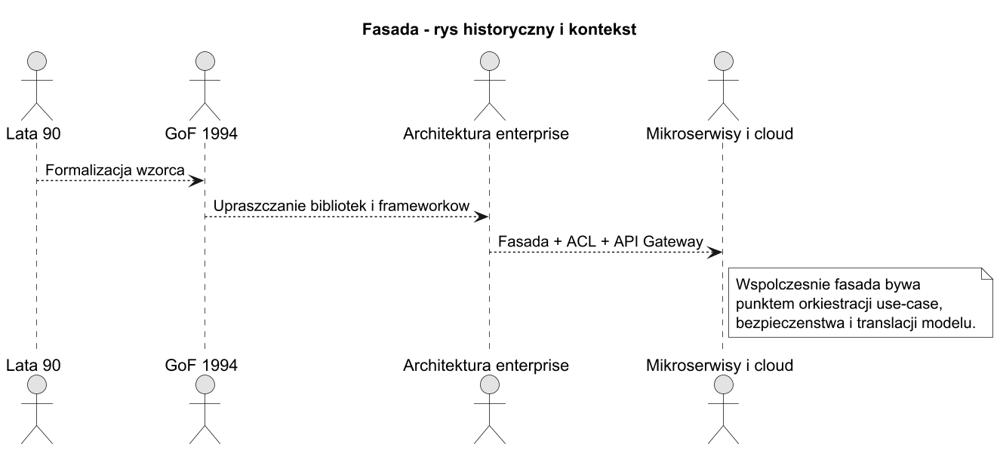
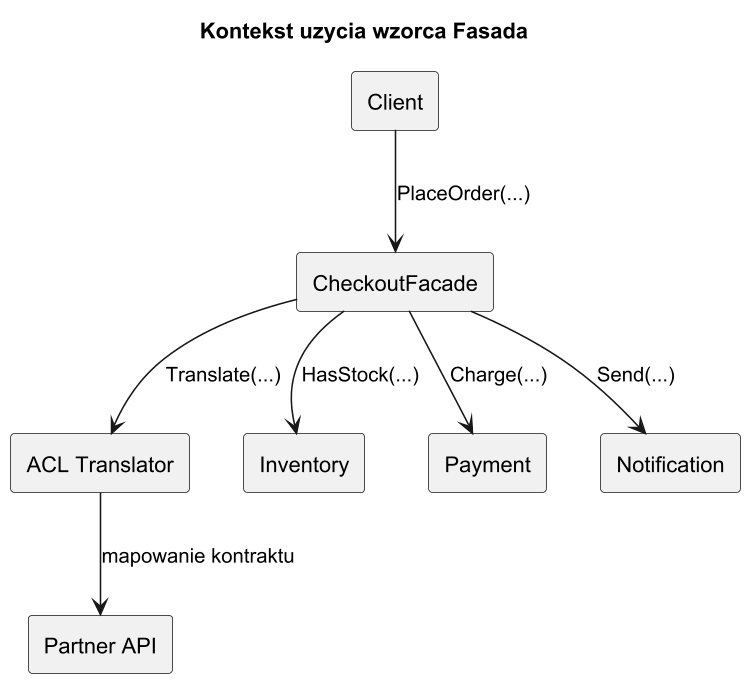
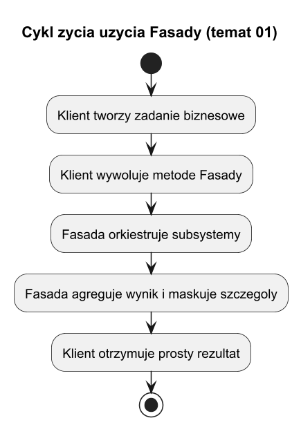

# 01. Idea i kontekst wzorca Fasada

## Cel tematu

Zrozumieć, po co powstał wzorzec Fasada, jakie potrzeby zaspokaja i jak łączy się z praktyką systemów produkcyjnych.

## Problem, który rozwiązuje Fasada

W dużych systemach klient często musi znać zbyt wiele szczegółów:

1. kolejność wywołań,
2. zależności między usługami,
3. obsługę wyjątków technicznych,
4. mapowanie danych pomiędzy modelami.

Fasada daje jeden, prosty punkt wejścia i ukrywa złożoną orkiestrację.

## Potrzeby, które zaspokaja

1. Ujednolicanie dostępu: jeden kontrakt zamiast wielu API.
2. Upraszczanie skomplikowanego API: klient wywołuje jedną metodę biznesową.
3. Ochrona domeny przed światem zewnętrznym: dobre miejsce na ACL.
4. Bezpieczeństwo: centralny punkt autoryzacji i audytu.
5. Stabilność: ograniczenie wpływu zmian subsystemów na kod klienta.

## Rys historyczny



Źródło: [diagrams/01-history.puml](diagrams/01-history.puml)

Interpretacja:

1. Wzorzec opisano formalnie w książce GoF.
2. Zyskał znaczenie wraz ze wzrostem liczby bibliotek i frameworków.
3. W architekturze rozproszonej bywa łączony z ACL i API Gateway.

## Fasada a ACL (Anti-Corruption Layer)

Fasada i ACL często współpracują, ale nie są tym samym:

1. Fasada upraszcza użycie subsystemu.
2. ACL tłumaczy model obcego systemu na model domenowy.
3. W praktyce jedna klasa fasady może korzystać z komponentów ACL.

## Diagram kontekstu



Źródło: [diagrams/02-context.puml](diagrams/02-context.puml)

## Diagram cyklu życia użycia fasady



Źródło: [diagrams/03-lifecycle.puml](diagrams/03-lifecycle.puml)

## Kod C# (minimum)

Kod: [Examples/Program.cs](Examples/Program.cs)

Fragment:

```csharp
var facade = new CheckoutFacade(
    new InventoryService(),
    new PaymentService(),
    new NotificationService());

var result = facade.PlaceOrder("C-100", "SKU-1", 2, 199.99m);
```

Co to pokazuje:

1. Klient nie zna szczegółów trzech subsystemów.
2. Fasada ukrywa kolejność walidacji i wykonania.
3. Kontrakt klienta jest prosty i stabilny.

## Uruchom

```bash
cd src/08-fasada/01-idea-i-kontekst/Examples
dotnet run
```

## Zadania z rozwiązaniami

1. Zadanie: dodaj subsystem `FraudCheckService` bez zmian w kliencie.
Rozwiązanie: rozszerz konstruktor fasady i metodę `PlaceOrder`; kod klienta zostaje bez zmian.

2. Zadanie: wprowadź prosty ACL mapujący kod błędu partnera do domenowego `ErrorCode`.
Rozwiązanie: dodaj klasę tłumacza (`PartnerAclTranslator`) używaną tylko wewnątrz fasady.

## Literatura

1. GoF, *Design Patterns*, Facade.
2. Refactoring.Guru: https://refactoring.guru/design-patterns/facade
3. Fowler ACL: https://martinfowler.com/bliki/AntiCorruptionLayer.html
