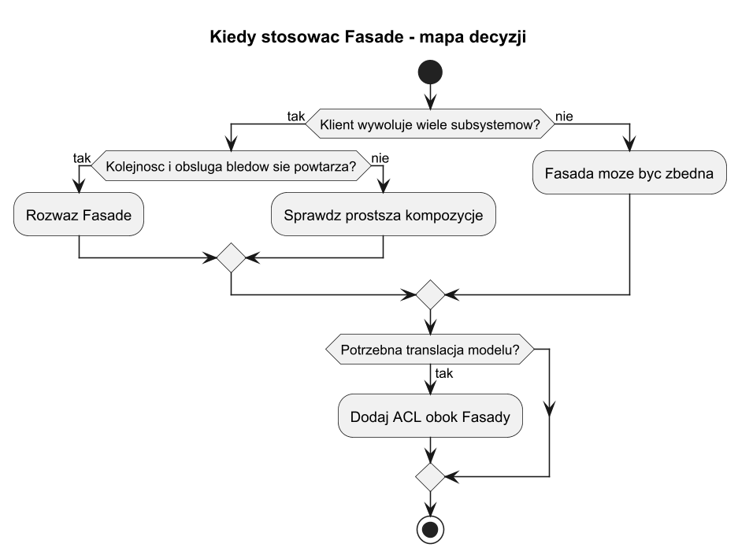
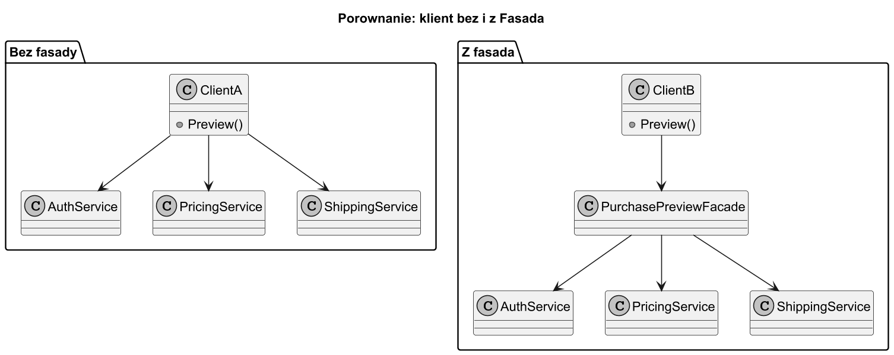
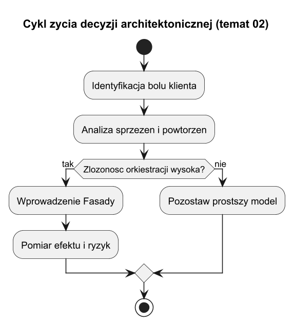

# 02. Kiedy stosować Fasadę - zalety i wady

## Cel tematu

Nauczyć się podejmować decyzję architektoniczną: kiedy Fasada rzeczywiście pomaga, a kiedy jest zbędną warstwą.

## Sygnały, że warto użyć Fasady

1. Klient wywołuje wiele usług w tej samej kolejności.
2. Kod klienta zawiera powtarzalną orkiestrację i obsługę wyjątków.
3. API subsystemu często się zmienia i destabilizuje klientów.
4. Potrzebujesz jednego miejsca na polityki bezpieczeństwa i logowanie.

## Sygnały ostrzegawcze (kiedy nie używać)

1. Subsystem jest bardzo prosty (jedna metoda) i nie ma realnej złożoności.
2. Każdy klient potrzebuje innej logiki, a wspólna fasada byłaby sztuczna.
3. Fasada zaczyna rosnąć do "god object" z dziesiątkami odpowiedzialności.

## Zalety

1. Mniejsze sprzężenie klientów z subsystemem.
2. Czytelniejsze API biznesowe.
3. Lepsza testowalność kodu klienta (mock jednej fasady).
4. Spójna obsługa błędów i bezpieczeństwa.

## Wady

1. Dodatkowa warstwa może ukryć potrzebne możliwości niskopoziomowe.
2. Ryzyko przeciążenia fasady zbyt wieloma funkcjami.
3. Potencjalny narzut utrzymaniowy, gdy jest źle zaprojektowana.

## Mapa decyzji



Źródło: [diagrams/01-decision-tree.puml](diagrams/01-decision-tree.puml)

## Porównanie: z fasadą vs bez fasady



Źródło: [diagrams/02-compare.puml](diagrams/02-compare.puml)

## Diagram cyklu życia decyzji



Źródło: [diagrams/03-lifecycle.puml](diagrams/03-lifecycle.puml)

## Kod C#

Kod: [Examples/Program.cs](Examples/Program.cs)

Program demonstruje dwa style:

1. "Bez fasady" - klient sam buduje orkiestrację.
2. "Z fasadą" - klient wywołuje pojedynczą metodę.

## Uruchom

```bash
cd src/08-fasada/02-kiedy-stosowac-zalety-wady/Examples
dotnet run
```

## Zadania z rozwiązaniami

1. Zadanie: wykryj i wypisz miejsca, gdzie klient łamie zasadę "Tell, Don't Ask".
Rozwiązanie: w wariancie bez fasady klient pobiera dane pośrednie i sam decyduje o krokach; po refaktoryzacji decyzje są wewnątrz fasady.

2. Zadanie: dodaj metrykę czasu wykonania operacji biznesowej.
Rozwiązanie: umieść pomiar czasu wewnątrz fasady, aby obejmował pełen use-case.

## Literatura

1. Refactoring.Guru Facade: https://refactoring.guru/design-patterns/facade
2. Microsoft Docs ILogger: https://learn.microsoft.com/dotnet/api/microsoft.extensions.logging.ilogger
