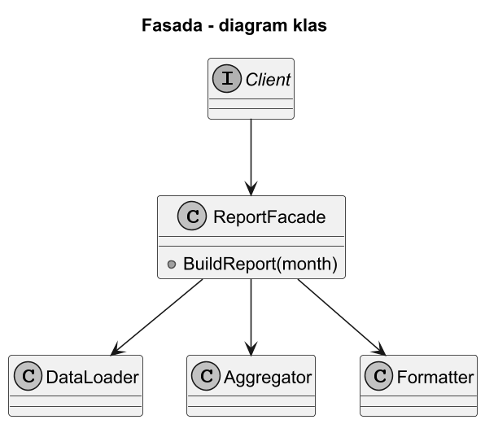
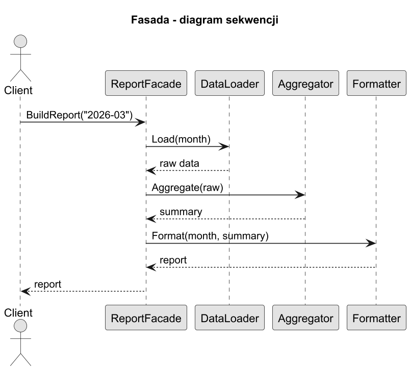
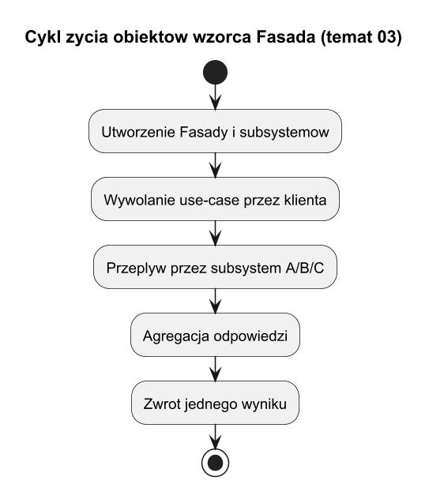

# 03. Jak działa Fasada - struktura i przepływ

## Cel tematu

Przeanalizować mechanikę wzorca: role, zależności, przebieg wywołań i cykl życia obiektów.

## Role we wzorcu Fasada

1. `Client` - zna tylko API fasady.
2. `Facade` - koordynuje kroki i ukrywa szczegóły.
3. `SubsystemA/B/C` - realizują konkretne operacje.

## Diagram klas (GoF)



Źródło: [diagrams/01-class.puml](diagrams/01-class.puml)

## Diagram sekwencji



Źródło: [diagrams/02-sequence.puml](diagrams/02-sequence.puml)

## Diagram cyklu życia obiektów



Źródło: [diagrams/03-lifecycle.puml](diagrams/03-lifecycle.puml)

## Wyjaśnienie przepływu

1. Klient wywołuje jedną metodę fasady (`ExecuteUseCase`).
2. Fasada waliduje wejście i inicjalizuje kontekst.
3. Fasada wywołuje kolejne subsystemy we właściwej kolejności.
4. Fasada agreguje wynik i mapuje błędy na model klienta.

## Kod C#

Kod: [Examples/Program.cs](Examples/Program.cs)

Fragment:

```csharp
var facade = new ReportFacade(new DataLoader(), new Aggregator(), new Formatter());
var report = facade.BuildReport("2026-03");
```

Szczegółowe wyjaśnienie:

1. `DataLoader` pobiera dane surowe.
2. `Aggregator` liczy metryki.
3. `Formatter` buduje finalny raport tekstowy.
4. Klient nie zna żadnego kroku pośredniego.

## Cykl życia

W tym przykładzie cykl życia jest prosty:

1. Konstrukcja fasady i subsystemów,
2. Jednorazowe wywołanie use-case,
3. Zwrot gotowego wyniku.

W aplikacji webowej zwykle fasada ma zasięg `Scoped` (na żądanie HTTP).

## Uruchom

```bash
cd src/08-fasada/03-struktura-i-dzialanie/Examples
dotnet run
```

## Zadania z rozwiązaniami

1. Zadanie: dodaj walidator wejścia jako krok przed `DataLoader`.
Rozwiązanie: nowy `InputValidator` wywoływany na początku `BuildReport`.

2. Zadanie: dodaj obsługę błędu formatowania i zwrot czytelnego komunikatu.
Rozwiązanie: mapowanie wyjątku `FormatException` na wynik domenowy zamiast przecieku wyjątku technicznego.

## Literatura

1. GoF, *Design Patterns*.
2. UML Distilled, Martin Fowler.
