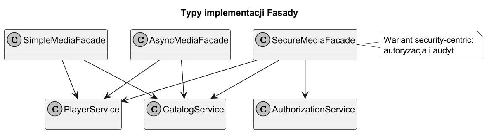
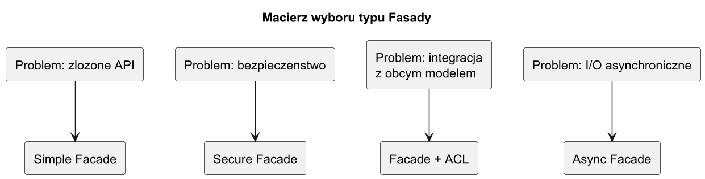
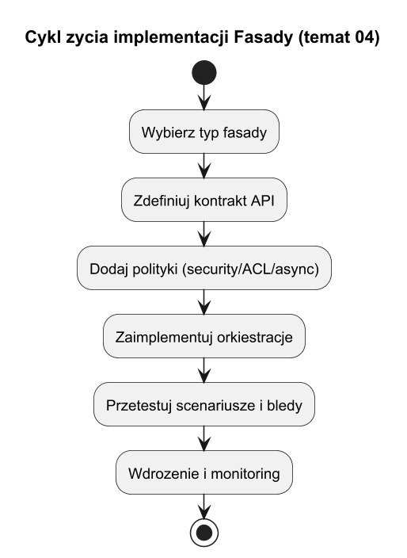

# 04. Typy implementacji Fasady i schemat wyboru

## Cel tematu

Poznać najczęstsze style implementacji fasady oraz nauczyć się dobierać wariant do kontekstu systemu.

## Typy implementacji

1. Fasada proceduralna (prosta): jedna klasa, metoda use-case, bez stanu.
2. Fasada aplikacyjna (use-case): mapowanie DTO, walidacja, polityki błędów.
3. Fasada bezpieczeństwa (secure facade): autoryzacja, audyt, maskowanie danych.
4. Fasada integracyjna z ACL: tłumaczenie kontraktów systemów zewnętrznych.
5. Fasada asynchroniczna: orkiestracja `Task`, timeout, retry.

## Schemat implementacji



Źródło: [diagrams/01-implementation-schema.puml](diagrams/01-implementation-schema.puml)

## Jak wybrać właściwy typ



Źródło: [diagrams/02-selection-matrix.puml](diagrams/02-selection-matrix.puml)

## Diagram cyklu życia implementacji



Źródło: [diagrams/03-lifecycle.puml](diagrams/03-lifecycle.puml)

Wskazówki praktyczne:

1. Jeśli problemem jest głównie złożoność API, zacznij od fasady prostej.
2. Jeśli integrujesz obcy system i inny model pojęciowy, dodaj ACL.
3. Jeśli kluczowe są polityki bezpieczeństwa i zgodność audytowa, użyj secure facade.
4. Jeśli kroki są I/O-bound i niezależne, rozważ fasadę asynchroniczną.

## Kod C#

Kod: [Examples/Program.cs](Examples/Program.cs)

Program pokazuje trzy warianty:

1. `SimpleMediaFacade`,
2. `SecureMediaFacade`,
3. `AsyncMediaFacade`.

## Uruchom

```bash
cd src/08-fasada/04-typy-implementacji/Examples
dotnet run
```

## Zadania z rozwiązaniami

1. Zadanie: dodaj wariant "resilience facade" z fallbackiem.
Rozwiązanie: opakuj wywołanie krytycznej usługi blokiem `try/catch` i przełącz na źródło zapasowe.

2. Zadanie: dodaj `CancellationToken` do fasady asynchronicznej.
Rozwiązanie: przekazuj token do wszystkich wywołań `Task` i sprawdzaj `ThrowIfCancellationRequested`.

## Literatura

1. Microsoft Docs, asynchronous programming: https://learn.microsoft.com/dotnet/csharp/asynchronous-programming/
2. Fowler, ACL: https://martinfowler.com/bliki/AntiCorruptionLayer.html
