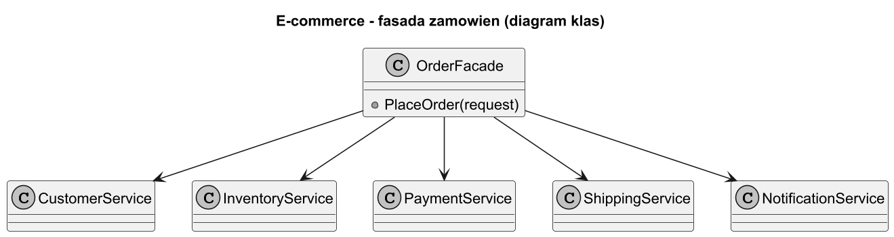
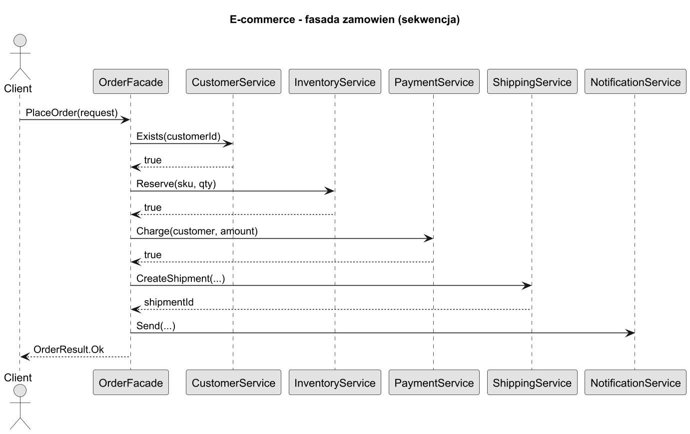
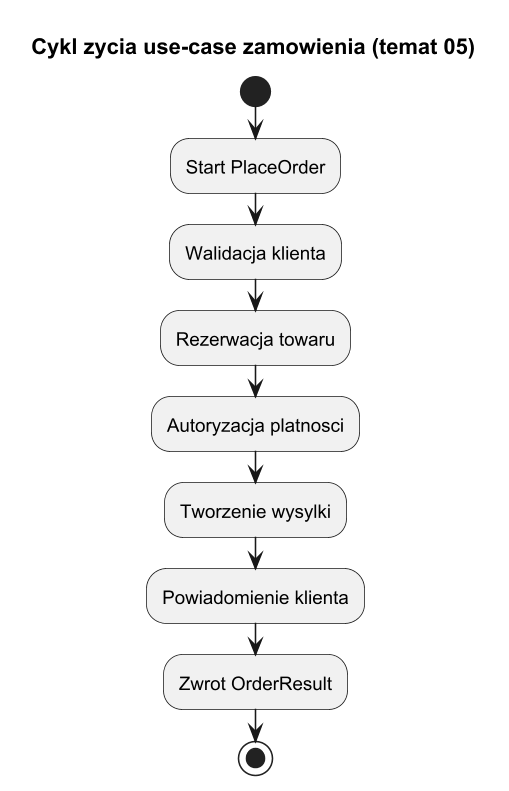

# 05. Większy przykład: zamówienie e-commerce i alternatywy

## Cel tematu

Zobaczyć pełny scenariusz biznesowy oraz świadomie porównać Fasadę z alternatywnymi podejściami.

## Scenariusz

Use-case `PlaceOrder` obejmuje:

1. walidację klienta,
2. sprawdzenie stanów magazynowych,
3. rezerwację,
4. płatność,
5. zlecenie wysyłki,
6. notyfikację.

Bez fasady ten przepływ często jest skopiowany w wielu miejscach i szybko się rozjeżdża.

## Diagram klas



Źródło: [diagrams/01-ecommerce-class.puml](diagrams/01-ecommerce-class.puml)

## Diagram sekwencji



Źródło: [diagrams/02-ecommerce-sequence.puml](diagrams/02-ecommerce-sequence.puml)

## Diagram cyklu życia use-case



Źródło: [diagrams/03-lifecycle.puml](diagrams/03-lifecycle.puml)

## Kiedy Fasada, a kiedy inne podejście

Alternatywy i kryteria:

1. Application Service - gdy już masz warstwę use-case i potrzebujesz głównie orkiestracji.
2. Mediator - gdy wiele komponentów komunikuje się wielokierunkowo.
3. API Gateway/BFF - gdy problem leży na poziomie granicy systemowej i wielu klientów.
4. Workflow/Saga - gdy proces jest długotrwały i transakcyjnie rozproszony.

Wniosek: Fasada jest bardzo dobra dla pojedynczego, synchronicznego use-case o złożonym wnętrzu.

## Kod C#

Kod: [Examples/Program.cs](Examples/Program.cs)

Program realizuje dwa scenariusze:

1. sukces zamówienia,
2. odrzucenie (brak towaru).

Wynik klienta to prosty `OrderResult`, bez przecieku błędów technicznych.

## Uruchom

```bash
cd src/08-fasada/05-wiekszy-przyklad-i-alternatywy/Examples
dotnet run
```

## Zadania z rozwiązaniami

1. Zadanie: dodaj mechanizm idempotencji (`RequestId`) do fasady zamówień.
Rozwiązanie: przed rozpoczęciem procesu sprawdź, czy `RequestId` był już zrealizowany.

2. Zadanie: dodaj alternatywny kanał notyfikacji (`SMS`) i wybór kanału na podstawie preferencji klienta.
Rozwiązanie: fasada korzysta z prostego routera notyfikacji, klient nadal wywołuje jedną metodę.

## Literatura

1. Enterprise Integration Patterns, Hohpe/Woolf.
2. Microsoft Cloud Design Patterns: https://learn.microsoft.com/azure/architecture/patterns/
