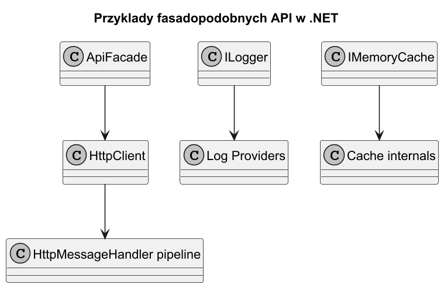
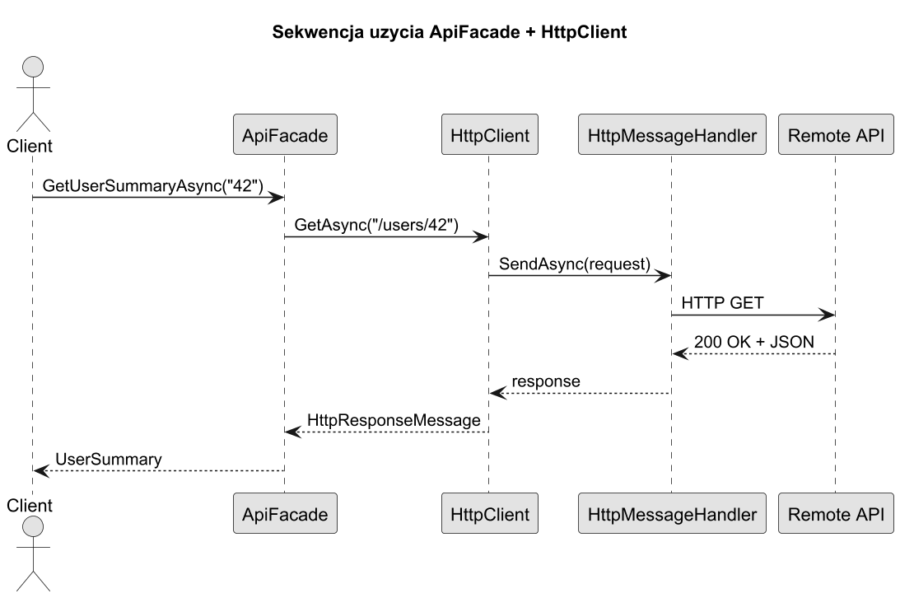
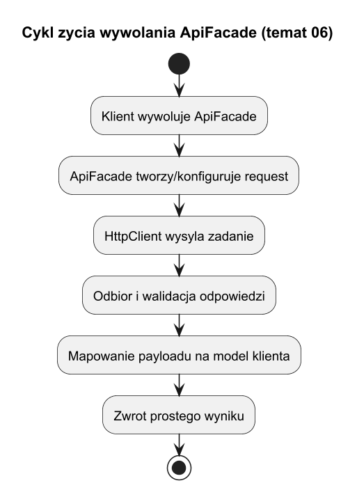

# 06. Fasady w standardowych rozwiązaniach i bibliotekach

## Cel tematu

Zobaczyć, że wzorzec Fasada jest praktycznie obecny w platformie .NET i nowoczesnych frameworkach.

## Przykłady z ekosystemu .NET

1. `HttpClient` jako uproszczone API do pracy z HTTP.
2. `ILogger<T>` jako spójna fasada dla różnych providerów logowania.
3. `IMemoryCache` jako prosty punkt wejścia do mechanizmów cache.

Uwaga: To przykłady "fasadopodobne" - uproszczone interfejsy ukrywające złożoność zaplecza.

## Diagram: standardowe fasady



Źródło: [diagrams/01-standard-facades.puml](diagrams/01-standard-facades.puml)

## Diagram sekwencji: `HttpClient`



Źródło: [diagrams/02-httpclient-sequence.puml](diagrams/02-httpclient-sequence.puml)

## Diagram cyklu życia wywołania



Źródło: [diagrams/03-lifecycle.puml](diagrams/03-lifecycle.puml)

## Wyjaśnienie

`HttpClient` nie jest "czystą" fasadą z GoF 1:1, ale pełni podobną rolę:

1. daje prosty kontrakt dla klienta (`GetAsync`, `PostAsync`),
2. ukrywa złożoność handlerów, połączeń i konfiguracji,
3. pozwala rozszerzać zachowanie przez pipeline handlerów.

To dobry przykład na wykładzie, bo pokazuje, że wzorce żyją jako idee, nie tylko jako literalne diagramy.

## Kod C#

Kod: [Examples/Program.cs](Examples/Program.cs)

Program buduje `ApiFacade`, która opakowuje `HttpClient` i upraszcza pobranie danych użytkownika.

## Uruchom

```bash
cd src/08-fasada/06-fasady-w-bibliotekach-standardowych/Examples
dotnet run
```

## Zadania z rozwiązaniami

1. Zadanie: dodaj retry do `ApiFacade` (maks. 3 próby) dla błędów sieciowych.
Rozwiązanie: pętla z ograniczeniem prób i prostym opóźnieniem; zachowaj jeden kontrakt metody dla klienta.

2. Zadanie: dodaj wariant metody `GetUserSummaryAsync` z `CancellationToken`.
Rozwiązanie: przekaż token do `GetAsync` i `ReadAsStringAsync`.

## Literatura

1. HttpClient docs: https://learn.microsoft.com/dotnet/api/system.net.http.httpclient
2. Logging docs: https://learn.microsoft.com/dotnet/core/extensions/logging
3. IMemoryCache docs: https://learn.microsoft.com/aspnet/core/performance/caching/memory
