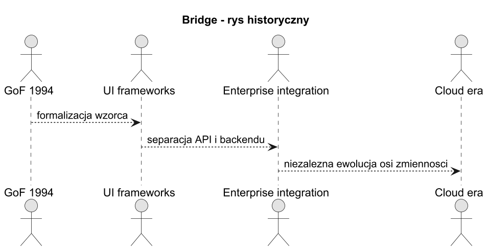
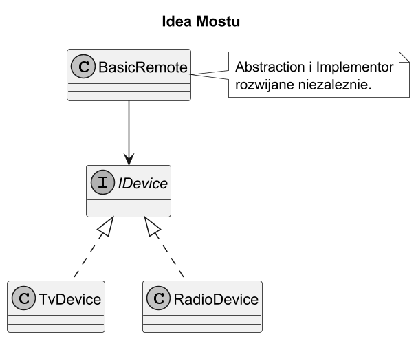
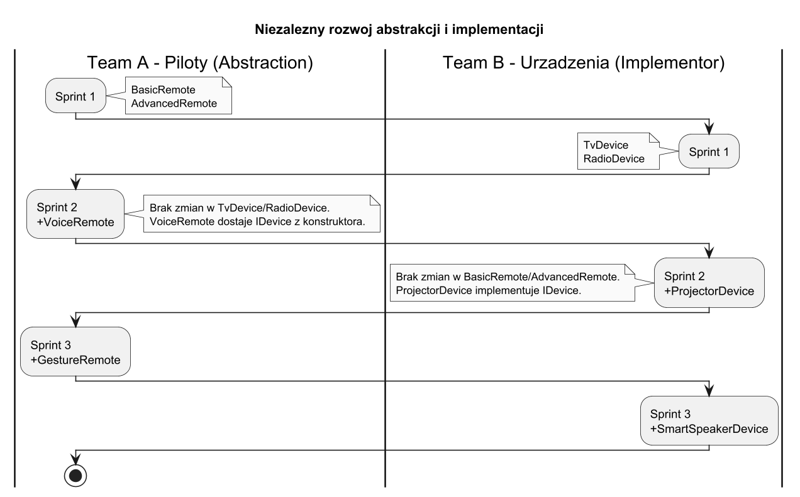
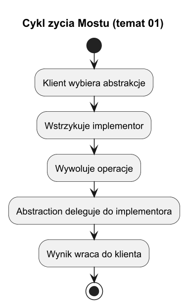

# 01. Idea i kontekst wzorca Most

## Cel tematu

Zrozumieć dlaczego Most powstał i jakie problemy rozwiązuje w projektowaniu klas.

## Problem: eksplozja klas przez dziedziczenie

Mamy dwie niezalezne osie zmienności:

- Os A (abstrakcja/zachowanie): BasicRemote, AdvancedRemote, VoiceRemote
- Os B (implementacja/technologia): TvDevice, RadioDevice, ProjectorDevice, SmartSpeakerDevice

Przy podejsciu czystego dziedziczenia kazda kombinacja to osobna klasa:

| | TvDevice | RadioDevice | ProjectorDevice | SmartSpeakerDevice |
|---|---|---|---|---|
| BasicRemote | BasicRemoteTv | BasicRemoteRadio | BasicRemoteProjector | BasicRemoteSpeaker |
| AdvancedRemote | AdvancedRemoteTv | AdvancedRemoteRadio | AdvancedRemoteProjector | AdvancedRemoteSpeaker |
| VoiceRemote | VoiceRemoteTv | VoiceRemoteRadio | VoiceRemoteProjector | VoiceRemoteSpeaker |

**3 piloty x 4 urzadzenia = 12 klas.** Dodanie jednego nowego pilota lub urzadzenia to dodanie kolejnego wiersza lub kolumny do tabeli — N + M nowych klas zamiast N lub M.



Źródło: [diagrams/01-history.puml](diagrams/01-history.puml)

## Rozwiązanie: Most rozdziela osie

Most rozdziela:

1. **Abstraction** — co klient chce zrobic (pilot: wlacz, ustaw glosnosc),
2. **Implementor** — jak to technicznie wykonac (urzadzenie: TV, Radio, Projektor).

Abstraction przechowuje referencje do Implementora przez interfejs i deleguje do niego operacje niskopoziomowe.



Źródło: [diagrams/02-idea.puml](diagrams/02-idea.puml)

## Niezależny rozwój dwóch osi — scenariusz zespołowy

Klucza zaleta Mostu jest to, że oba wymiary moga byc rozwijane bez wiedzy o sobie nawzajem:

```
Sprint 1 — Team A (Piloty):
  + BasicRemote    [abstraction]
  + AdvancedRemote [refined abstraction]

Sprint 1 — Team B (Urzadzenia):
  + TvDevice       [implementor]
  + RadioDevice    [implementor]

Sprint 2 — Team A (nowy pilot, bez zmian w Team B):
  + VoiceRemote    [refined abstraction]
  Brak dotkniec klas TvDevice, RadioDevice.

Sprint 2 — Team B (nowe urzadzenie, bez zmian w Team A):
  + ProjectorDevice [implementor]
  Brak dotkniec klas BasicRemote, AdvancedRemote, VoiceRemote.
```

Dodanie `VoiceRemote` i `ProjectorDevice` to **2 nowe klasy**, a nie 2*N lub M*2.



Źródło: [diagrams/04-independent-evolution.puml](diagrams/04-independent-evolution.puml)

## Cykl zycia



Źródło: [diagrams/03-lifecycle.puml](diagrams/03-lifecycle.puml)

## Kod C#

Kod: [Examples/Program.cs](Examples/Program.cs)

Program pokazuje:

1. BasicRemote i AdvancedRemote jako dwie abstrakcje,
2. TvDevice, RadioDevice, ProjectorDevice jako implementory,
3. runtime switching implementora (podmiana urzadzenia bez zmiany pilota),
4. rozszerzenie abstrakcji (Mute tylko w AdvancedRemote) bez zmian implementorów,
5. rozszerzenie implementacji (ProjectorDevice) bez zmian pilotow.

## Uruchom

```bash
cd src/09-most/01-idea-i-kontekst/Examples
dotnet run
```

## Zadania z rozwiązaniami

1. Dodaj `SmartSpeakerDevice` (oś implementacji).
   Rozwiązanie: nowy implementor `IDevice`, bez zmian w `BasicRemote` ani `AdvancedRemote`.

1. Dodaj `Mute` tylko po stronie `AdvancedRemote` (oś abstrakcji).
   Rozwiązanie: `RefinedAbstraction` rozszerza API bez naruszania implementorów.

1. Policz, ile klas trzeba by napisac bez Mostu dla 4 pilotow i 5 urzadzen.
   Rozwiązanie: 4×5 = 20 klas vs 4 + 5 = 9 klas z Mostem.

## Literatura

1. Refactoring.Guru: https://refactoring.guru/design-patterns/bridge
2. GoF, Design Patterns.
