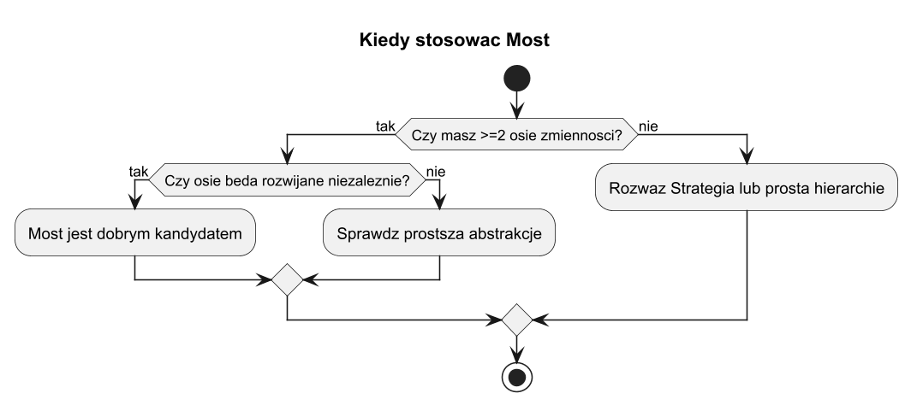
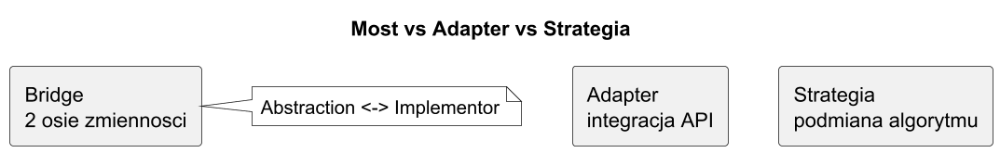
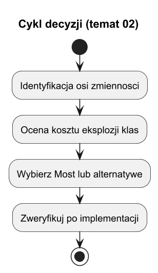

# 02. Kiedy stosowac Most - zalety i wady

## Cel tematu

Nauczyc sie podejmowac decyzje, czy Most ma sens w danym kontekscie.

## Sygnaly, ze warto

1. Masz co najmniej dwie osie zmiennosci.
2. Obie osie beda rozwijane niezaleznie.
3. Chcesz ograniczyc eksplozje klas dziedziczacych.

## Kiedy nie

1. Masz jedna os zmiennosci (wtedy czesto wystarczy Strategia).
2. Integrujesz obce API bez zmiany modelu (wtedy Adapter).
3. Problem jest prosty i stabilny (Most bylby overengineering).

## Zalety

1. Niezalezne rozszerzanie abstrakcji i implementacji.
2. Lepsza testowalnosc i podstawialnosc implementorow.
3. Mniejsze sprzezenie klienta z infrastruktura.

## Wady

1. Wiecej klas i warstw.
2. Ryzyko leakage implementacji.
3. Zly do prostych, jednowymiarowych scenariuszy.



Zrodlo: [diagrams/01-decision-map.puml](diagrams/01-decision-map.puml)



Zrodlo: [diagrams/02-compare.puml](diagrams/02-compare.puml)

## Checklista decyzyjna per scenariusz

### Scenariusz A: Integracja z zewnetrznym API (np. nowy dostawca kuriera)

1. Czy model domenowy ma zostac bez zmian? [tak]
2. Czy glownym problemem jest roznica interfejsow? [tak]
3. Czy nie projektujesz nowej, niezaleznej osi biznesowej? [tak]

Wniosek: wybierz **Adapter**.

### Scenariusz B: Podmiana sposobu liczenia (np. rabat standardowy/premium)

1. Czy zmienia sie glownie algorytm, a nie infrastruktura? [tak]
2. Czy masz jedna os decyzji (wariant algorytmu)? [tak]
3. Czy obiekt kontekstowy ma tylko delegowac obliczenia? [tak]

Wniosek: wybierz **Strategia**.

### Scenariusz C: Dwie osie rozwoju (np. typ Alertu x kanal dostarczenia)

1. Czy masz co najmniej 2 osie zmiennosci? [tak]
2. Czy osie beda rozwijane niezaleznie (oddzielne release'y/zespoly)? [tak]
3. Czy bez rozdzielenia grozi eksplozja klas typu XViaY? [tak]
4. Czy chcesz moc podmieniac implementor bez zmian po stronie Abstraction? [tak]

Wniosek: wybierz **Most**.

### Szybka regula 10 sekund

1. Integracja obcego API -> **Adapter**.
2. Podmiana algorytmu w jednej osi -> **Strategia**.
3. Niezalezny rozwoj dwoch osi -> **Most**.

## Cykl decyzji



Zrodlo: [diagrams/03-lifecycle.puml](diagrams/03-lifecycle.puml)

## Kod C#

Kod: [Examples/Program.cs](Examples/Program.cs)

Program porownuje wariant bez Mostu i z Mostem.

## Uruchom

```bash
cd src/09-most/02-kiedy-stosowac-zalety-wady/Examples
dotnet run
```

## Zadania z rozwiazaniami

1. Rozpoznaj osie zmiennosci dla scenariusza platnosci i raportowania.
Rozwiazanie: platnosc i raport to osobne osie, kandydat na Most.

2. Wskaz antywzorzec leakage w dostarczonym kodzie.
Rozwiazanie: if implementor is X wewnatrz Abstraction.
